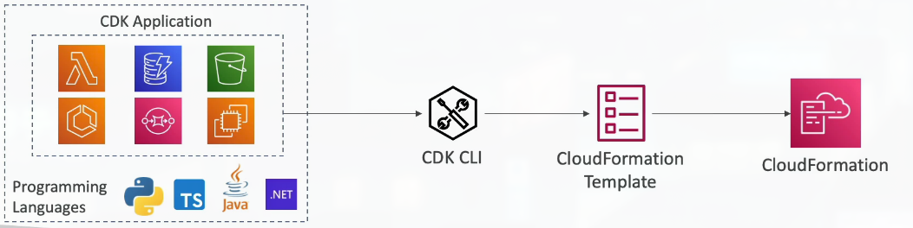
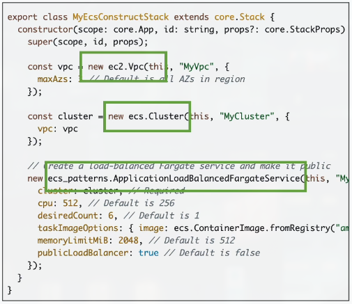
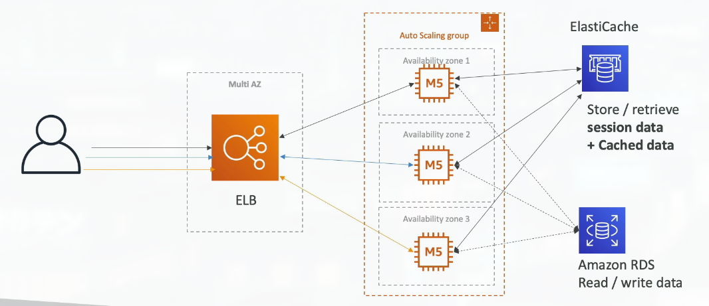
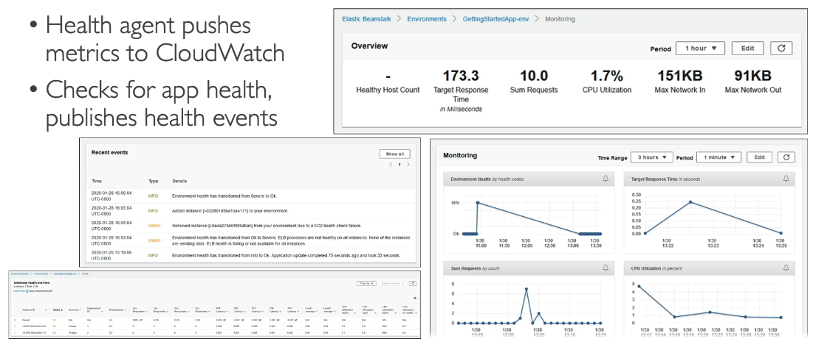
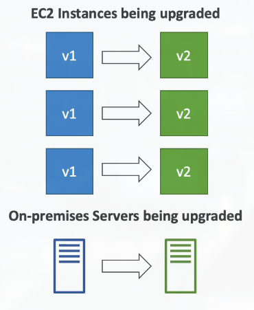
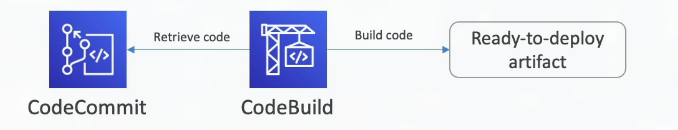

# Section 11: Deployments & Managing Infrastructure at Scale

## 123. CloudFormation Overview

### What is CloudFormation

- CloudFormation is a declarative way of outlining your AWS Infrastructure, for any resources (most of them are supported).
- For example, within a CloudFormation template, you say:
    - I want a security group
    - I want two EC2 instances using this security group
    - I want an S3 bucket
    - I want a load balancer (ELB) in front of these machines
- Then CloudFormation creates those for you, in the right order, with the exact configuration that you specify

### Benefits of AWS CloudFormation

- Infrastructure as code
    - No resources are manually created, which is excellent for control
    - Changes to the infrastructure are reviewed through code
- Cost
    - Each resources within the stack is tagged with an identifier so you can easily see how much a stack costs you
    - You can estimate the costs of your resources using the CloudFormation template
    - Savings strategy: In Dev, you could automation deletion of templates at 5 PM and recreated at 8 AM, safely

- Productivity
    - Ability to destroy and re-create an infrastructure on the cloud on the fly
    - Automated generation of Diagram for your templates
    - Declarative programming (no need to figure out ordering and orchestration)

- Don't re-invent the wheel
    - Leverage existing templates on the web
    - Leverate the documentation

- Supports (almost) all AWS resources:
    - Everything we'll see in this course is supported
    - You can use "custom resources" for resources that are not supported

### CloudFormation + Infrastructure Composer
- Example: WordPress CloudFormation Stack
- We can see all the resouces
- We can see the relations between the components

## 124. CloudFormation Hands On
***This is a lab tutorial lesson***

## 125. CDK Overview

### AWS Cloud Development Kit (CDK)
- Define your cloud infrastructure using a familiar language:
    - JavaScript/TypeScript, Python, Java, and .NET
- The code is "compiled" into a CloudFormation template (JSON/YAML)
- You can therefore deploy infrastructure and application runtime code together
    - Great for Lambda functions
    - Great for Docker containers in ECS/EKS

### CDK Example

## 126. Beanstalk Overview

### Typical architecture: Web App 3-tier

### Developer problems on AWS

- Managing infrastructure
- Deploying Code
- Configuring all the databases, load balancers, etc
- Scaling concerns

- Most web apps are the same architecture (ALB + ASG)
- All the developers want is for their code to run
- Possibly, consistently across different applications and environments

### AWS Elastic Beanstalk Overview

- Elastic Beanstalk is a developer centric view of deploying an application on AWS
- It uses all the component's we have seen before: EC2, ASG, ELB, RDS, etc...
- But it's all in one view that's easy to make sense of
- We still have full control over the configuration

- Beanstalk = Platform as a Service (PaaS)

### Elastic Bean

- Managed service
    - Instance configuration / OS is handled by Beanstalk
    - Deployment strategy is configurable but performed by Elastic Beanstalk
    - Capacity provisioning
    - Load balancing & auto-scaling
    - Application health-monitoring & responsiveness
- Just the application code is the responsibility of the developer
- Three architecture models:
    - Single Instance deployment: good for dev
    - LB + ASG: great for production or pre-production web applications
    - ASG only: great for non-web apps in production (workers, etc...)

- Support for many platforms: Go, Java SE, Java with Tomcat, .NET on Windows Server with IIS, Node.js, PHP, Python, Ruby, Packer Builder, Single Container Docker, Multi-Container Docker, Preconfigured Docker

### Elastic Beanstalk - Health Monitoring

## 127. Beanstalk Hands On
***This is a lab tutorial lesson***

## 128. CodeDeploy Overview

### AWS CodeDeploy
- We want to deploy our application automatically
- Works with EC2 Instances
- Works with On-Premises Servers
- Hybrid service
- Servers / Instances must be provisioned and configured ahead of time with the CodeDeploy Agent

## 129. IMPORTANT: CodeCommit Discontinuation

- On July 25th 2025, AWS abruptly discontinued CodeCommit
- New customers cannot use the service
- AWS recommends to migrate to an external Git solution

- For this course:
    - CodeCommit might still appear at the exam (for now)
    - Everytime i mention CodeCommit, assume there's a GitHub integration

## 130. CodeCommit Overview

### AWS CodeCommit

- Before pushing the application code to servers, it needs to be stored somewhere
- Developers usually store code in a repository, using the Git technology
- A famous public offering is GitHub, AWS' competing product is CodeCommit
- CodeCommit:
    - Source-control service that hosts Git-based repositories
    - Makes it easy to collaborate with others on code
    - The code changes are automatically versioned
- Benefits:
    - Fully managed
    - Scalable & highly available
    - Private, Secured, Integrated with AWS

## 131. CodeBuild Overview

### AWS CodeBuild

- Code building service in the cloud (name is obvious)
- Compiles source code, run tests, and produces packages that are ready to be deployed (by CodeDeploy for example)

- Benefits:
    - Fully managed, serverless
    - Continuously scalable & highly available
    - Secure
    - Pay-as-you-go pricing - only pay for the build time

## 132. CodePipeline Overview

## 133. CodeArtifact Overview

## 134. Systems Manager (SSM) Overview

## 135. SSM Session Manager

## 136. SSM Parameter Store

## 137. Deployment Summary
