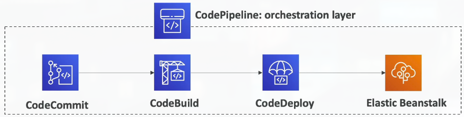
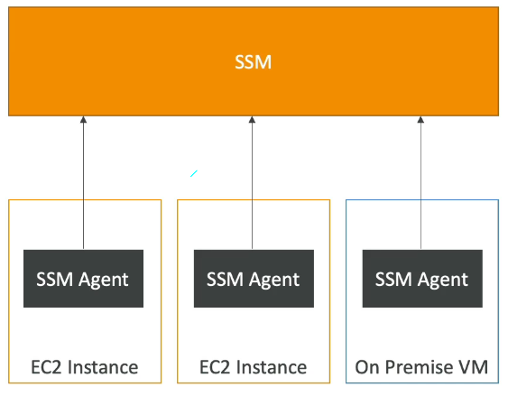
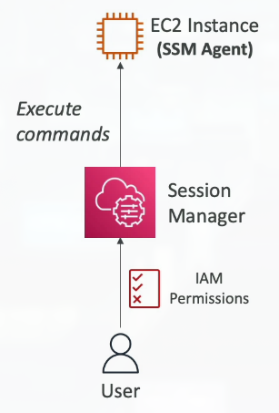
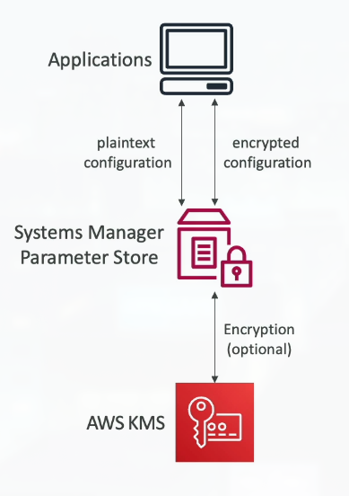

# Section 11: Deployments & Managing Infrastructure at Scale

## 123. CloudFormation Overview

### What is CloudFormation?

**AWS CloudFormation** is a **declarative way of outlining your AWS Infrastructure** for any resources (most of them are supported).

**How it works**:
- **For example, within a CloudFormation template, you declare**:
    - I want a **security group**
    - I want two **EC2 instances** using this security group
    - I want an **S3 bucket**
    - I want a **load balancer (ELB)** in front of these machines
- **Then CloudFormation creates those for you**, in the right order, with the exact configuration that you specify

> CloudFormation is like writing a recipe for your AWS infrastructure. Instead of manually clicking through the AWS console to create resources one by one, you write a template (in JSON or YAML) that describes what you want - "I need 2 EC2 instances, an S3 bucket, and a load balancer." CloudFormation reads this recipe and creates everything in the correct order, handling dependencies automatically. For example, it knows to create the security group before the EC2 instances (because instances need the security group), and to create the EC2 instances before the load balancer (because the load balancer needs to know which instances to balance). This is "declarative" - you declare what you want, not how to create it. The benefits are enormous: you can version control your infrastructure (store templates in Git), recreate identical environments (dev, staging, production), and easily tear down and rebuild everything. It's Infrastructure as Code (IaC) - treating your infrastructure like software code.

### Benefits of AWS CloudFormation

**CloudFormation** provides numerous benefits for managing AWS infrastructure:

**1. Infrastructure as Code**
    - **No resources are manually created**, which is excellent for control and consistency
    - **Changes to the infrastructure are reviewed through code** - use version control and code reviews
    - Templates can be stored in Git, tracked, and audited

**2. Cost Management**
    - **Each resource within the stack is tagged with an identifier** so you can easily see how much a stack costs you
    - **You can estimate the costs of your resources** using the CloudFormation template before creating them
    - **Savings strategy**: In Dev, you could automate deletion of templates at 5 PM and recreate them at 8 AM, safely
        - Only pay for resources during working hours

**3. Productivity**
    - **Ability to destroy and re-create an infrastructure** on the cloud on the fly
    - **Automated generation of diagrams** for your templates - visualize your architecture
    - **Declarative programming** (no need to figure out ordering and orchestration) - CloudFormation handles dependencies

**4. Don't Re-invent the Wheel**
    - **Leverage existing templates on the web** - thousands of templates available
    - **Leverage the documentation** - comprehensive AWS documentation with examples

**5. Broad Support**
    - **Supports (almost) all AWS resources**:
        - Everything we'll see in this course is supported
        - You can use "custom resources" for resources that are not supported

### CloudFormation + Infrastructure Composer

**CloudFormation** integrates with **Infrastructure Composer** to provide visual representation:

- **Example**: WordPress CloudFormation Stack
- **We can see all the resources** - visual representation of your infrastructure
- **We can see the relations between the components** - understand dependencies and connections

## 124. CloudFormation Hands On
***This is a lab tutorial lesson***

## 125. CDK Overview

### AWS Cloud Development Kit (CDK)

**AWS CDK (Cloud Development Kit)** allows you to **define your cloud infrastructure using a familiar programming language**:

- **Supported languages**: JavaScript/TypeScript, Python, Java, and .NET
- **The code is "compiled" into a CloudFormation template** (JSON/YAML) - CDK generates CloudFormation under the hood
- **You can therefore deploy infrastructure and application runtime code together**:
    - **Great for Lambda functions** - define the function and its infrastructure in one place
    - **Great for Docker containers in ECS/EKS** - package everything together

> CDK is like CloudFormation, but instead of writing JSON or YAML (which can be verbose and error-prone), you write code in a programming language you already know. If you're a Python developer, you can define your infrastructure in Python. If you're a TypeScript developer, you can use TypeScript. CDK provides "constructs" - reusable components that represent AWS resources. For example, instead of writing 50 lines of YAML to create an S3 bucket with specific settings, you write `Bucket(self, "MyBucket", versioned=True)`. CDK then compiles your code into a CloudFormation template, which AWS uses to create your infrastructure. The big advantage is that you can use programming features like loops, conditionals, and functions - making it much easier to create complex, reusable infrastructure. You can also package your application code with your infrastructure code, so when you deploy, both the infrastructure and the application are deployed together. This is especially powerful for serverless applications where the infrastructure (API Gateway, Lambda) and code are tightly coupled.

### CDK Example

## 126. Beanstalk Overview

### Typical Architecture: Web App 3-Tier

Most web applications follow a **3-tier architecture**:

### Developer Problems on AWS

When deploying applications to AWS, developers face several challenges:

- **Managing infrastructure** - setting up EC2 instances, networking, security
- **Deploying Code** - getting application code onto servers
- **Configuring all the databases, load balancers, etc** - complex setup and configuration
- **Scaling concerns** - handling traffic spikes and scaling appropriately

**The reality**:
- **Most web apps are the same architecture** (ALB + ASG + EC2 + RDS)
- **All the developers want is for their code to run** - they don't want to manage infrastructure
- **Possibly, consistently across different applications and environments** - same setup for dev, staging, production

### AWS Elastic Beanstalk Overview

**AWS Elastic Beanstalk** is a **developer-centric view of deploying an application on AWS**:

- **It uses all the components we have seen before**: **EC2**, **ASG**, **ELB**, **RDS**, etc.
- **But it's all in one view that's easy to make sense of** - simplified interface
- **We still have full control over the configuration** - can customize everything if needed
- **Beanstalk = Platform as a Service (PaaS)** - abstracts away infrastructure management

> Elastic Beanstalk is like having a personal assistant who sets up your entire AWS infrastructure for you, but you can still tell them exactly how you want it configured. Instead of manually creating EC2 instances, Auto Scaling Groups, Load Balancers, and databases, you just upload your application code (or point to your Git repository), and Beanstalk automatically provisions and configures everything. It's Platform as a Service (PaaS) - you provide the platform (your code), and AWS provides the service (the infrastructure). Beanstalk handles the "undifferentiated heavy lifting" - the infrastructure setup that's the same for most web applications. However, unlike some PaaS solutions that lock you in, Beanstalk gives you full access to the underlying resources. You can SSH into the EC2 instances, modify configurations, and even take full control if needed. This makes Beanstalk perfect for developers who want to focus on writing code but need the flexibility to customize their infrastructure when necessary.

### Elastic Beanstalk Features

**Elastic Beanstalk** is a **managed service** that handles:

- **Instance configuration / OS is handled by Beanstalk** - AWS manages the operating system
- **Deployment strategy is configurable but performed by Elastic Beanstalk** - you choose the strategy, Beanstalk executes it
- **Capacity provisioning** - automatically provisions the right amount of resources
- **Load balancing & auto-scaling** - handles traffic distribution and scaling
- **Application health-monitoring & responsiveness** - monitors your application and replaces unhealthy instances

**Developer Responsibility**:
- **Just the application code is the responsibility of the developer** - focus on your code, not infrastructure

**Three Architecture Models**:
    - **Single Instance deployment**: Good for dev - simple, cost-effective for testing
    - **LB + ASG**: Great for production or pre-production web applications - load balancer with auto-scaling
    - **ASG only**: Great for non-web apps in production (workers, etc.) - background processing without load balancer

**Support for Many Platforms**:
    - Go, Java SE, Java with Tomcat, .NET on Windows Server with IIS, Node.js, PHP, Python, Ruby
    - Packer Builder, Single Container Docker, Multi-Container Docker, Preconfigured Docker

### Elastic Beanstalk - Health Monitoring

## 127. Beanstalk Hands On
***This is a lab tutorial lesson***

## 128. CodeDeploy Overview

### AWS CodeDeploy

**AWS CodeDeploy** enables **automatic deployment of applications**:

- **We want to deploy our application automatically** - no manual deployment steps
- **Works with EC2 Instances** - deploy to AWS cloud servers
- **Works with On-Premises Servers** - deploy to your own servers
- **Hybrid service** - works across cloud and on-premises
- **Servers / Instances must be provisioned and configured ahead of time** with the **CodeDeploy Agent**

> CodeDeploy is like having an automated deployment system that knows how to update your application on multiple servers. Unlike Elastic Beanstalk which handles both infrastructure provisioning AND code deployment, CodeDeploy focuses only on deployment - it assumes your servers already exist. You install the CodeDeploy agent on your servers (EC2 instances or on-premises), and CodeDeploy can then deploy your application code to them. This is useful when you've already set up your infrastructure (maybe using CloudFormation) and just need to deploy code updates. CodeDeploy supports different deployment strategies - you can deploy to all servers at once (fast but risky), deploy to a few servers first and then roll out (safer), or use blue/green deployments (zero downtime). The agent on each server receives the deployment instructions and executes them - pulling code from S3, running installation scripts, restarting services, etc. CodeDeploy tracks the deployment status and can automatically roll back if something goes wrong. This makes it perfect for organizations that want to automate deployments but have existing infrastructure or need to deploy to on-premises servers.

## 129. IMPORTANT: CodeCommit Discontinuation

<u>**Important Notice**: On July 25th, 2025, AWS abruptly discontinued CodeCommit.</u>

- **New customers cannot use the service**
- **AWS recommends migrating to an external Git solution** (like GitHub, GitLab, or Bitbucket)

**For this course**:
    - **CodeCommit might still appear at the exam** (for now) - exam content may not be updated immediately
    - **Every time I mention CodeCommit, assume there's a GitHub integration** - the concepts are the same, just use GitHub instead

## 130. CodeCommit Overview

### AWS CodeCommit

**AWS CodeCommit** is a **source-control service** (Note: Discontinued in 2025, but concepts still relevant):

- **Before pushing the application code to servers, it needs to be stored somewhere**
- **Developers usually store code in a repository**, using the **Git technology**
- **A famous public offering is GitHub**, AWS' competing product was **CodeCommit**
- **CodeCommit** (now use GitHub instead):
    - **Source-control service that hosts Git-based repositories**
    - **Makes it easy to collaborate with others on code** - team collaboration features
    - **The code changes are automatically versioned** - full Git version control

**Benefits** (applies to Git repositories in general):
    - **Fully managed** - no servers to maintain
    - **Scalable & highly available** - handles any team size
    - **Private, Secured, Integrated with AWS** - works seamlessly with other AWS services

> CodeCommit was AWS's managed Git repository service, similar to GitHub or GitLab. While it's been discontinued, the concepts are still important. Source control is essential for any software project - it's where developers store their code, track changes, collaborate, and manage versions. Git is the most popular version control system, and services like GitHub, GitLab, or Bitbucket host Git repositories in the cloud. The key benefits are collaboration (multiple developers can work on the same codebase), version control (you can see the history of all changes and revert if needed), and integration with CI/CD pipelines (automated builds and deployments trigger when code is pushed). Even though CodeCommit is gone, AWS services integrate well with external Git providers like GitHub - you can trigger CodePipeline builds when code is pushed to GitHub, for example. The important concept is that code should be stored in version control before being deployed, and this integrates with the rest of the AWS deployment pipeline.

## 131. CodeBuild Overview

### AWS CodeBuild

**AWS CodeBuild** is a **code building service in the cloud**:

- **Compiles source code, runs tests, and produces packages** that are ready to be deployed (by CodeDeploy for example)
- **Fully managed build service** - no build servers to maintain

**Benefits**:
    - **Fully managed, serverless** - no infrastructure to manage
    - **Continuously scalable & highly available** - handles any build load
    - **Secure** - isolated build environments
    - **Pay-as-you-go pricing** - only pay for the build time

> CodeBuild is like having a dedicated build server in the cloud that you only pay for when you use it. When developers write code, it often needs to be "built" - compiled (for languages like Java or C#), packaged (for deployment), and tested. Traditionally, organizations would set up build servers that run 24/7, even when not building anything. CodeBuild is serverless - you just trigger a build (manually or automatically via CodePipeline), and AWS provisions a build environment, runs your build commands, and then tears it down. You only pay for the time the build is actually running. CodeBuild supports many programming languages and build tools (Maven, Gradle, npm, etc.) and can run custom build commands. It integrates seamlessly with CodePipeline - when code is pushed to your repository, CodePipeline automatically triggers CodeBuild to compile and test it. If the build succeeds, it can automatically deploy. If it fails, the deployment is blocked. This ensures only tested, working code gets deployed to production. CodeBuild is perfect for CI/CD pipelines where you want automated builds without managing build infrastructure.

## 132. CodePipeline Overview

### AWS CodePipeline

**AWS CodePipeline** **orchestrates the different steps** to have code automatically pushed to production:

- **Pipeline stages**: Code => Build => Test => Provision => Deploy
- **Basis for CI/CD** (Continuous Integration & Continuous Delivery) - automate the entire software delivery process

**Benefits**:
    - **Fully managed**, compatible with CodeCommit (or GitHub), CodeBuild, CodeDeploy, Elastic Beanstalk, CloudFormation, GitHub, 3rd-party services & custom plugins
    - **Fast delivery & rapid updates** - automate repetitive tasks

> CodePipeline is like an assembly line for software deployment. Instead of manually building, testing, and deploying code (which is error-prone and slow), you create a pipeline that automates these steps. The pipeline has stages: first, it pulls code from your repository (Source stage), then builds it (Build stage with CodeBuild), then tests it (Test stage), then provisions infrastructure if needed (using CloudFormation), and finally deploys it (Deploy stage with CodeDeploy or Beanstalk). Each stage can have multiple actions, and you can configure approval gates (require manual approval before deploying to production). The pipeline automatically runs when code is pushed to your repository - this is Continuous Integration (automatically building and testing on every code change). If all stages pass, the code is automatically deployed - this is Continuous Delivery (automatically deploying working code). This enables rapid, reliable deployments - developers push code, and within minutes it's tested and deployed. CodePipeline integrates with many AWS services and third-party tools, making it the central orchestration tool for CI/CD on AWS. It's fully managed, so you don't need to maintain pipeline infrastructure - just define your pipeline stages and actions, and AWS runs it for you.

## 133. CodeArtifact Overview

### AWS CodeArtifact

**AWS CodeArtifact** is a **secure, scalable, and cost-effective artifact management** service for software development:

- **Software packages depend on each other to be built** (also called code dependencies), and new ones are created
- **Storing and retrieving these dependencies is called artifact management**
- **Traditionally you need to set up your own artifact management system** - complex and expensive
- **CodeArtifact** provides managed artifact storage and retrieval
- **Works with common dependency management tools** such as Maven, Gradle, npm, yarn, twine, pip, and NuGet
- **Developers and CodeBuild can then retrieve dependencies** straight from CodeArtifact

> CodeArtifact solves the problem of managing software dependencies (also called packages or artifacts). When developers write code, they often use libraries and frameworks created by others - for example, a Python developer might use the "requests" library to make HTTP calls, or a Java developer might use Spring Framework. These dependencies need to be stored somewhere and retrieved when building applications. Traditionally, organizations would set up their own artifact repositories (like Nexus or Artifactory), which requires servers, maintenance, and configuration. CodeArtifact is AWS's managed solution - you create a repository, and developers and build systems can publish and retrieve packages from it. CodeArtifact supports many package formats (Maven for Java, npm for JavaScript, pip for Python, etc.) and can proxy public repositories (like npmjs.com or Maven Central), caching packages for faster builds. It integrates with IAM for access control, so you can control who can publish or download packages. CodeBuild can automatically retrieve dependencies from CodeArtifact during builds, ensuring consistent, fast builds. This is especially important for organizations that want to control which versions of dependencies are used, audit package usage, or have private packages that shouldn't be publicly available.

## 134. Systems Manager (SSM) Overview

### AWS Systems Manager (SSM)

**AWS Systems Manager (SSM)** helps you **manage your EC2 and On-Premises systems at scale**:

- **Another Hybrid AWS service** - works with both cloud and on-premises systems
- **Get operational insights** about the state of your infrastructure
- **Suite of 10+ products** - comprehensive management toolkit
- **Most important features are**:
    - **Patching automation** for enhanced compliance - keep systems up to date
    - **Run commands across an entire fleet of servers** - execute commands on many servers at once
    - **Store parameter configuration** with the SSM Parameter Store - centralized configuration management
- **Works for Linux, macOS, and Raspberry Pi OS (Raspbian)** - broad platform support

> Systems Manager is like having a remote control and management system for all your servers, whether they're in AWS or in your own data center. Managing hundreds or thousands of servers manually is impossible - you need automation. SSM provides a suite of tools to help: you can patch all your servers automatically (ensuring security updates are applied), run commands across your entire fleet (like updating a configuration file on all servers), and store configuration parameters centrally (so all servers can retrieve the same database connection string, for example). SSM uses an agent (the SSM agent) that runs on each server. The agent communicates with AWS Systems Manager, allowing you to manage servers without opening SSH ports or maintaining VPN connections. This is much more secure than traditional management methods. SSM is particularly powerful for hybrid environments - you can manage both your AWS EC2 instances and your on-premises servers from the same interface, using the same tools and processes. This unified management approach is essential for organizations with mixed infrastructure.

### How Systems Manager Works

**Systems Manager** requires the **SSM agent** to be installed on systems you want to manage:

- **We need to install the SSM agent** onto the systems we control
- **Installed by default on Amazon Linux AMI & some Ubuntu AMI** - comes pre-installed on many AWS images
- **If an instance can't be controlled with SSM, it's probably an issue with the SSM agent** - check agent installation and IAM permissions
- **Thanks to the SSM, we can run commands, patch & configure our servers** - all through the SSM interface

> The SSM agent is a small piece of software that runs on each server you want to manage. It's like having a secure communication channel between your server and AWS Systems Manager. The agent doesn't require any inbound ports to be opened (unlike SSH which requires port 22) - it makes outbound connections to AWS, which is much more secure. The agent receives commands from Systems Manager and executes them on the server. For example, Systems Manager can send a command to patch the operating system, and the agent executes it. The agent also sends status information back to Systems Manager, so you can see the health and state of all your servers in one place. On AWS EC2 instances, the SSM agent is often pre-installed, but you need to ensure the instance has an IAM role with SSM permissions. For on-premises servers, you need to install the agent manually and configure it with credentials to connect to AWS. Once the agent is running and has proper permissions, you can manage that server through Systems Manager without any direct network access.

## 135. SSM Session Manager

### Systems Manager - SSM Session Manager

**SSM Session Manager** allows you to **start a secure shell on your EC2 and on-premises servers**:

- **No SSH access, bastion hosts, or SSH keys needed** - completely different approach
- **No port 22 needed** (better security) - no inbound ports required
- **Supports Linux, macOS, and Windows** - cross-platform support
- **Send session log data to S3 or CloudWatch Logs** - audit and compliance

> SSM Session Manager is a game-changer for secure server access. Traditionally, to access a server, you'd need to open SSH port 22, maintain SSH keys, and possibly use a bastion host (a jump server) for security. This creates security risks - open ports can be attacked, SSH keys can be lost or stolen, and managing access is complex. Session Manager eliminates all of this. Instead of connecting directly to the server, you connect through AWS Systems Manager. The SSM agent on the server establishes an outbound connection to AWS, and your connection goes through AWS's infrastructure. This means: (1) No ports need to be open on your server (much more secure), (2) No SSH keys to manage (authentication is handled by IAM), (3) All sessions are logged (you can see who accessed what server and when), and (4) You can access servers in private subnets without a bastion host. It's like having a secure tunnel that goes through AWS, rather than directly connecting to your server. This is especially valuable for compliance and security - you have full audit trails, and you can revoke access instantly by changing IAM permissions, without needing to remove SSH keys from servers.

***This is a lab tutorial lesson***

## 136. SSM Parameter Store

### Systems Manager Parameter Store

**SSM Parameter Store** provides **secure storage for configuration and secrets**:

- **API Keys, passwords, configurations...** - store sensitive and non-sensitive data
- **Serverless, scalable, durable, easy SDK** - fully managed service
- **Control access permissions using IAM** - fine-grained access control
- **Version tracking & encryption (optional)** - track changes and secure sensitive data

> SSM Parameter Store is like a secure vault for your application configuration and secrets. Instead of hardcoding database passwords, API keys, or configuration values in your code (which is insecure and makes updates difficult), you store them in Parameter Store. Your applications retrieve these values at runtime using the Parameter Store API. This centralizes configuration management - if you need to change a database password, you update it in Parameter Store, and all applications automatically get the new value on their next request. Parameter Store supports two types of parameters: String (for non-sensitive data like configuration) and SecureString (for sensitive data like passwords, encrypted using AWS KMS). You can version parameters (track changes over time) and reference other parameters (build complex configurations). Access is controlled through IAM, so you can grant different applications access to different parameters. This is much better than storing secrets in code repositories or configuration files on servers. Parameter Store integrates seamlessly with other AWS services - Lambda functions, EC2 instances, and ECS tasks can easily retrieve parameters. It's also free for standard parameters (with some limits), making it an attractive alternative to more expensive secret management services for many use cases.

***This is a lab tutorial lesson***

## 137. Deployment Summary

### Deployment - Summary

**Infrastructure as Code**:
- **CloudFormation** (AWS only):
    - **Infrastructure as Code**, works with almost all AWS resources
    - **Repeat across Regions & Accounts** - consistent deployments everywhere
- **AWS CDK**: Define your cloud infrastructure using a programming language
    - Generates CloudFormation templates
    - Use familiar languages (Python, TypeScript, Java, .NET)

**Platform as a Service**:
- **Elastic Beanstalk** (AWS only):
    - **Platform as a Service (PaaS)**, limited to certain programming languages or Docker
    - **Deploy code consistently** with a known architecture: e.g., ALB + EC2 + RDS
    - Handles infrastructure provisioning and code deployment

**Deployment Services**:
- **CodeDeploy** (hybrid): Deploy & upgrade any application onto servers
    - Works with EC2 and on-premises servers
    - Requires CodeDeploy agent on servers

**CI/CD Pipeline**:
- **CodeCommit** (or GitHub): Store code in private Git repository (version controlled)
- **CodeBuild**: Build & test code in AWS (serverless build service)
- **CodePipeline**: Orchestration of pipeline (from code to build to deploy)
    - Connects all the pieces together
- **CodeArtifact**: Store software packages / dependencies on AWS
    - Managed artifact repository

**Management & Operations**:
- **Systems Manager (SSM)** (hybrid): Patch, configure and run commands at scale
    - **SSM Session Manager**: Secure shell access without SSH
    - **SSM Parameter Store**: Secure storage for configuration and secrets
    - Works with EC2 and on-premises servers
