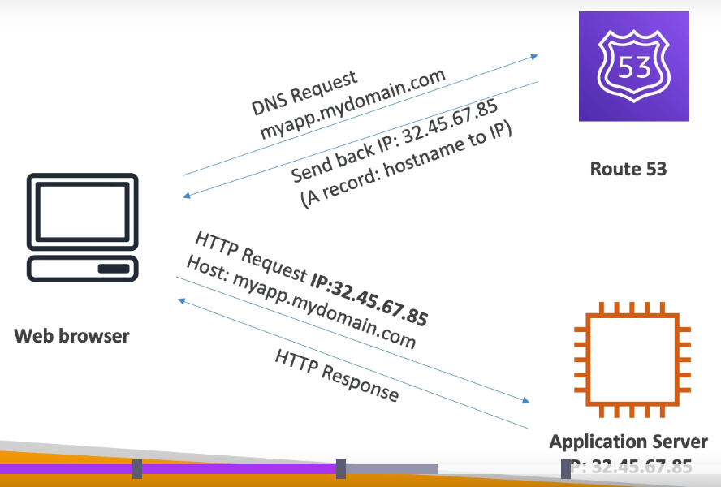
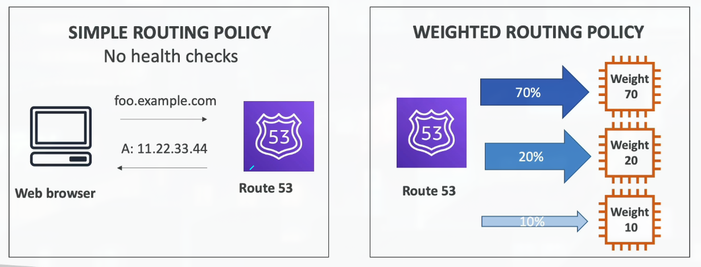
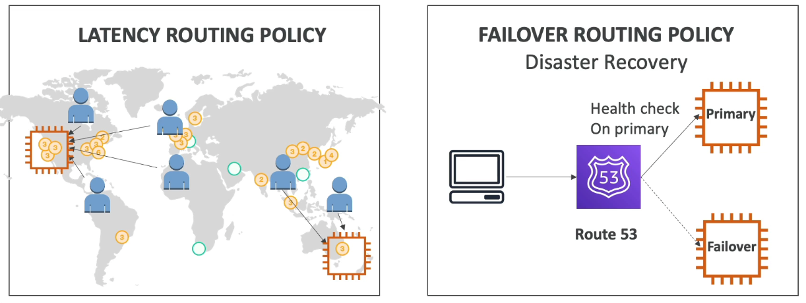

Section 12: Leveraging the AWS Global Infrastructure

## 138. Why Global Applications?

### Why make a global application?
- A global application is an application deployed in multiple geographies
- On AWS: this could be Regions and / or Edge Locations
- Decreased Latency
    - Latency is the time it takes for a network packet to reach a server
    - It takes time for a packet from Asia to reach the US
    - Deploy your applications closer to your users to decrease latency, better experience
- Disaster Recovery (DR)
    - Latency is the time it takes for a network packet to reach a server
    - It takes time for a packet from Asia to reach the US
    - Deploy your applications closer to your users to decrease latency, better experience
- Disaster Recovery (DR)
    - If an AWS region goes down (earthquake, storms, power shutdown, politics)...
    - You can fail-over to another region and have
    - A DR plan is important to increase the availability of your application
- Attack protection: distributed global infrastructure is harder to attack

### Global AWS Infrastructure
- Regions: For deploying applications and infrastructure
- Availability Zones: Made of multiple data centers
- Edge Locations (Points of Presence): for content delivery as close as possible to users
- More at: https://infrastructure.aws/

### Global Applications in AWS
- Global DNS: Route 53
    - Great to route users to the closest deployment with least latency
    - Great for disaster recovery strategies
- Global Content Delivery Network (CDN): CloudFront
    - Replicate part of your application to AWS Edge Locations - decrease latency
    - Cache common requests - improved user experience and decreased latency
- S3 Transfer Acceleration
    - Accelerate global uploads & downloads into Amazon S3
- AWS Global Accelerator:
    - Improve global application availability and performance using the AWS global network

## 139. Route 53 Overview

### Amazon Route 53 Overview
- Route53 is a Managed DNS (Domain Name System)
- DNS is a collection of rules and records which helps clients understand how to reach a server through URLs
- In AWS, the most common records are:
    - www.google.com => 12.34.56.78 == A record (IPv4)
    - www.google.com => 2001:0db8:85a3:0000:0000:8a2e:0370:7334 = AAAA IPv6
    - search.google.com => www.google.com == CNAME: hostname to hostname
    - example.com => AWS resource == Alias (ex: ELB, CloudFront, S3, RDS, etc...)

### Route 53 - Diagram for A Record

### Route 53 Routing Policies

- Need to know them at a high-level for the Cloud Practitioner

## 140. Route 53 Hands On
***This is a lab tutorial lesson***

## 141. CloudFront Overview

## 142. CloudFront Hands On

## 143. S3 Transfer Acceleration

## 144. AWS Global Accelerator

## 145. AWS Outposts

## 146. AWS WaveLength

## 147. AWS Local Zones

## 148. Global Applications Architecture

## 149. Leveraging the AWS Global Infrastructure Summary
