Section 12: Leveraging the AWS Global Infrastructure

## 138. Why Global Applications?

### Why make a global application?
- A global application is an application deployed in multiple geographies
- On AWS: this could be Regions and / or Edge Locations
- Decreased Latency
    - Latency is the time it takes for a network packet to reach a server
    - It takes time for a packet from Asia to reach the US
    - Deploy your applications closer to your users to decrease latency, better experience
- Disaster Recovery (DR)
    - Latency is the time it takes for a network packet to reach a server
    - It takes time for a packet from Asia to reach the US
    - Deploy your applications closer to your users to decrease latency, better experience
- Disaster Recovery (DR)
    - If an AWS region goes down (earthquake, storms, power shutdown, politics)...
    - You can fail-over to another region and have
    - A DR plan is important to increase the availability of your application
- Attack protection: distributed global infrastructure is harder to attack

### Global AWS Infrastructure
- Regions: For deploying applications and infrastructure
- Availability Zones: Made of multiple data centers
- Edge Locations (Points of Presence): for content delivery as close as possible to users
- More at: https://infrastructure.aws/

### Global Applications in AWS
- Global DNS: Route 53
    - Great to route users to the closest deployment with least latency
    - Great for disaster recovery strategies
- Global Content Delivery Network (CDN): CloudFront
    - Replicate part of your application to AWS Edge Locations - decrease latency
    - Cache common requests - improved user experience and decreased latency
- S3 Transfer Acceleration
    - Accelerate global uploads & downloads into Amazon S3
- AWS Global Accelerator:
    - Improve global application availability and performance using the AWS global network

## 139. Route 53 Overview

### Amazon Route 53 Overview
- Route53 is a Managed DNS (Domain Name System)
- DNS is a collection of rules and records which helps clients understand how to reach a server through URLs
- In AWS, the most common records are:
    - www.google.com => 12.34.56.78 == A record (IPv4)
    - www.google.com => 2001:0db8:85a3:0000:0000:8a2e:0370:7334 = AAAA IPv6
    - search.google.com => www.google.com == CNAME: hostname to hostname
    - example.com => AWS resource == Alias (ex: ELB, CloudFront, S3, RDS, etc...)

### Route 53 - Diagram for A Record

### Route 53 Routing Policies

- Need to know them at a high-level for the Cloud Practitioner

## 140. Route 53 Hands On
***This is a lab tutorial lesson***

## 141. CloudFront Overview

### AWS CloudFront
- Content Delivery Network (CDN)
- Improves read performance, content is cached at the edge
- Improves users experience
- Hundreds of Points of Presence globally (edge locations, caches)
- DDoS protection (because worldwide), integration with Shield, AWS Web Application Firewall

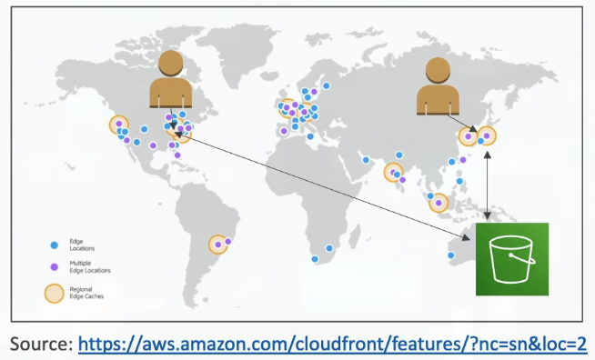

### CloudFront - Origins
- S3 bucket
    - For distributed files and caching them at the edge
    - For uploading files to S3 through CloudFront
    - Secured using Origin Access Control (OAC)
- VPC Origin
    - For applications hosted in VPC private subnets
    - Application Load Balancer / Network Load Balancer / EC2 Instances
- Custom Origin (HTTP)
    - S3 website (must first enable the bucket as a static S3 website)
    - Any public HTTP backend you want

### CloudFront at a high level

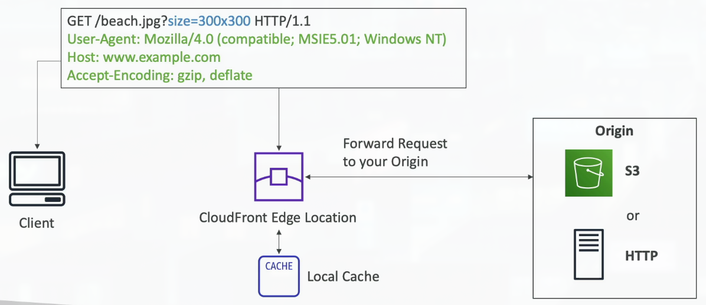

### CloudFront - S3 as an Origin

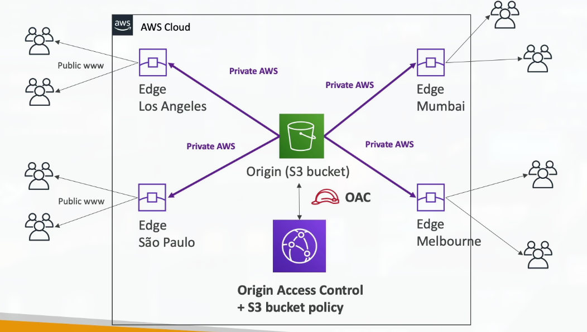

### CloudFront vs S3 Cross Region Replication
- CloudFront
    - Global Edge network
    - Files are cached for a TTL (maybe a day)
    - Great for static content that must be available everywhere
- S3 Cross Region Replication
    - Must be setup for each region you want replication to happen
    - Files are updated in near real-time
    - Read only
    - Great for dynamic content that needs to be available at low-latency in few regions

## 142. CloudFront Hands On
***This is a lab tutorial lesson***

## 143. S3 Transfer Acceleration

### S3 Transfer Acceleration
- Increase transfer speed by transferring file to an AWS edge location which will forward the data to the S3 bucket in the target region

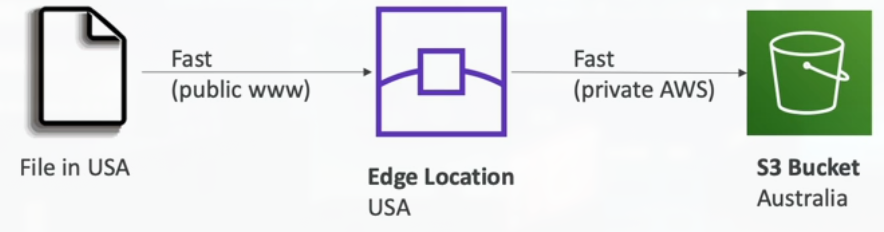

***This is a lab tutorial lesson***

## 144. AWS Global Accelerator

### AWS Global Accelerator

- Improve global application availability and performance using the AWS global network
- Leverage the AWS internal network to optimize the route to your application (60% improvement)
- 2 Anycast IP are created for your application and traffic is sent through Edge Locations

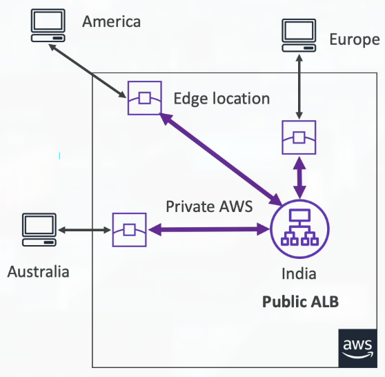

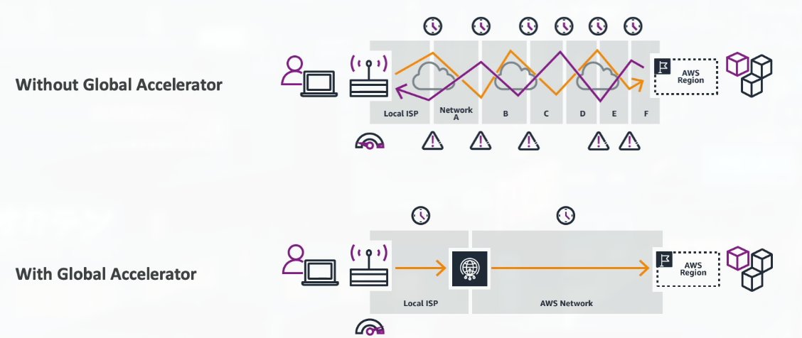

### AWS Global Accelerator vs CloudFront
- They both use the AWS global network and its edge locations around the world
- Both services integrate with AWS Shield for DDoS protection
- CloudFront - Content Delivery Network
    - Improves performance for your cacheable content (such as images and videos)
    - Content is served at the edge
- Global Accelerator
    - No caching, proxying packets at the edge to appplcations running in one or more AWS Regions
    - Improves performance for a wide range of applications over TCP or UDP
    - Good for HTTP use cases that require static IP addresses
    - Good for HTTP use cases that required deterministic, fast regional failover

## 145. AWS Outposts

### AWS Outposts
- Hybrid Cloud: business that keep an on-premises infrastructure alongside a cloud infrastructure
- Therefore, two ways of dealing with IT systems:
    - One for the AWS cloud (using the AWS console, CLI, and AWS APIs)
    - One for their on-premises infrastructure
- AWS Outposts are "server racks" that offers the same AWS infrastructure, services, APIs & tools to build your own applications on-premises just as in the cloud
- AWS will setup a manage "Outposts Racks" within your on-premises infrastructure and you can start leveraging AWS services on-premises
- You are responsible for the Outposts Rack physical security

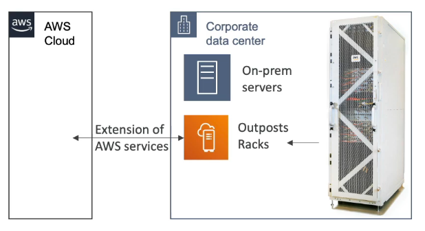

- Benefits:
    - Low-latency access to on-premises systems
    - Local data processing
    - Data residency
    - Easier migration from on-premises to the cloud
    - Fully managed service
- Some services that work on Outposts:

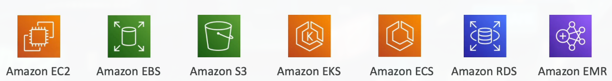

## 146. AWS WaveLength

### AWS WaveLength
- WaveLength Zones are infrastructure deployments embedded within the telecommunications providers' datacenters at the edge of the 5G networks
- Brings AWS services to the edge of the 5G networks
- Example: EC2, EBS, VPC...
- Ultra-low latency applications through 5G networks
- Traffic doesn't leave the Communication Service Provider's (CSP) network
- High-bandwidth and secure connection to the parent AWS Region
- No additional charges or service agreements
- Use cases: Smart Cities, ML-assisted diagnostics, Connected Vehicles, Interactive Live Video Streams, AR/VR Real-time Gaming...

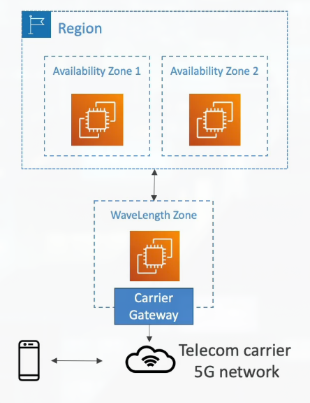

## 147. AWS Local Zones
***This is a lab tutorial lesson***

## 148. Global Applications Architecture

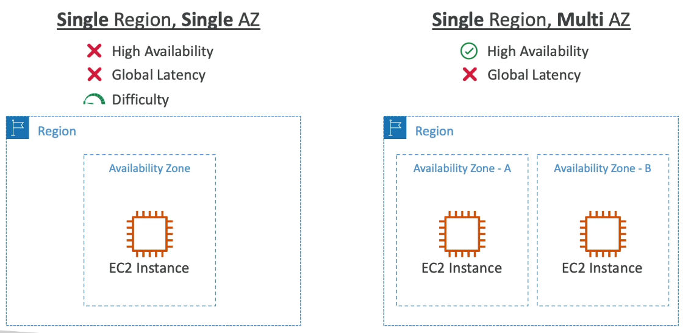

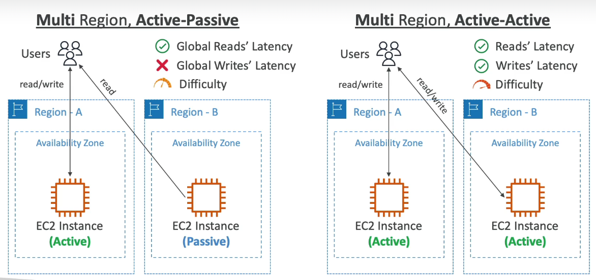

## 149. Leveraging the AWS Global Infrastructure Summary

### Global Applications in AWS - Summary
- Global DNS: Route 53
    - Great to route users to the closest deployment with least latency
    - Great for disaster recovery strategies
- Global Content Delivery Network (CDN): CloudFron
    - Replicate part of your application to AWS Edge Locations - decrease latency
    - Cache common requests - improved user experience and decreased latency
- S3 Transfer Acceleration
    - Acceleration global uploads & downloads into Amazon S3
- AWS Global Accelerator
    - Improve global application availability and performance using the AWS global network
- AWS Outposts
    - Deploy Outposts Racks in your own Data Centers to extend AWS services
- AWS WaveLength
    - Brings AWS services to the edge of the 5G networks
    - Ultra-low latency applications
- AWS Local Zones
    - Bring AWS resources (compute, database, storage, ...) closer to your users
    - Good for latency-sensitive applications
