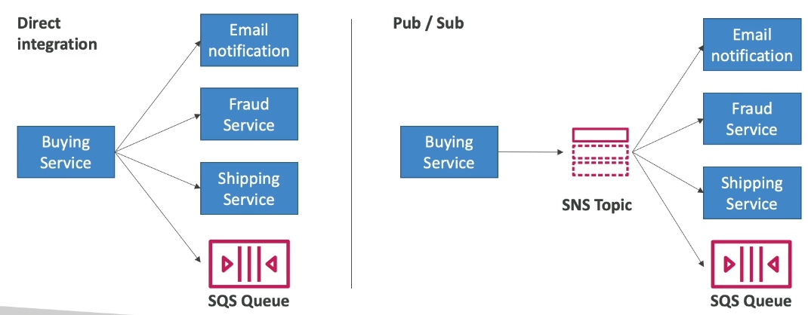
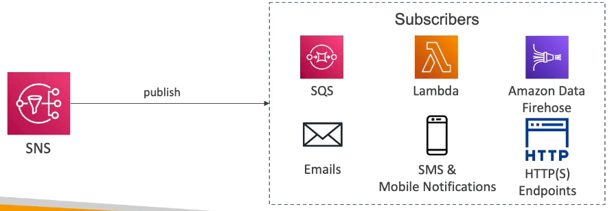

# Section 13: Cloud Integrations

## 150. Cloud Integrations Overview

### Section Introduction

**When we start deploying multiple applications, they will inevitably need to communicate with one another**. There are **two patterns of application communication**:

**Synchronous communication** between applications can be problematic if there are sudden spikes of traffic:
- **What if you need to suddenly encode 1000 videos but usually it's 10?**
- The receiving application might be overwhelmed and crash
- Both applications must be available at the same time

**In that case, it's better to decouple your applications**:
    - **Using SQS**: Queue model - messages wait in a queue until processed
    - **Using SNS**: Pub/sub model - one message sent to many subscribers
    - **Using Kinesis**: Real-time data streaming model - continuous data streams

**These services can scale independently from our application!** - they handle the load automatically

> Application integration is about how different parts of your system communicate. Synchronous communication is like a phone call - both parties must be available at the same time, and if one is busy, the other has to wait. This works fine for simple interactions, but becomes problematic when you have traffic spikes. For example, if your web application suddenly receives 1000 orders, and each order needs to trigger a video encoding process, synchronous communication means your web app has to wait for each encoding to complete before handling the next order. This creates bottlenecks and can cause your application to crash. Asynchronous communication is like sending emails or text messages - you send the message, and the recipient processes it when they're ready. This "decoupling" allows each part of your system to scale independently. AWS provides three main services for this: SQS (queues - like a to-do list), SNS (pub/sub - like a newsletter), and Kinesis (streaming - like a live data feed). These services are fully managed and scale automatically, so you don't have to worry about infrastructure.

## 151. SQS Overview

### Amazon SQS - Simple Queue Service

**What's a queue?**

A **queue** is like a waiting line - messages are added to one end and processed from the other end. **SQS (Simple Queue Service)** is AWS's managed queue service.

> Think of SQS like a post office box system. Producers (applications that create messages) put messages into the queue, and consumers (applications that process messages) retrieve and process them. The queue acts as a buffer - if producers create messages faster than consumers can process them, the messages wait in the queue. If consumers process messages faster than producers create them, consumers wait for new messages. This decouples producers from consumers - they don't need to know about each other or be available at the same time. For example, a web application might put order processing requests into a queue, and a separate order processing service retrieves and processes them. If the order processing service is busy or temporarily unavailable, orders just wait in the queue until it's ready. This makes systems more resilient and scalable.

### Amazon SQS - Standard Queue

**Amazon SQS Standard Queue** is the default queue type:

- **Oldest AWS offering** (over 10 years old) - battle-tested and reliable
- **Fully managed service (~serverless)**, use to decouple applications
- **Scales from 1 message per second to 10,000s per second** - automatic scaling
- **Default retention of messages**: 4 days, **maximum of 14 days** - messages persist even if consumers are down
- **No limit to how many messages can be in the queue** - unlimited capacity
- **Messages are deleted after they're read by consumers** - once processed, they're gone
- **Low latency** (< 10ms on publish and receive) - very fast
- **Consumers share the work** to read messages & scale horizontally - multiple consumers can process messages in parallel

> Standard Queues provide best-effort ordering and at-least-once delivery. This means messages might arrive out of order (message 2 might arrive before message 1), and occasionally a message might be delivered more than once. This is by design - Standard Queues prioritize throughput and availability over strict ordering. If you have 10 consumers reading from the same queue, they'll all compete for messages, and whichever consumer is fastest will get more messages. This allows you to scale horizontally - just add more consumers, and they'll automatically share the workload. Standard Queues are perfect for most use cases where you need high throughput and can handle occasional duplicate messages or out-of-order delivery. The 14-day retention is generous - if your consumers are down for a week, messages will still be there when they come back online.

### SQS to Decouple Between Application Tiers

**SQS is commonly used to decouple application tiers** - separating frontend, backend, and processing layers:

> Decoupling application tiers means making them independent - the frontend doesn't need to wait for the backend, and the backend doesn't need to know about the processing layer. For example, a web application might receive user uploads (frontend), put processing requests in an SQS queue (decoupling), and have a separate service process those uploads (backend). If the processing service is slow or temporarily unavailable, the web application continues working - it just adds requests to the queue. When the processing service is ready, it processes the backlog. This architecture is much more resilient and scalable than tightly coupled systems where each tier must wait for the previous one.

### Amazon SQS - FIFO Queue

**Amazon SQS FIFO Queue** provides strict ordering and exactly-once processing:

- **FIFO = First In First Out** (ordering of messages in the queue)
- **Messages are processed in order** by the consumer - strict ordering guaranteed
- **Exactly-once delivery** - messages are delivered once and only once (no duplicates)
- **Limited throughput**: 300 messages per second (with batching) or 3,000 messages per second with high-throughput mode
- **Message groups**: Messages with the same group ID are processed in order
- **Deduplication**: Prevents duplicate messages within a 5-minute window

> FIFO Queues are like a single-file line at a bank - everyone must be served in the exact order they arrived. Standard Queues are like multiple tellers - whoever is available first gets served. FIFO Queues guarantee that messages are processed in the exact order they were sent, and each message is delivered exactly once (no duplicates). This is important for applications where order matters - like processing financial transactions where you must debit before crediting, or processing user actions where you need to maintain sequence. However, this comes with trade-offs: FIFO Queues have lower throughput (300 messages/second vs unlimited for Standard), and you can't have multiple consumers processing the same message group in parallel (they must process sequentially to maintain order). Use FIFO Queues when order and exactly-once delivery are critical. Use Standard Queues when you need maximum throughput and can handle occasional duplicates or out-of-order messages.

## 152. SQS Hands On
***This is a lab tutorial lesson***

## 153. Kinesis Overview

### Amazon Kinesis Data Streams

**Amazon Kinesis** is AWS's real-time data streaming service:

- **For the exam: Kinesis = real-time big data streaming**
- **Managed service to collect, process, and analyze real-time streaming data** at any scale
- **Designed for continuous data streams** - not individual messages like SQS

**Too detailed for the Cloud Practitioner exam but good to know**:
    - **Amazon Kinesis Data Streams**: Low latency streaming to ingest data at scale from hundreds of thousands of sources
    - **Amazon Kinesis Data Firehose**: Load Kinesis Data Streams into Amazon S3, Redshift, OpenSearch, etc.
    - **Amazon Kinesis Data Analytics**: Analyze streaming data in real-time using SQL
    - **Amazon Kinesis Video Streams**: Stream video from connected devices

> Kinesis is fundamentally different from SQS. SQS is for discrete messages (like "process this order"), while Kinesis is for continuous data streams (like "here's a continuous feed of clickstream data from our website"). Think of SQS like a mailbox (individual letters) and Kinesis like a live news feed (continuous stream of information). Kinesis is designed for scenarios where you have massive amounts of data coming in continuously - like IoT sensor data, website clickstreams, log files, or social media feeds. The data flows through "shards" (partitions), and multiple consumers can read from the same stream simultaneously. Unlike SQS where messages are deleted after being read, Kinesis retains data for a configurable period (default 24 hours, up to 7 days), allowing multiple consumers to read the same data. Kinesis Data Firehose is a simpler service that automatically loads streaming data into destinations like S3, Redshift, or Elasticsearch without you having to write consumer applications. For the Cloud Practitioner exam, just remember: Kinesis = real-time big data streaming.

### Amazon Kinesis (High-level Overview)

## 154. SNS Overview

### Amazon SNS

**Amazon SNS (Simple Notification Service)** is a **pub/sub (publish/subscribe) messaging service**:

- **What if you want to send one message to many receivers?** - SNS solves this
- **The "event publishers" only send message to one SNS topic** - simple publishing
- **As many "event subscribers" as we want** to listen to the SNS topic notifications
- **Each subscriber to the topic will get all the messages** - fan-out pattern
- **Up to 12,500,000 subscriptions per topic**, 100,000 topics limit - massive scale

> SNS is like a radio station - one broadcaster (publisher) sends a message, and everyone tuned in (subscribers) receives it. This is the "pub/sub" (publish/subscribe) pattern. Unlike SQS where messages are queued and consumed by one consumer, SNS delivers the same message to all subscribers simultaneously. For example, when a user places an order, you might publish an event to an SNS topic. Multiple subscribers might listen: one sends a confirmation email, one updates inventory, one triggers a shipping process, and one sends a notification to the mobile app. All of these happen in parallel, and the publisher doesn't need to know about any of them - it just publishes to the topic. SNS supports multiple subscription types: email, SMS, HTTP/HTTPS endpoints, Lambda functions, SQS queues, and mobile push notifications. This makes SNS perfect for event-driven architectures where one event needs to trigger multiple actions. SNS is also commonly used with SQS - you can have SNS publish to multiple SQS queues, creating a fan-out pattern where the same message is delivered to multiple queues for different processing.

## 155. SNS Hands On
***This is a lab tutorial lesson***

## 156. Amazon MQ Overview

### Amazon MQ

**Amazon MQ** is a **managed message broker service** for applications that need traditional messaging protocols:

- **SQS, SNS are "cloud native" services**: Proprietary protocols from AWS
- **Traditional applications running from on-premises** may use open protocols such as: **MQTT, AMQP, STOMP, Openwire, WSS**
- **When migrating to the cloud**, instead of re-engineering the application to use SQS and SNS, we can use **Amazon MQ**
- **Amazon MQ is a managed message broker service** for **RabbitMQ and ActiveMQ**
- **Amazon MQ does not "scale" as much as SQS / SNS** - has scaling limitations
- **Amazon MQ runs on servers**, can run in **Multi-AZ with failover** - more like traditional infrastructure
- **Amazon MQ has both queue feature (~SQS) and topic features (~SNS)** - supports both patterns

> Amazon MQ bridges the gap between traditional messaging systems and AWS cloud-native services. Many enterprise applications were built using standard messaging protocols like AMQP (Advanced Message Queuing Protocol) or MQTT (Message Queuing Telemetry Transport). These applications expect to connect to message brokers like RabbitMQ or ActiveMQ. If you migrate these applications to AWS, you have two options: (1) Rewrite them to use SQS/SNS (which use AWS proprietary APIs), or (2) Use Amazon MQ, which provides managed RabbitMQ and ActiveMQ brokers. Amazon MQ is essentially AWS hosting and managing RabbitMQ or ActiveMQ for you, so your existing applications can connect without code changes. However, Amazon MQ has limitations compared to SQS/SNS - it doesn't scale as well (it runs on actual servers, not serverless), and it's more expensive. Use Amazon MQ when you have existing applications that use standard messaging protocols and you don't want to rewrite them. For new applications, SQS and SNS are generally better choices because they're more scalable, cheaper, and fully serverless.

## 157. Cloud Integrations Summary

### Integration Section - Summary

**SQS (Simple Queue Service)**:
    - **Queue service in AWS** - message queue for decoupling applications
    - **Multiple Producers** - many applications can send messages
    - **Messages are kept up to 14 days** - persistent storage
    - **Multiple Consumers share the read** and delete messages when done - horizontal scaling
    - **Used to decouple applications in AWS** - asynchronous processing
    - **Two types**: Standard Queue (high throughput) and FIFO Queue (strict ordering)

**SNS (Simple Notification Service)**:
    - **Notification service in AWS** - pub/sub messaging
    - **Subscribers**: Email, Lambda, SQS, HTTP, Mobile push notifications...
    - **Multiple Subscribers** - send all messages to all of them (fan-out pattern)
    - **No message retention** - messages are delivered immediately, not stored
    - **One-to-many messaging** - one publisher, many subscribers

**Kinesis**:
    - **Real-time data streaming** - continuous data streams
    - **Persistence and analysis** - data retained for processing
    - **Designed for big data** - high-volume, continuous data ingestion
    - **Multiple consumers** can read the same stream

**Amazon MQ**:
    - **Managed message broker** for ActiveMQ and RabbitMQ in the cloud
    - **Supports open protocols**: MQTT, AMQP, STOMP, Openwire, WSS
    - **For migrating traditional applications** - no code changes needed
    - **Both queue and topic features** - supports both SQS-like and SNS-like patterns
    - **Less scalable than SQS/SNS** - runs on servers, not serverless
