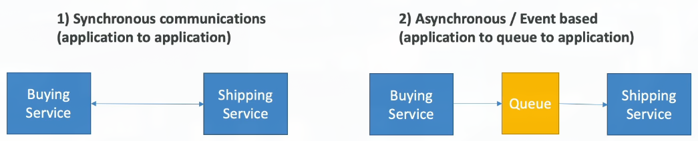
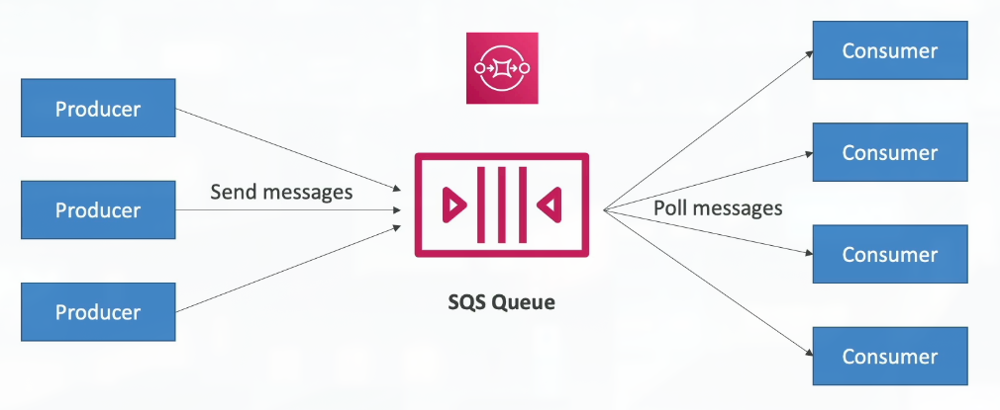
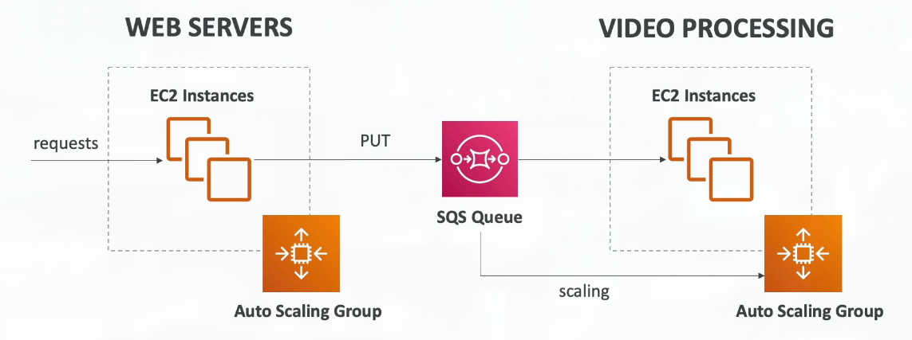
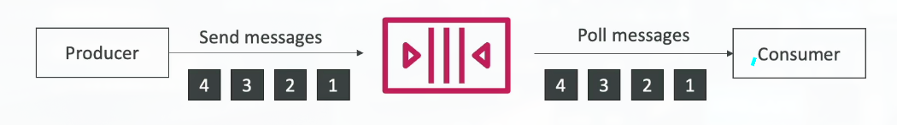
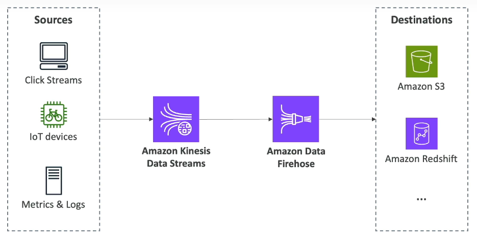

# Section 13: Cloud Integrations

## 150. Cloud Integrations Overview

### Section Introduction

- When we start deploying multiple applications, they will inevitably need to communicate with one another
- There are two patterns of application communication

- Synchronous between applications can be problematic if there are sudden spikes of traffic
- What if you need to suddenly encode 1000 videos but usually it's 10?

- In that case, it's better to decouple your applications:
    - using SQS: queue model
    - using SNS: pub/sub model
    - using Kinesis: real-time data streaming model
- These services can scale independently from our application!

## 151. SQS Overview

### Amazon SQS - Simple Queue Service

What's a queue?

### Amazon SQS - Standard Queue
- Oldest AWS offering (over 10 years old)
- Fully managed service (~serverless), use to decouple applications
- Scales from 1 message per second to 10,000s per second
- Default retention of messages: 4 days, maximum of 14 days
- No limit to how many messages can be in the queue
- Messages are deleted after they're read by consumers
- Low latency (< 10ms on publish and receive)
- Consumers share the work to read messages & scale horizontally

### SQS to decouple between application tiers

### Amazon SQS - FIFO Queue

- FIFO = First In First Out (ordering of messages in the queue)

- Messages are processed in order by the consumer

## 152. SQS Hands On
***This is a lab tutorial lesson***

## 153. Kinesis Overview

### Amazon Kinesis Data Streams

- For the exam: Kinesis = real-time big data streaming
- Managed service to collect, process, and analyze real-time streaming data at any scale

- Too detailed for the Cloud Practitioner exam but good to know:
    - Amazon Kinesis Data Streams: low latency streaming to ingest data at scale from hundreds of thousangs of sources
    - Amazon Data Firehose: load Kinesis Data Streams into Amazon S3 Redshift, OpenSearch, etc...

### Amazon Kinesis (High-level Overview)

## 154. SNS Overview

## 155. SNS Hands On

## 156. Amazon MQ Overview

## 157. Cloud Integrations Summary
