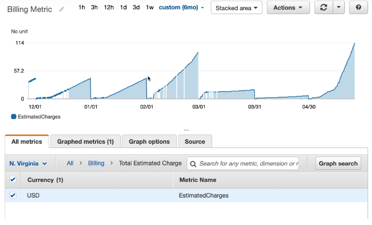
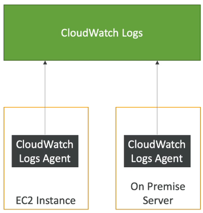
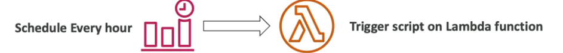
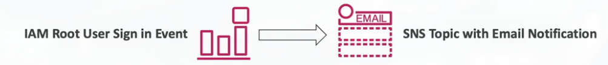
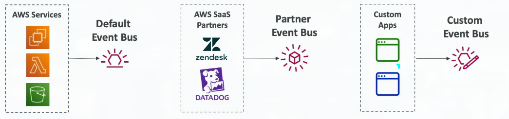
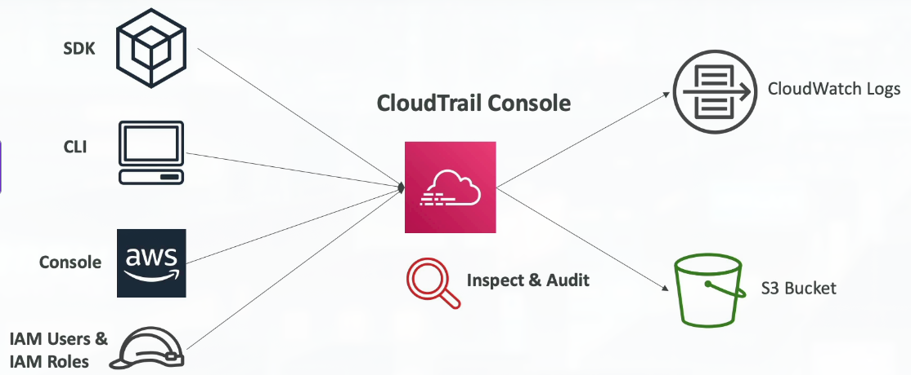
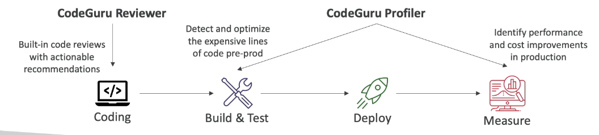
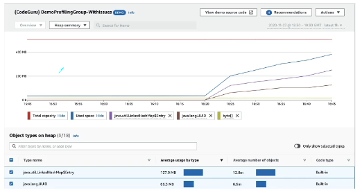
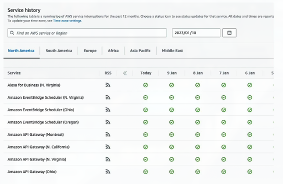
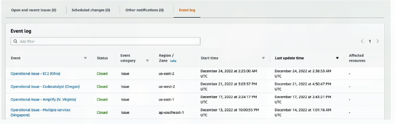

# Section 14: Cloud Monitoring

## 158. CloudWatch Metrics & CloudWatch Alarms Overview

### Amazon CloudWatch Metrics

**Amazon CloudWatch** is AWS's monitoring and observability service:

- **CloudWatch provides metrics for every service in AWS** - comprehensive monitoring
- **Metric is a variable to monitor** (CPU Utilization, Network In, etc.) - a data point over time
- **Metrics have timestamps** - time-series data
- **Can create CloudWatch dashboards** of metrics - visualize your infrastructure

> CloudWatch Metrics are like the dashboard in your car - they show you what's happening with your AWS resources in real-time. Every AWS service automatically sends metrics to CloudWatch - things like CPU usage, network traffic, request counts, error rates, etc. These metrics are stored as time-series data (values over time), so you can see trends and patterns. For example, you can see that your EC2 instance's CPU usage spiked at 2 PM yesterday, or that your S3 bucket received 1 million requests today. CloudWatch collects these metrics automatically - you don't need to do anything. You can then create dashboards to visualize multiple metrics together, making it easy to see the health of your entire infrastructure at a glance. Metrics are fundamental to monitoring - they tell you what's happening, but they don't tell you when something is wrong. That's where CloudWatch Alarms come in.

### Example: CloudWatch Billing metric (us-east-1)

### Important Metrics

**Key metrics to monitor for different AWS services**:

- **EC2 instances**: CPU Utilization, Status Check, Network (not RAM by default)
    - **Default metrics every 5 minutes** - basic monitoring included
    - **Option for Detailed Monitoring ($$$)**: Metrics every 1 minute - more granular data
- **EBS volumes**: Disk Read/Writes - I/O performance
- **S3 buckets**: Bucket Size Bytes, Number Of Objects, All Requests - storage and access metrics
- **Billing**: Total Estimated Charge (only in us-east-1) - track your AWS costs
- **Service Limits**: How much you have been using a service API - avoid hitting limits
- **Custom metrics**: Push your own metrics - monitor application-specific data

> Understanding which metrics matter for each service is crucial. EC2 instances provide CPU, network, and status check metrics by default, but not RAM - you'd need to use CloudWatch agent for that. The status check metrics are particularly important - they tell you if the instance itself is healthy (instance status check) and if the operating system is responding (system status check). S3 metrics help you understand storage usage and access patterns - useful for cost optimization. Billing metrics are critical for cost management - you can set alarms to notify you when costs exceed thresholds. Custom metrics allow you to monitor anything your application cares about - like queue depth, processing time, or business metrics. The key is to monitor metrics that matter for your application's health and performance, not just collect everything.

### Amazon CloudWatch Alarms

**CloudWatch Alarms** are used to **trigger notifications and actions for any metric**:

- **Alarm actions**:
    - **Auto Scaling**: Increase or decrease EC2 instances "desired" count - automatic scaling
    - **EC2 Actions**: Stop, terminate, reboot or recover an EC2 instance - automated remediation
    - **SNS notifications**: Send a notification into an SNS topic - alert teams
- **Various options** (sampling, %, max, min, etc.) - flexible threshold configuration
- **Can choose the period** on which to evaluate an alarm - how long to monitor before triggering
- **Example**: Create a billing alarm on the CloudWatch Billing metric - cost management
- **Alarm States**: **OK**, **INSUFFICIENT_DATA**, **ALARM** - three possible states

> CloudWatch Alarms are like smoke detectors for your infrastructure - they watch metrics and alert you (or take action) when something goes wrong. You define a threshold (like "CPU > 80% for 5 minutes"), and the alarm monitors the metric. When the condition is met, the alarm enters the ALARM state and can trigger actions. This is where monitoring becomes actionable - instead of just watching metrics, alarms can automatically respond. For example, if CPU usage is high, an alarm can trigger Auto Scaling to add more instances. If an instance is unhealthy, an alarm can trigger a recovery action. Billing alarms are particularly important - you can set an alarm to notify you when your estimated monthly charges exceed a threshold, helping you avoid surprise bills. Alarms have three states: OK (everything is fine), ALARM (threshold exceeded), and INSUFFICIENT_DATA (not enough data to evaluate - common when you first create an alarm or when a resource is starting up). The key to effective alarms is setting appropriate thresholds - too sensitive and you get false alarms, too lenient and you miss real issues.

## 159. CloudWatch Metrics & CloudWatch Alarms Hands On
***This is a lab tutorial lesson***

## 160. CloudWatch Logs Overview

### Amazon CloudWatch Logs

**CloudWatch Logs** can collect logs from various sources:

- **Elastic Beanstalk**: Collection of logs from application - automatic log collection
- **ECS**: Collection from containers - containerized application logs
- **AWS Lambda**: Collection from function logs - serverless function logs
- **CloudTrail based on filter** - API call logs
- **CloudWatch log agents**: On EC2 machines or on-premises servers - custom log collection
- **Route 53**: Log DNS queries - DNS resolution logs
- **Enables real-time monitoring of logs** - search and analyze logs as they arrive
- **Adjustable CloudWatch Logs retention** - configure how long to keep logs (1 day to forever)

> CloudWatch Logs is like a centralized filing system for all your application and infrastructure logs. Instead of logging into each server to check logs, you send all logs to CloudWatch Logs where they're stored, indexed, and searchable. Many AWS services automatically send logs to CloudWatch Logs - Lambda functions, Elastic Beanstalk applications, and ECS containers all send logs automatically. For EC2 instances and on-premises servers, you need to install the CloudWatch agent, which reads log files and sends them to CloudWatch. Once logs are in CloudWatch, you can search them using CloudWatch Logs Insights (a query language), set up metric filters (extract metrics from log data), and create alarms based on log patterns (like "alert me if I see 'ERROR' in the logs"). Log retention is important for cost management - logs are stored, so keeping them forever can get expensive. You can set retention policies to automatically delete old logs, or export them to S3 for long-term archival at a lower cost.

### CloudWatch Logs for EC2

**CloudWatch Logs for EC2** requires manual configuration:

- **By default, no logs from your EC2 instance will go to CloudWatch** - automatic collection is not enabled
- **You need to run a CloudWatch agent on EC2** to push the log files you want - manual setup required
- **Make sure IAM permissions are correct** - the agent needs permissions to write to CloudWatch Logs
- **The CloudWatch log agent can be set up on-premises too** - hybrid cloud logging

> Unlike Lambda or Elastic Beanstalk which automatically send logs to CloudWatch, EC2 instances require you to install and configure the CloudWatch agent. This is because EC2 instances are just virtual machines - AWS doesn't know what's running on them or where your application logs are stored. The CloudWatch agent is a small program that runs on your EC2 instance, reads log files from specified locations (like `/var/log/myapp.log`), and sends them to CloudWatch Logs. You configure which log files to monitor, and the agent handles the rest. The agent needs IAM permissions (typically through an IAM role attached to the EC2 instance) to write to CloudWatch Logs. This same agent can also collect system-level metrics (like memory usage) that aren't available by default. The agent can also be installed on on-premises servers, allowing you to centralize logs from both cloud and on-premises infrastructure in CloudWatch.

## 161. CloudWatch Logs Hands On
***This is a lab tutorial lesson***

## 162. EventBridge Overview (formerly CloudWatch Events)

### Amazon EventBridge (formerly CloudWatch Events)

**Amazon EventBridge** is a **serverless event bus** that makes it easy to connect applications using data from your own applications, integrated Software-as-a-Service (SaaS) applications, and AWS services:

- **Schedule**: Cron jobs (scheduled scripts) - time-based triggers
- **Event Pattern**: Event rules to react to a service doing something - event-driven triggers
- **Trigger Lambda functions, send SQS/SNS messages...** - various target actions

**Additional Features**:
- **Schema Registry**: Model event schema - define and discover event structures
- **You can archive events** (all/filter) sent to an event bus (indefinitely or set period) - event replay capability
- **Ability to replay archived events** - useful for testing and recovery

> EventBridge is like a smart event router for your AWS infrastructure. It watches for events (things that happen in AWS or your applications) and routes them to targets (like Lambda functions, SQS queues, or SNS topics) based on rules you define. There are two main ways to use EventBridge: (1) Scheduled rules - like cron jobs, trigger something on a schedule (e.g., "run this Lambda function every day at 2 AM"), and (2) Event patterns - react to events as they happen (e.g., "when an EC2 instance is launched, send a notification"). EventBridge supports three types of event buses: Default (AWS service events), Partner (events from SaaS partners like Datadog or PagerDuty), and Custom (your own application events). The Schema Registry helps you understand event structures - AWS services publish schemas for their events, making it easier to build applications that consume them. Event archiving and replay is powerful for disaster recovery or testing - you can archive all events and replay them later to rebuild state or test scenarios. EventBridge is the evolution of CloudWatch Events with additional features for building event-driven architectures.

## 163. EventBridge Hands On
***This is a lab tutorial lesson***

## 164. CloudTrail Overview

### AWS CloudTrail

**AWS CloudTrail** provides **governance, compliance, and audit** for your AWS Account:

- **CloudTrail is enabled by default!** - basic logging is automatic
- **Get a history of events / API calls** made within your AWS Account by:
    - **Console** - web interface actions
    - **SDK** - programmatic API calls
    - **CLI** - command-line interface calls
    - **AWS Services** - service-to-service API calls
- **Can put logs from CloudTrail into CloudWatch Logs or S3** - centralized log storage
- **A trail can be applied to all Regions (default) or a single Region** - regional or global logging
- **If a resource is deleted in AWS, investigate CloudTrail first!** - audit trail for troubleshooting

> CloudTrail is like a security camera system for your AWS account - it records everything that happens. Every API call made in your AWS account is logged by CloudTrail, including who made it, when, from where (IP address), and what the result was. This is essential for security, compliance, and troubleshooting. CloudTrail is enabled by default and logs management events (like creating or deleting resources) for the last 90 days. For more comprehensive logging (including data events like S3 object access), you need to create a trail, which stores logs in S3 for long-term retention and analysis. CloudTrail logs are invaluable for security investigations - if someone deletes a resource, you can see exactly who did it, when, and from where. They're also essential for compliance - many regulations require audit logs of who accessed what and when. CloudTrail logs can be sent to CloudWatch Logs for real-time monitoring and alerting, or stored in S3 for long-term archival and analysis. The key difference from CloudWatch is that CloudWatch monitors resource performance (metrics), while CloudTrail monitors who did what (audit logs).

### CloudTrail Diagram

## 165. CloudTrail Hands On
***This is a lab tutorial lesson***

## 166. X-Ray Overview

### AWS X-Ray

**AWS X-Ray** helps you **debug and analyze distributed applications**:

**Debugging in Production, the old way**:
    - **Test locally** - but production is different
    - **Add log statements everywhere** - cluttered code, performance impact
    - **Re-deploy in production** - slow, risky process

**Problems with traditional debugging**:
    - **Log formats differ across applications** and log analysis is hard - inconsistent data
    - **Debugging: one big monolith "easy"**, distributed services "hard" - complex interactions
    - **No common views of your entire architecture** - can't see the full request flow
    - **Enter ... AWS X-Ray!** - distributed tracing solution

### AWS X-Ray Advantages

**AWS X-Ray** provides powerful capabilities for distributed application analysis:

- **Troubleshooting performance (bottlenecks)** - identify slow components
- **Understanding dependencies in a microservice architecture** - visualize service relationships
- **Pinpoint service issues** - see exactly where problems occur
- **Review request behavior** - trace requests end-to-end
- **Find errors and exceptions** - identify failures in the request path
- **Are we meeting time SLA?** - measure performance against targets
- **Where am I throttled?** - identify rate limiting issues
- **Identify users that are impacted** - understand user experience

> X-Ray is like having X-ray vision for your distributed applications. In a monolithic application, when a request comes in, it's processed by one application, and you can see everything in one place. In a microservices architecture, a single user request might go through multiple services - API Gateway → Lambda → DynamoDB → S3 → another Lambda → SNS. If something is slow or fails, it's hard to know which service is the problem. X-Ray solves this by tracing requests as they flow through your architecture. Each service adds trace data (timing, errors, metadata), and X-Ray assembles this into a complete picture of the request. You can see a visual map of your architecture showing how services connect, how long each service takes, and where errors occur. This is invaluable for debugging - instead of searching through logs from multiple services trying to piece together what happened, X-Ray shows you the complete request flow in one view. X-Ray integrates with many AWS services (Lambda, API Gateway, EC2, ECS, Elastic Beanstalk) and can trace requests across all of them. It's particularly powerful for identifying performance bottlenecks - you can see that a request takes 2 seconds total, with 1.8 seconds spent in a database query, making it obvious where to optimize.

## 167. CodeGuru Overview

### Amazon CodeGuru

**Amazon CodeGuru** is an **ML-powered service for automated code reviews and application performance recommendations**:

- **Provides two functionalities**:
    - **CodeGuru Reviewer**: Automated code reviews for static code analysis (development)
    - **CodeGuru Profiler**: Visibility/recommendations about application performance during runtime (production)

### Amazon CodeGuru Reviewer

**CodeGuru Reviewer** provides **automated code reviews**:

- **Identify critical issues, security vulnerabilities, and hard-to-find bugs**
- **Example**: Common coding best practices, resource leaks, security detection, input validation
- **Uses Machine Learning and automated reasoning** - learns from millions of code reviews
- **Hard-learned lessons across millions of code reviews** on 100s of open-source and Amazon repositories
- **Supports Java and Python** - popular programming languages
- **Integrates with GitHub, Bitbucket, and AWS CodeCommit** - works with your existing workflow

> CodeGuru Reviewer is like having an expert code reviewer that never sleeps. It uses machine learning trained on millions of code reviews from Amazon's own codebase and open-source projects to identify issues that human reviewers might miss. When you push code to your repository, CodeGuru Reviewer automatically analyzes it and provides recommendations. It looks for security vulnerabilities (like SQL injection risks), resource leaks (like not closing database connections), performance issues (like inefficient algorithms), and best practice violations. The ML model has learned patterns from real code reviews, so it can identify subtle issues that static analysis tools might miss. It integrates directly into your pull request workflow - when you create a PR, CodeGuru Reviewer comments on it with recommendations, just like a human reviewer would. This helps catch issues before they reach production, improving code quality and security. It's particularly valuable for teams that don't have dedicated code reviewers or want to supplement human reviews with automated analysis.

### Amazon CodeGuru Profiler

**CodeGuru Profiler** helps **understanding the runtime behavior of your application**:

- **Example**: Identify if your application is consuming excessive **CPU capacity** on a logging routine
- **Features**:
    - **Identify and remove code inefficiencies** - find performance bottlenecks
    - **Improve application performance** (e.g., reduce CPU utilization) - optimize hot paths
    - **Decrease compute costs** - run more efficiently, use fewer resources
    - **Provides heap summary** (identify which objects are using up memory) - memory analysis
    - **Anomaly Detection** - automatically detect unusual performance patterns
- **Supports applications running on AWS or on-premises** - hybrid cloud support
- **Minimal overhead on application** - low performance impact

> CodeGuru Profiler is like a performance analyst that watches your application 24/7. While CodeGuru Reviewer analyzes code before it runs (static analysis), Profiler analyzes code while it's running (runtime analysis). It continuously collects performance data - CPU usage, memory allocation, method call frequencies, etc. - and uses ML to identify inefficiencies. For example, it might detect that a logging function is taking 30% of your CPU time, or that a particular database query is being called thousands of times per second. It provides visualizations showing where your application spends time (flame graphs) and recommendations for optimization. The ML model learns your application's normal behavior and can detect anomalies - like "this method usually takes 10ms but today it's taking 100ms." This helps you identify performance regressions or issues that only appear under certain conditions. Profiler has minimal overhead (typically less than 2% CPU), so you can run it in production without significant impact. It supports applications running on AWS (Lambda, EC2, ECS, etc.) or on-premises, making it useful for hybrid environments. The goal is to help you optimize performance and reduce costs - if you can make your application 20% more efficient, you can use smaller instances or fewer Lambda invocations, saving money.

## 168. AWS Health Dashboard

### AWS Health Dashboard - Service History

**AWS Health Dashboard - Service History** provides **general AWS service status**:

- **Shows all regions, all services health** - comprehensive service status
- **Shows historical information for each day** - track service availability over time
- **Has an RSS feed you can subscribe to** - automated notifications
- **Previously called AWS Service Health Dashboard** - renamed for clarity

> The Service History dashboard shows the general health status of all AWS services across all regions. It's like a public status page - it shows if AWS services are experiencing issues, but it's not personalized to your account. For example, it might show "S3 is experiencing issues in us-east-1" but that doesn't mean your specific S3 buckets are affected. This is useful for understanding AWS-wide issues, but for issues specific to your resources, you need the Account Health Dashboard. The historical information helps you see patterns - like "EC2 had issues last Tuesday" - which can be useful for planning or understanding past incidents. The RSS feed allows you to integrate this information into monitoring systems or get automated notifications.

### AWS Health Dashboard - Your Account

**AWS Health Dashboard - Your Account** provides **personalized health information**:

- **Previously called AWS Personal Health Dashboard (PHD)**
- **AWS Account Health Dashboard provides alerts and remediation guidance** when AWS is experiencing events that may impact you
- **While the Service Health Dashboard displays the general status of AWS services**, Account Health Dashboard gives you a **personalized view** into the performance and availability of the AWS services underlying your AWS resources
- **The dashboard displays relevant and timely information** to help you manage events in progress and provides proactive notification to help you plan for scheduled activities
- **Can aggregate data from an entire AWS Organization** - organization-wide view
- **Global service** - works across all regions
- **Shows how AWS outages directly impact you and your AWS resources** - personalized impact assessment

> The Account Health Dashboard is like a personalized health report for your AWS account. While the Service History shows general AWS service status, the Account Health Dashboard shows only events that affect YOUR resources. For example, if AWS is experiencing issues with EC2 in us-east-1, but you don't have any EC2 instances in us-east-1, you won't see that event in your Account Health Dashboard. However, if you do have instances there, you'll see the event with specific details about which instances are affected and remediation steps. This personalized view is much more actionable - you only see what matters to you. The dashboard also shows scheduled events that will affect you - like "EC2 maintenance in us-east-1a on Friday at 2 AM" - allowing you to plan ahead. It provides remediation guidance - not just "something is wrong" but "here's what you can do about it." For organizations with multiple AWS accounts, you can aggregate data to see organization-wide health, making it easier to manage large deployments. This dashboard is essential for operations teams - it's the first place to check when investigating issues.

## 169. AWS Health Dashboard - Hands On
***This is a lab tutorial lesson***

## 170. Cloud Monitoring Summary

### Cloud Monitoring - Summary

**CloudWatch** - Monitoring and Observability:
    - **Metrics**: Monitor the performance of AWS services and billing metrics
    - **Alarms**: Automate notification, perform EC2 action, notify to SNS based on metric
    - **Logs**: Collect log files from EC2 instances, servers, Lambda functions...
    - **Events (or EventBridge)**: React to events in AWS, or trigger a rule on a schedule

**CloudTrail** - Audit and Compliance:
    - **Audit API calls** made within your AWS account
    - **CloudTrail Insights**: Automated analysis of your CloudTrail events
    - **Enabled by default** - basic logging automatic

**X-Ray** - Distributed Tracing:
    - **Trace requests** made through your distributed applications
    - **Identify performance bottlenecks** and service dependencies
    - **Visualize request flows** across microservices

**AWS Health Dashboard** - Service Status:
    - **Service History**: Status of all AWS services across all regions (general status)
    - **Your Account**: AWS events that impact your infrastructure (personalized view)

**Amazon CodeGuru** - Code Quality and Performance:
    - **CodeGuru Reviewer**: Automated code reviews and static analysis
    - **CodeGuru Profiler**: Runtime performance analysis and recommendations
    - **ML-powered** insights for code quality and optimization
