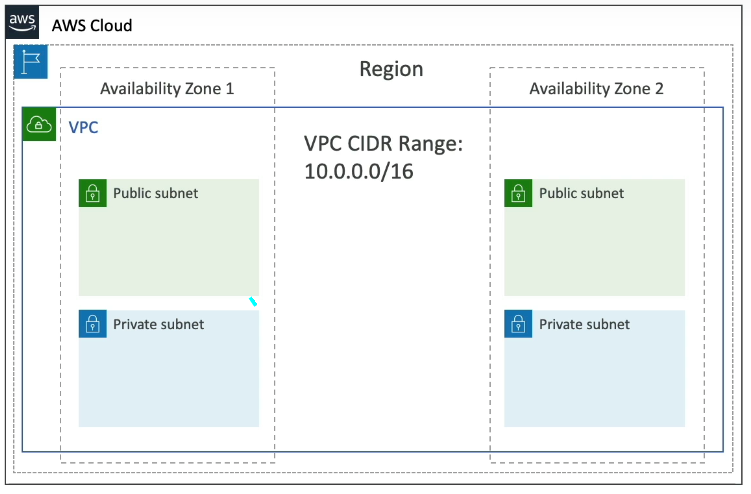
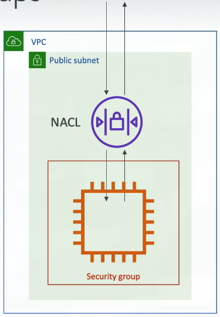
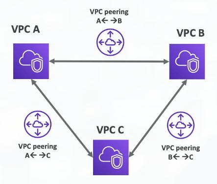
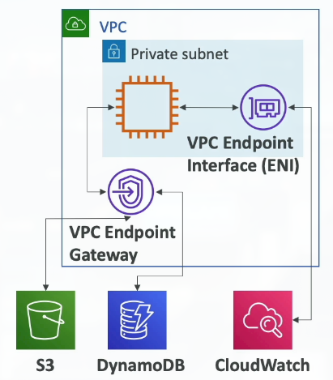
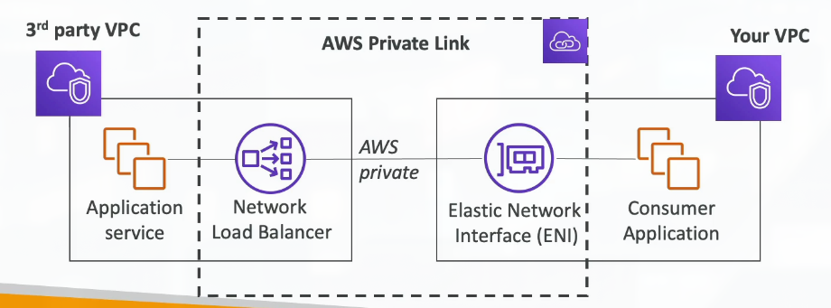
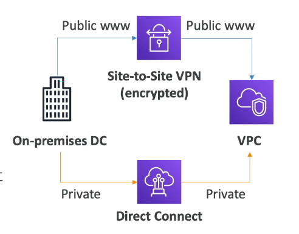
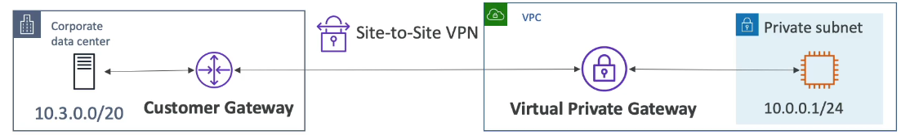
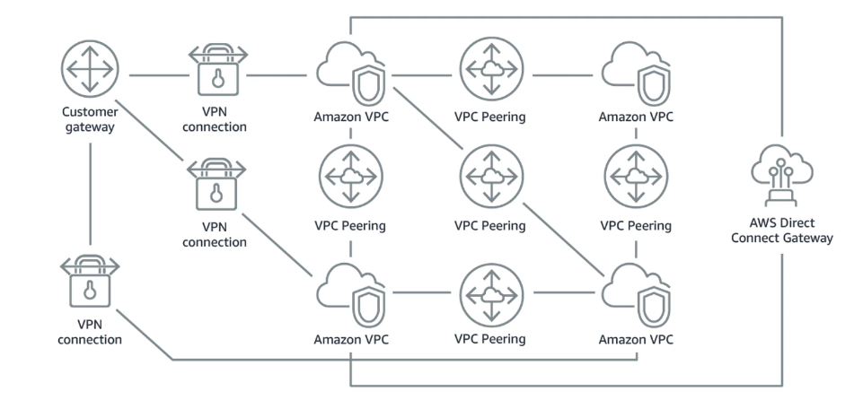
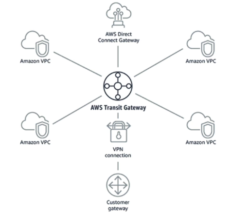

# Section 15: VPC & Networking

## 171. VPC Overview

### VPC - Crash Course

**VPC (Virtual Private Cloud)** is AWS's networking foundation:

- **VPC is something you should know in depth** for the AWS Certified Solutions Architect Associate & AWS Certified SysOps Administrator
- **At the AWS Certified Cloud Practitioner Level, you should know about**:
    - **VPC, Subnets, Internet Gateways & NAT Gateways** - basic networking components
    - **Security Groups, Network ACL (NACL), VPC Flow Logs** - security and monitoring
    - **VPC Peering, VPC Endpoints** - connectivity options
    - **Site to Site VPN & Direct Connect** - hybrid cloud connectivity
    - **Transit Gateway** - large-scale networking
- **I will just give you an overview** - less than 1 or 2 questions at your exam
- **We will have a look at the "default VPC"** (created by default by AWS for you)
- **There is a summary lecture at the end. It's okay if you don't understand it all** - VPC is complex, focus on the basics

> VPC is like creating your own private network in the cloud, similar to a traditional network in your office building. When you create an AWS account, AWS automatically creates a "default VPC" for you in each region - this is a pre-configured network that you can use immediately. However, for production applications, you'll typically create custom VPCs with specific configurations. VPC gives you complete control over your network - you can define IP address ranges, create subnets, configure routing, and set up gateways. This is fundamental to AWS networking - almost everything you deploy (EC2 instances, RDS databases, Lambda functions in VPCs) exists within a VPC. Understanding VPC is crucial because it affects security, connectivity, and how your applications communicate. At the Cloud Practitioner level, you don't need to know all the details, but understanding the basic concepts will help you understand how AWS services work together.

## 172. IP Addresses in AWS

### IP Addresses in AWS

Understanding **IP addresses** is fundamental to AWS networking:

**IPv4 - Internet Protocol version 4** (4.3 billion addresses):
    - **Public IPv4** - can be used on the Internet
    - **EC2 instance gets a new public IP address** every time you stop then start it (default)
    - **Private IPv4** - can be used on private networks (LAN) such as internal AWS networking (e.g., 192.168.1.1)
    - **Elastic IP** - allows you to attach a fixed public IPv4 address to EC2 instance
    - **Note**: All public IPv4 on AWS will be charged **$0.005 per hour** (including EIP) - even if not attached to a resource

**IPv6 - Internet Protocol version 6** (3.4 x 10^38 addresses):
    - **Every IP address is public in AWS** (no private range)
    - **Example**: `2001:db8:3333:4444:cccc:dddd:eeee:ffff`
    - **Free** - no charge for IPv6 addresses

> IP addresses are like street addresses for computers on a network. IPv4 is the older standard (what most of the internet uses today), while IPv6 is the newer standard designed to solve IPv4's address exhaustion problem. In AWS, when you launch an EC2 instance, it gets a private IP address (like 10.0.1.5) that's only accessible within your VPC, and optionally a public IP address (like 54.123.45.67) that's accessible from the internet. However, if you stop and start the instance, the public IP changes (unless you use an Elastic IP). Elastic IPs are like permanent addresses - you allocate one, and it stays the same even if you stop/start instances. This is useful for applications that need a fixed IP address (like DNS records pointing to your server). However, Elastic IPs cost money even when not attached to anything, so only allocate what you need. IPv6 is the future - it has virtually unlimited addresses (340 undecillion!), but in AWS, all IPv6 addresses are public (there's no private IPv6 range). IPv6 is free in AWS, which is great for cost savings, but you need to ensure your security groups and network ACLs properly secure IPv6 traffic.

## 173. VPC, Subnet, Internet Gateway & NAT Gateways

### VPC & Subnets Primer

**VPC (Virtual Private Cloud)** is a **private network to deploy your resources** (regional resource):

- **Subnets allow you to partition your network** inside your VPC (Availability Zone resource)
- **A public subnet is a subnet that is accessible from the internet** - has route to internet gateway
- **A private subnet is a subnet that is NOT directly accessible from the internet** - no direct internet route
- **To define access to the internet and between subnets, we use Route Tables** - routing configuration

> Think of a VPC like a building, and subnets like floors or sections within that building. A VPC is a logically isolated network in AWS - it's your own private cloud network. Within a VPC, you create subnets - smaller network segments, each in a specific Availability Zone. Subnets allow you to organize and secure your resources. Public subnets have a route to an Internet Gateway, so resources in public subnets can have public IP addresses and be accessible from the internet (like web servers). Private subnets don't have a direct route to the internet, so resources in private subnets can only be accessed from within the VPC (like databases). This is a fundamental security pattern - put public-facing resources in public subnets, and sensitive resources (databases, internal services) in private subnets. Route tables control how traffic flows - they're like road signs telling traffic where to go. Each subnet has a route table that defines what destinations are reachable and how to reach them. The default route table allows communication within the VPC, and you can add routes to internet gateways (for public subnets) or NAT gateways (for private subnets that need outbound internet access).

### VPC Diagram

### Internet Gateway & NAT Gateways

**Internet Gateway and NAT Gateways** provide internet connectivity for VPC resources:

- **Internet Gateways help our VPC instances connect with the internet** - provides public internet access
- **Public Subnets have a route to the internet gateway** - enables public internet access
- **NAT Gateways (AWS-managed) & NAT Instances (self-managed)** allow your instances in your **Private Subnets to access the internet while remaining private** - outbound-only internet access

> An Internet Gateway is like the main entrance to your building that connects to the public internet. It's a VPC-level component that enables two-way internet communication - resources in public subnets can receive traffic from the internet and send traffic to the internet. When you attach an Internet Gateway to your VPC and add a route to it in your subnet's route table, that subnet becomes "public" - resources in it can have public IP addresses and be accessible from the internet. A NAT (Network Address Translation) Gateway is different - it's like a one-way door. Resources in private subnets can send traffic out to the internet through the NAT Gateway, but the internet cannot initiate connections to those resources. This is perfect for resources that need to download updates or access external APIs but shouldn't be directly accessible from the internet (like databases or application servers). NAT Gateways are AWS-managed (you just create them, AWS handles the infrastructure), while NAT Instances are EC2 instances you manage yourself (more control but more work). NAT Gateways are recommended for most use cases because they're highly available, automatically scale, and AWS manages them. The key difference: Internet Gateway = two-way public access, NAT Gateway = one-way outbound access while staying private.

## 174. VPC, Subnet, Internet Gateway & NAT Gateways - Hands On
***This is a lab tutorial lesson***

## 175. Security Groups & Network Access Control List (NACL)

**NACL (Network ACL)**:
    - **A firewall which controls traffic from and to subnet** - operates at the subnet level
    - **Can have ALLOW and DENY rules** - both allow and block traffic
    - **Are attached at the Subnet level** - applies to all resources in the subnet
    - **Rules only include IP addresses** - cannot reference security groups

**Security Groups**:
    - **A firewall that controls traffic to and from an EC2 Instance** - operates at the instance level
    - **Can have only ALLOW rules** - default deny, explicit allow
    - **Rules include IP addresses and other security groups** - more flexible than NACLs

### Network ACLs vs Security Groups

Understanding the differences between **Security Groups** and **Network ACLs** is crucial:

| Security Group | Network ACL |
| -------------- | ----------- |
| **Operates at the instance level** | **Operates at the subnet level** |
| **Supports allow rules only** | **Supports allow rules and deny rules** |
| **Is stateful**: Return traffic is automatically allowed, regardless of any rules | **Is stateless**: Return traffic must be explicitly allowed by rules |
| **We evaluate all rules** before deciding whether to allow traffic | **We process rules in number order** when deciding whether to allow traffic |
| **Applies to an instance only if someone specifies** the security group when launching the instance, or associates the security group with the instance later on | **Automatically applies to all instances** in the subnets it's associated with (therefore, you don't have to rely on users to specify the security group) |

> Security Groups and Network ACLs provide defense in depth - multiple layers of security. Security Groups are like personal bodyguards for each EC2 instance - they're attached to specific instances and protect just that instance. They're stateful, meaning if you allow inbound traffic on port 80, the return traffic is automatically allowed (you don't need a separate outbound rule). Security Groups can reference other security groups, making it easy to say "allow traffic from the web server security group" without knowing IP addresses. Network ACLs are like building security - they protect entire subnets. They're stateless, meaning you must explicitly allow both inbound and outbound traffic (including return traffic). Network ACLs process rules in order (lowest number first) and stop at the first match, so order matters. They can have explicit DENY rules, which is useful for blocking specific IP addresses. The key difference: Security Groups are more flexible and easier to use (stateful, can reference other security groups), while NACLs provide subnet-level protection and explicit deny capabilities. Most applications rely primarily on Security Groups, with NACLs providing an additional layer of defense or subnet-level restrictions.

### Hands On
***This is a lab tutorial lesson***

## 176. VPC Flow Logs & VPC Peering

### VPC Flow Logs

**VPC Flow Logs** capture information about IP traffic going into your interfaces:

- **Three levels of flow logs**:
    - **VPC Flow Logs** - all traffic in the VPC
    - **Subnet Flow Logs** - traffic for a specific subnet
    - **Elastic Network Interface Flow Logs** - traffic for a specific network interface
- **Helps to monitor and troubleshoot connectivity issues**. Examples:
    - **Subnets to internet** - see what's trying to reach the internet
    - **Subnets to subnets** - inter-subnet communication
    - **Internet to subnets** - inbound internet traffic
- **Captures network information from AWS managed interfaces too**: Elastic Load Balancers, **ElastiCache**, RDS, Aurora, etc.
- **VPC Flow logs data can go to S3, CloudWatch Logs, and Amazon Kinesis Data Firehose** - flexible storage options

> VPC Flow Logs are like network packet capture logs - they record information about every IP packet that flows through your network interfaces. This is invaluable for security analysis, troubleshooting connectivity issues, and understanding network traffic patterns. Flow logs capture metadata (not the actual packet contents) including source/destination IP addresses, ports, protocol, and whether the traffic was accepted or rejected. This helps answer questions like "Why can't my EC2 instance reach the internet?" or "What IP addresses are trying to access my database?" Flow logs can be enabled at different levels - for the entire VPC (captures everything), for specific subnets (captures traffic in those subnets), or for specific network interfaces (captures traffic for that specific resource). The logs are sent to S3 (for long-term storage and analysis), CloudWatch Logs (for real-time monitoring and alerting), or Kinesis Data Firehose (for streaming to analytics services). Flow logs are particularly useful for security - you can analyze them to detect suspicious patterns, identify unauthorized access attempts, or investigate security incidents. They're also essential for troubleshooting - when something doesn't work, flow logs show you exactly what traffic was allowed or denied and why.

### VPC Peering

**VPC Peering** allows you to **connect two VPCs privately using AWS's network**:

- **Make them behave as if they were in the same network** - seamless connectivity
- **Must not have overlapping CIDR** (IP address range) - IP ranges must be unique
- **VPC Peering connection is not transitive** (must be established for each VPC that needs to communicate with one another)
    - If VPC A is peered with VPC B, and VPC B is peered with VPC C, VPC A cannot communicate with VPC C through VPC B

> VPC Peering is like building a private tunnel between two buildings - they can communicate directly as if they're in the same building, but the connection is private and doesn't go through the public internet. This is useful when you have multiple VPCs (maybe one for production and one for development, or VPCs in different regions) and you want them to communicate privately. The key requirement is that the VPCs must have non-overlapping CIDR blocks (IP address ranges) - you can't peer VPCs that both use 10.0.0.0/16, for example. VPC Peering is not transitive - this is important to understand. If you have three VPCs (A, B, C) and you peer A with B, and B with C, VPC A cannot reach VPC C through VPC B. You would need to create a separate peering connection between A and C. This limitation is why Transit Gateway exists - for connecting many VPCs, Transit Gateway is more scalable. VPC Peering is perfect for simple scenarios with a few VPCs that need to communicate, but becomes complex when you have many VPCs (you'd need peering connections between every pair, which is N*(N-1)/2 connections for N VPCs).

### Hands On
***This is a lab tutorial lesson***

## 177. VPC Endpoints - Interface & Gateway (S3 & DynamoDB)

### VPC Endpoints

**VPC Endpoints** allow you to **connect to AWS Services using a private network** instead of the public internet:

- **This gives you enhanced security and lower latency** to access AWS services
- **VPC Endpoint Gateway**: **S3 & DynamoDB** - free, simple to use
- **VPC Endpoint Interface**: Most services (including S3 & DynamoDB) - more flexible, costs per hour

> VPC Endpoints solve a common problem: when resources in private subnets need to access AWS services (like S3 or DynamoDB), they would normally need to go through a NAT Gateway to reach the public internet, then to AWS services. This adds latency, cost (NAT Gateway charges), and potential security concerns (traffic goes over the internet). VPC Endpoints create a private connection from your VPC directly to AWS services, using AWS's internal network. This means traffic never leaves AWS's network - it's more secure (no internet exposure) and faster (lower latency). There are two types: Gateway Endpoints (for S3 and DynamoDB) are free and simple - you just add a route to your route table. Interface Endpoints (for most other services) are more flexible - they create network interfaces in your subnets and work with any service, but they cost money per hour. Gateway Endpoints are preferred for S3 and DynamoDB because they're free and simple. Interface Endpoints are used for services that don't support Gateway Endpoints (like API Gateway, KMS, or your own services via PrivateLink). VPC Endpoints are essential for keeping traffic private and reducing costs when accessing AWS services from private subnets.

### Hands On
***This is a lab tutorial lesson***

## 178. PrivateLink

### AWS PrivateLink (VPC Endpoint Services)

**AWS PrivateLink** is the **most secure & scalable way to expose a service to 1000s of VPCs**:

- **Does not require VPC peering, internet gateway, NAT, route tables...** - simplified connectivity
- **Requires a network load balancer (Service VPC) and ENI (Customer VPC)** - specific components needed
- **Private connectivity** - traffic never traverses the public internet

> PrivateLink is like having a private entrance to a building that thousands of people can use without them needing to know about each other. It's designed for scenarios where you want to expose a service (like an API or application) to many VPCs (potentially thousands) without the complexity of VPC peering. With VPC peering, if you want to expose a service to 100 VPCs, you'd need 100 peering connections, and each customer VPC would need to configure routing. With PrivateLink, you expose your service once (via a Network Load Balancer in your VPC), and any number of customer VPCs can connect to it using Interface Endpoints. The key advantage is that customers don't need to peer with you or configure complex networking - they just create an Interface Endpoint pointing to your service. Traffic flows privately through AWS's network, never touching the public internet. This is perfect for SaaS providers who want to offer their services to enterprise customers who require private connectivity. It's also used internally by AWS - many AWS services use PrivateLink under the hood. PrivateLink provides the security of private connectivity with the scalability of a public service.

## 179. Direct Connect & Site-to-Site VPN

### Site to Site VPN & Direct Connect

**Two options for connecting on-premises infrastructure to AWS**:

**Site to Site VPN**:
    - **Connect an on-premises VPN to AWS** - virtual private network connection
    - **The connection is automatically encrypted** - secure tunnel over internet
    - **Goes over the public internet** - uses existing internet connection
    - **Quick to set up** - can be configured in hours

**Direct Connect (DX)**:
    - **Establish a physical connection** between on-premises and AWS - dedicated network link
    - **The connection is private, secure and fast** - not over public internet
    - **Goes over a private network** - dedicated fiber connection
    - **Takes at least a month to establish** - requires physical installation

> Site-to-Site VPN and Direct Connect solve the same problem (connecting on-premises to AWS) but in very different ways. Site-to-Site VPN is like using a secure tunnel through the public internet - you use your existing internet connection, but the traffic is encrypted in a VPN tunnel. It's quick to set up (can be done in hours), relatively inexpensive, and works with any internet connection. However, performance depends on your internet connection quality, and there's variability in latency and bandwidth. Direct Connect is like having a dedicated private highway between your data center and AWS - it's a physical fiber connection that AWS installs. It's more expensive and takes longer to set up (typically 1-3 months for installation), but provides consistent, high-performance connectivity with lower latency and higher bandwidth. Direct Connect is often used for high-volume data transfer, applications requiring consistent performance, or compliance requirements that prohibit internet-based connections. Many organizations use both - Direct Connect for production workloads and Site-to-Site VPN as a backup or for less critical traffic. The choice depends on your requirements: need it quickly and cheaply? Use VPN. Need high performance and consistency? Use Direct Connect.

### Site-to-Site VPN Components

**Site-to-Site VPN** requires specific components on both sides:

- **On-premises**: Must use a **Customer Gateway (CGW)** - your VPN device/router
- **AWS**: Must use a **Virtual Private Gateway (VGW)** - AWS's VPN endpoint

> Setting up a Site-to-Site VPN requires coordination between your on-premises network and AWS. On your side, you need a Customer Gateway - this is your VPN device (router, firewall, or dedicated VPN appliance) that supports IPsec VPN. You configure it with AWS's VPN endpoint details. On AWS's side, you create a Virtual Private Gateway (VGW) and attach it to your VPC. The VGW is AWS's VPN endpoint. You then create a VPN connection between the Customer Gateway and Virtual Private Gateway. AWS provides configuration files for common VPN devices, making setup easier. Once configured, traffic between your on-premises network and AWS VPC flows through an encrypted VPN tunnel over the internet. This creates a secure, encrypted connection that makes your on-premises network and AWS VPC appear to be on the same private network.

## 180. Client VPN

### AWS Client VPN

**AWS Client VPN** allows you to **connect from your computer using OpenVPN** to your private network in AWS and on-premises:

- **Allows you to connect to your EC2 instances over a private IP** (just as if you were in the private VPC network)
- **Goes over public Internet** - uses your existing internet connection
- **Secure, managed VPN solution** - AWS manages the VPN infrastructure

> AWS Client VPN is like having a secure remote access solution - it allows individual users (like employees working from home) to connect to AWS resources as if they were physically in the office or connected to the VPC. Unlike Site-to-Site VPN which connects entire networks, Client VPN connects individual devices (laptops, phones, tablets) to your AWS VPC. Users install an OpenVPN client on their device, connect to AWS Client VPN, and then can access EC2 instances, RDS databases, or any other resources in your VPC using private IP addresses. This is much more secure than exposing resources to the public internet or using SSH port forwarding. Client VPN uses the OpenVPN protocol, which is widely supported across platforms. AWS manages the VPN infrastructure (servers, certificates, etc.), so you don't need to set up and maintain VPN servers yourself. This is perfect for remote workers, contractors, or anyone who needs secure access to private AWS resources from anywhere in the world. The connection goes over the public internet but is encrypted, providing security while using existing internet infrastructure.

## 181. Transit Gateway Overview

### Network Topologies Can Become Complicated

As your AWS infrastructure grows, **network topologies can become complicated**:

### Transit Gateway

**AWS Transit Gateway** simplifies large-scale networking:

- **For having transitive peering between thousands of VPCs and on-premises** - hub-and-spoke (star) connection
- **One single Gateway to provide this functionality** - central hub for all connectivity
- **Works with Direct Connect Gateway, VPN connections** - integrates with hybrid cloud

> Transit Gateway solves the complexity problem of connecting many VPCs. With VPC Peering, if you have 10 VPCs that all need to communicate with each other, you'd need 45 peering connections (10 choose 2 = 45). With 100 VPCs, you'd need 4,950 connections! Transit Gateway uses a hub-and-spoke model - you create one Transit Gateway (the hub), and all your VPCs, on-premises networks, and other resources connect to it (the spokes). This means you only need one connection per VPC to the Transit Gateway, and all VPCs can communicate through it. The Transit Gateway provides transitive routing - if VPC A is attached to the gateway, and VPC B is attached to the gateway, they can communicate even though there's no direct peering between them. This dramatically simplifies network management - instead of managing hundreds of peering connections, you manage one Transit Gateway and attach VPCs to it. Transit Gateway also integrates with Direct Connect and VPN connections, so you can connect on-premises networks through the same hub. This creates a unified network architecture where everything connects through one central point, making routing, security, and management much simpler. Transit Gateway is essential for large organizations with many VPCs or complex hybrid cloud architectures.

## 182. VPC & Networking Summary

### VPC Closing Comments

**Core Networking Components**:
- **VPC**: Virtual Private Cloud - your private network in AWS
- **Subnets**: Tied to an AZ, network partition of the VPC
- **Internet Gateway**: At the VPC level, provide Internet Access - two-way public access
- **NAT Gateway / Instances**: Give internet access to private subnets - one-way outbound access

**Security**:
- **NACL**: Stateless, subnet rules for inbound and outbound - subnet-level firewall
- **Security Groups**: Stateful, operate at the EC2 instance level or ENI - instance-level firewall

**Connectivity**:
- **VPC Peering**: Connect two VPCs with non-overlapping IP ranges, non-transitive - simple VPC-to-VPC connection
- **VPC Endpoints**: Provide private access to AWS Services within VPC - private AWS service access
- **PrivateLink**: Privately connect to a service in a 3rd party VPC - secure service exposure
- **Site to Site VPN**: VPN over public internet between on-premises DC and AWS - encrypted tunnel
- **Client VPN**: OpenVPN connection from your computer into your VPC - remote user access
- **Direct Connect**: Direct private connection to AWS - dedicated physical connection
- **Transit Gateway**: Connect thousands of VPCs and on-premises networks together - hub-and-spoke model

**Monitoring**:
- **VPC Flow Logs**: Network traffic logs - capture IP traffic metadata

**IP Addresses**:
- **Elastic IP**: Fixed public IPv4, ongoing cost if not in-use - permanent public IP address
