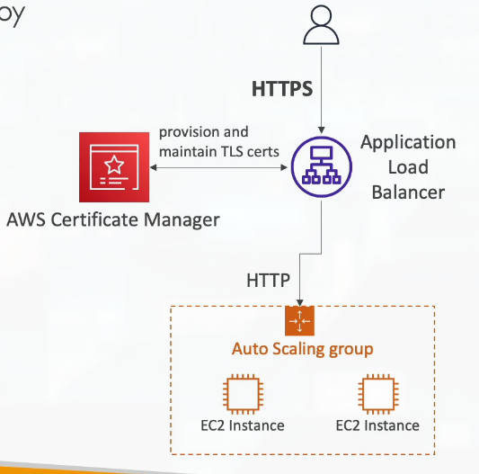
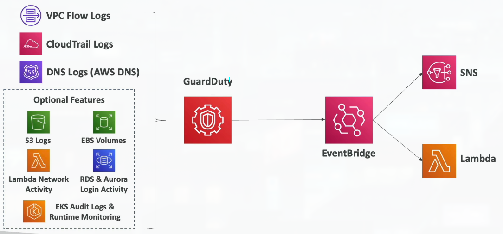
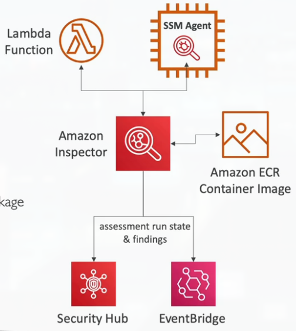
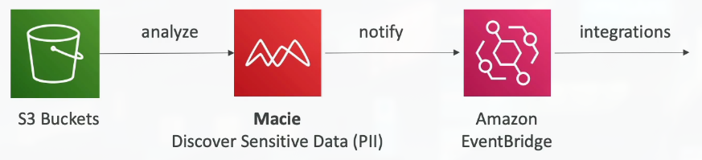
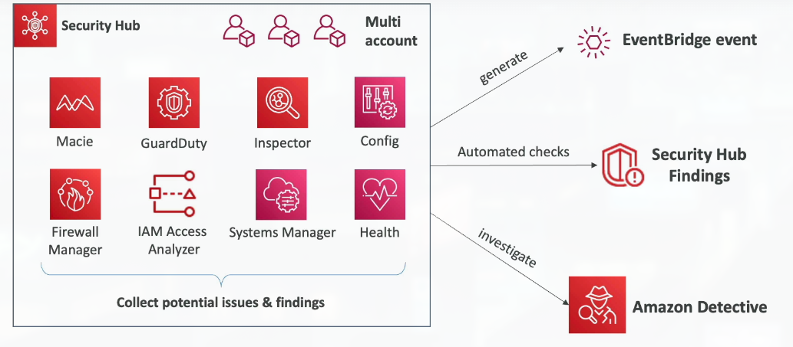
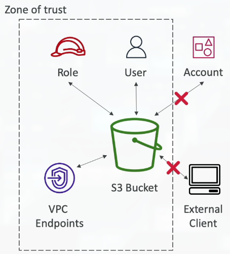

# Section 16: Security & Compliance

## 182. Shared Responsibility Model: Reminders & Examples

### AWS Shared Responsibility Model

The **Shared Responsibility Model** is fundamental to understanding security in AWS:

**AWS responsibility - Security OF the Cloud**:
    - **Protecting infrastructure** (hardware, software, facilities, and networking) that runs all the AWS services
    - **Managed services** like S3, DynamoDB, RDS, etc. - AWS manages the infrastructure

**Customer responsibility - Security IN the Cloud**:
    - **For EC2 instance**, customer is responsible for management of the guest OS (including security patches and updates), firewall & network configuration, IAM
    - **Encrypting application data** - customer controls encryption settings
    - **Application security** - securing your applications and data

**Shared controls**:
    - **Patch Management**, **Configuration Management**, **Awareness & Training** - both AWS and customer have responsibilities

> The Shared Responsibility Model is like the difference between a landlord and a tenant. AWS (the landlord) is responsible for the building's security - the physical infrastructure, the foundation, the walls, the roof. You (the tenant) are responsible for what happens inside your apartment - locking your doors, securing your valuables, who you let in. AWS secures the cloud infrastructure (the "building"), while you secure what you put in it (your "apartment"). For managed services like S3 or RDS, AWS handles more of the security (like the building's security system), but you're still responsible for configuration (like setting up your apartment's locks). For services like EC2 where you have more control, you're responsible for more (like managing the operating system). Understanding this model is crucial because it tells you what you need to secure versus what AWS secures for you. This is especially important for compliance - auditors will ask what you're responsible for versus what AWS is responsible for.

### Example: Shared Responsibility for RDS

**AWS responsibility**:
    - **Manage the underlying EC2 instance**, disable SSH access - infrastructure management
    - **Automated DB patching** - database software updates
    - **Automated OS patching** - operating system updates
    - **Audit the underlying instance and disks & guarantee it functions** - infrastructure reliability

**Your responsibility**:
    - **Check the ports / IP / security group inbound rules** in DB's Security Group - network security
    - **In-database user creation and permissions** - database access control
    - **Creating a database with or without public access** - access configuration
    - **Ensure parameter groups or DB is configured to only allow SSL connections** - encryption in transit
    - **Database encryption setting** - encryption at rest configuration

> RDS is a managed service, so AWS handles a lot - the underlying EC2 instances, operating system patches, database software updates, backups, and infrastructure reliability. However, you're still responsible for the security configuration - who can access the database (security groups, network configuration), what users exist in the database and their permissions, whether the database is publicly accessible, and encryption settings. This is a common pattern with managed services - AWS handles the "undifferentiated heavy lifting" (infrastructure management), but you control the security configuration. For example, AWS will patch the database software automatically, but you need to configure security groups to restrict access. AWS will encrypt the underlying storage if you enable it, but you need to enable it. Understanding these responsibilities helps you know what to configure and what AWS handles automatically.

### Example: Shared Responsibility for S3

**AWS responsibility**:
    - **Guarantee you get unlimited storage** - infrastructure scalability
    - **Guarantee you get encryption** - encryption infrastructure available
    - **Ensure separation of the data** between different customers - multi-tenancy security
    - **Ensure AWS employees can't access your data** - AWS access controls

**Your responsibility**:
    - **Bucket configuration** - how buckets are set up
    - **Bucket policy / public setting** - who can access your data
    - **IAM user and roles** - access control configuration
    - **Enabling encryption** - choosing and configuring encryption

> S3 is another managed service where AWS handles the infrastructure, but you control access and encryption. AWS guarantees that the infrastructure supports unlimited storage and encryption, and that your data is isolated from other customers. However, you're responsible for configuring who can access your buckets (bucket policies, IAM permissions), whether buckets are public or private, and enabling encryption. This is where many security incidents occur - misconfigured bucket policies that make S3 buckets publicly accessible, or forgetting to enable encryption. AWS provides the tools (bucket policies, IAM, encryption), but you must configure them correctly. This is a critical responsibility - AWS can't prevent you from making your bucket public if you configure it that way. Understanding this helps you know what security settings to check and configure.

### Shared Responsibility Model diagram

## 183. DDoS Protection: WAF & Shield

### What's a DDoS Attack?

**DDoS** stands for **Distributed Denial-of-Service**:

> A DDoS attack is like thousands of people simultaneously trying to enter a store - the store gets overwhelmed and can't serve legitimate customers. In a DDoS attack, attackers use many compromised computers (a "botnet") to send massive amounts of traffic to a target (like your website), overwhelming it and making it unavailable to legitimate users. These attacks can be devastating - they can take down websites, cause service outages, and cost businesses money. DDoS attacks come in different forms: Layer 3/4 attacks (like SYN floods that overwhelm network capacity) and Layer 7 attacks (like HTTP floods that overwhelm application servers). AWS provides multiple layers of protection against DDoS attacks, from automatic protection (Shield Standard) to advanced protection (Shield Advanced) to application-level filtering (WAF). Understanding DDoS protection is important because any internet-facing service is a potential target, and AWS's global infrastructure provides natural protection, but you should also configure additional defenses.

### DDoS Protection on AWS

AWS provides **multiple layers of DDoS protection**:

- **AWS Shield Standard**: Protects against DDoS attacks for your website and applications, for all customers at no additional costs
- **AWS Shield Advanced**: 24/7 premium DDoS protection - enhanced protection and support
- **AWS WAF**: Filter specific requests based on rules - application-level protection
- **CloudFront and Route 53**:
    - **Availability protection using global edge network** - distributed infrastructure
    - **Combined with AWS Shield**, provides attack mitigation at the edge - stop attacks before they reach your origin
- **Be ready to scale** - leverage AWS Auto Scaling - handle legitimate traffic spikes

> AWS's DDoS protection works at multiple levels. Shield Standard is automatically enabled for all AWS customers - it provides basic protection against common DDoS attacks at no cost. This is like having basic security guards at the building entrance. Shield Advanced is a premium service ($3,000/month) that provides enhanced protection, 24/7 DDoS response team access, and protection against cost spikes during attacks. WAF (Web Application Firewall) works at the application layer - it can filter malicious requests based on rules (like blocking requests from certain IP addresses or blocking SQL injection attempts). CloudFront and Route 53 provide natural DDoS protection because they're distributed globally - attacks are spread across many edge locations, making it harder to overwhelm any single point. The combination of these services provides defense in depth - multiple layers of protection. Additionally, using Auto Scaling ensures that if you do experience a traffic spike (legitimate or attack), your infrastructure can scale to handle it. The key is to use these services together - Shield for network-level protection, WAF for application-level protection, and CloudFront/Route 53 for distributed infrastructure.

### Sample Reference Architecture for DDoS Protection

### AWS Shield

**AWS Shield** provides **automatic DDoS protection**:

**AWS Shield Standard**:
    - **Free service that is activated for every AWS customer** - automatic protection
    - **Provides protection from attacks** such as SYN/UDP Floods, Reflection attacks and other **layer 3 / layer 4 attacks**
    - **Basic DDoS mitigation** - protects against common network-level attacks

**AWS Shield Advanced**:
    - **Optional DDoS mitigation service** ($3,000 per month per organization)
    - **Protect against more sophisticated attacks** on Amazon EC2, Elastic Load Balancing (ELB), Amazon CloudFront, AWS Global Accelerator, and Route 53
    - **24/7 access to AWS DDoS response team (DRP)** - expert support during attacks
    - **Protect against higher fees during usage spikes due to DDoS** - cost protection

> Shield Standard is like having automatic flood protection - it's always on and protects against common DDoS attacks without any configuration. It's included with every AWS account at no additional cost. Shield Advanced is like having a dedicated security team on call 24/7. It provides protection against more sophisticated attacks, gives you access to AWS's DDoS response team (experts who help during attacks), and importantly, protects you from cost spikes. During a DDoS attack, your services might scale up to handle the attack traffic, which could result in massive bills. Shield Advanced includes cost protection - AWS absorbs the costs of scaling during a DDoS attack. This is valuable for organizations that are likely targets (like financial institutions, gaming companies, or high-profile websites). Shield Advanced also provides more detailed attack analytics and custom mitigations. For most applications, Shield Standard provides adequate protection, but for high-risk or high-profile applications, Shield Advanced is worth considering.

### AWS WAF - Web Application Firewall

**AWS WAF (Web Application Firewall)** protects your web applications from common web exploits:

- **Protects your web applications from common web exploits (Layer 7)**
- **Layer 7 is HTTP** (vs Layer 4 is TCP) - application layer protection
- **Deploy on Application Load Balancer, API Gateway, CloudFront** - flexible deployment options
- **Define Web ACL (Web Access Control List)**:
    - **Rules can include IP addresses, HTTP headers, HTTP body, or URI strings** - flexible rule matching
    - **Protects from common attacks** - SQL injection and Cross-Site Scripting (XSS)
    - **Size constraints, geo-match (block countries)** - advanced filtering options
    - **Rate-based rules** (to count occurrences of events) - for DDoS protection

> WAF is like a bouncer at a club who checks IDs and looks for suspicious behavior before letting people in. While Shield protects against network-level DDoS attacks (Layer 3/4), WAF protects against application-level attacks (Layer 7 - HTTP). WAF sits in front of your web applications and inspects every HTTP request before it reaches your application. You define rules in a Web ACL (Web Access Control List) that specify what to allow or block. For example, you can block requests from specific IP addresses, block requests that contain SQL injection patterns, block requests from certain countries, or rate-limit requests from the same IP address. WAF integrates with Application Load Balancers, API Gateway, and CloudFront, so you can protect applications at different points in your architecture. WAF is particularly useful for protecting against common web application vulnerabilities like SQL injection (where attackers try to manipulate database queries) and Cross-Site Scripting (XSS - where attackers inject malicious scripts). WAF can also help with DDoS protection at the application layer - rate-based rules can limit how many requests come from a single IP address, preventing application-level DDoS attacks. WAF is essential for any internet-facing web application.

## 184. AWS Network Firewall

### AWS Network Firewall

**AWS Network Firewall** provides **network-level firewall protection for your entire Amazon VPC**:

- **Protect your entire Amazon VPC** - VPC-wide protection
- **From Layer 3 to Layer 7** - comprehensive network inspection
- **Any direction, you can inspect**:
    - **VPC to VPC traffic** - inter-VPC communication
    - **Outbound to internet** - egress filtering
    - **Inbound from internet** - ingress filtering
    - **To / from Direct Connect & Site-to-Site VPN** - hybrid cloud traffic

> AWS Network Firewall is like having a comprehensive security checkpoint at the borders of your VPC. While Security Groups and NACLs provide basic firewall capabilities, Network Firewall provides advanced, stateful inspection capabilities similar to traditional enterprise firewalls. It can inspect traffic at multiple network layers (Layer 3 - network, Layer 4 - transport, Layer 7 - application), allowing you to create sophisticated rules based on protocols, ports, IP addresses, and even application-layer content. Network Firewall can inspect traffic in all directions - not just inbound, but also outbound (preventing data exfiltration) and between VPCs (preventing lateral movement in case of a breach). It integrates with AWS managed rule groups (pre-configured rules for common threats) and allows you to create custom rules. Network Firewall is particularly useful for organizations that need enterprise-grade firewall capabilities, compliance with regulations that require network-level controls, or protection against advanced threats. It's more powerful than Security Groups (which are simpler and instance-level) but also more complex to configure. Use Network Firewall when you need advanced threat protection, deep packet inspection, or compliance with regulations that require network-level security controls.

## 185. AWS Firewall Manager

### AWS Firewall Manager

**AWS Firewall Manager** helps you **manage security rules across all accounts** of an AWS Organization:

- **Security policy**: Common set of security rules - centralized policy management
    - **VPC Security Groups** for EC2, Application Load Balancer, etc.
    - **WAF rules** - centralized WAF policy
    - **AWS Shield Advanced** - organization-wide Shield protection
    - **AWS Network Firewall** - centralized network firewall rules
- **Rules are applied to new resources as they are created** (good for compliance) across all and future accounts in your Organization

> Firewall Manager is like having a central security policy that automatically applies to all your AWS accounts. In large organizations with many AWS accounts, managing security rules individually in each account is time-consuming and error-prone. Firewall Manager solves this by allowing you to define security policies once and have them automatically applied across all accounts in your AWS Organization. For example, you can create a policy that says "all Security Groups must block port 22 from the internet" or "all WAF rules must include protection against SQL injection." When new resources are created in any account, Firewall Manager automatically applies these policies. This is essential for compliance - you can ensure that security standards are consistently applied across all accounts, and auditors can see that policies are automatically enforced. Firewall Manager works with Security Groups, WAF, Shield Advanced, and Network Firewall, providing centralized management for all your firewall needs. It's particularly valuable for organizations with many accounts (like enterprises with separate accounts for each department or environment) where maintaining consistent security policies manually would be impossible.

## 186. Penetration Testing

### Penetration Testing on AWS Cloud

**AWS customers are welcome to carry out security assessments or penetration tests** against their AWS infrastructure:

**Allowed without prior approval** (for 8 services):
    - **Amazon EC2 instances**, NAT Gateways, and Elastic Load Balancers
    - **Amazon RDS**
    - **Amazon CloudFront**
    - **Amazon Aurora**
    - **Amazon API Gateways**
    - **AWS Lambda and Lambda Edge functions**
    - **Amazon Lightsail resources**
    - **Amazon Elastic Beanstalk environments**
- **List can increase over time** (you won't be tested on that at the exam)

**Prohibited Activities**:
    - **DNS zone walking** via Amazon Route 53 Hosted Zones
    - **Denial of Service (DoS), Distributed Denial of Service (DDoS)**, Simulated DoS, Simulated DDoS
    - **Port flooding** - overwhelming ports with traffic
    - **Protocol flooding** - overwhelming protocols
    - **Request flooding** (login request flooding, API request flooding) - overwhelming applications

> Penetration testing (or "pen testing") is like hiring someone to try to break into your house to find security weaknesses. Many organizations conduct regular penetration tests to identify security vulnerabilities before attackers do. AWS allows you to perform penetration tests on your own infrastructure without prior approval for specific services. This is important because you don't want to accidentally trigger AWS's security systems during legitimate security testing. However, AWS prohibits certain activities that could impact other customers or AWS infrastructure - like DDoS attacks (even simulated ones) or DNS zone walking (which could reveal information about other customers). If you need to test services not on the allowed list, or perform prohibited activities, you need to contact AWS for approval. Understanding what's allowed helps you plan security assessments without violating AWS's terms of service. For the Cloud Practitioner exam, you just need to know that penetration testing is generally allowed for common services, but certain activities are prohibited.

## 187. Encryption with KMS & CloudHSM

### Data at Rest vs. Data in Transit

Understanding **data encryption** requires knowing the two states of data:

**At Rest**: Data stored or archived on a device
    - **On a hard disk**, on a RDS instance, in S3 Glacier Deep Archive, etc.
    - **Data is stationary** - not being transmitted

**In Transit (in motion)**: Data being moved from one location to another
    - **Transfer from on-premises to AWS**, EC2 to DynamoDB, etc.
    - **Means data transferred on the network** - data is moving

**We want to encrypt data in both states to protect it!** - comprehensive security
**For this we leverage encryption keys** - keys are used to encrypt and decrypt data

> Data exists in two states, and both need protection. Data at rest is like money in a safe - it's stored somewhere (on a disk, in a database, in S3), and you want to encrypt it so that if someone steals the safe (or the disk), they can't read the contents. Data in transit is like money being transported in an armored truck - it's moving from one place to another (over the network), and you want to encrypt it so that if someone intercepts the transmission, they can't read it. Both states are vulnerable - unencrypted data at rest can be read if storage is compromised, and unencrypted data in transit can be intercepted and read. AWS provides encryption for both states: encryption at rest (like S3 server-side encryption, EBS volume encryption, RDS encryption) and encryption in transit (like HTTPS/TLS for web traffic, encrypted connections to databases). Encryption keys are the "locks" - you need the right key to decrypt the data. AWS provides services like KMS (Key Management Service) to manage these keys securely. The principle is: encrypt everything, everywhere - both at rest and in transit.

### AWS KMS (Key Management Service)

**AWS KMS (Key Management Service)** is AWS's managed encryption key service:

- **Anytime you hear "encryption" for an AWS service, it's most likely KMS** - KMS is the foundation
- **KMS = AWS manages the encryption keys for us** - fully managed key management
- **Encryption Opt-in** (you must enable):
    - **EBS volumes**: Encrypt volumes - block storage encryption
    - **S3 buckets**: Server-side encryption of objects (SSE-S3 enabled by default, SSE-KMS opt in)
    - **Redshift database**: Encryption of data - data warehouse encryption
    - **RDS database**: Encryption of data - database encryption
    - **EFS drives**: Encryption of data - file system encryption
- **Encryption Automatically enabled**:
    - **CloudTrail Logs** - audit logs are encrypted
    - **S3 Glacier** - archive storage is encrypted
    - **Storage Gateway** - hybrid storage is encrypted

> KMS is like a master key system for AWS - it manages all the encryption keys used by AWS services. When you enable encryption on an EBS volume or S3 bucket, KMS generates and manages the encryption keys. KMS provides several benefits: (1) Centralized key management - all your keys in one place, (2) Key rotation - keys can be automatically rotated for security, (3) Access control - you control who can use which keys through IAM, (4) Audit trail - CloudTrail logs all key usage, (5) Integration - works seamlessly with most AWS services. KMS supports different types of keys: Customer Managed Keys (you control), AWS Managed Keys (AWS manages for you), and AWS Owned Keys (AWS uses internally). For most use cases, AWS Managed Keys are sufficient - AWS handles everything, and you just enable encryption. For compliance requirements that need more control, you can use Customer Managed Keys where you have full control over key policies and rotation. KMS is essential for encryption in AWS - it's the service that makes encryption easy and manageable.

### CloudHSM

**CloudHSM** provides **dedicated hardware for encryption**:

- **KMS => AWS manages the software for encryption** - software-based key management
- **CloudHSM => AWS provisions encryption hardware** - hardware-based key management
- **Dedicated Hardware (HSM = Hardware Security Module)** - physical encryption device
- **You manage your own encryption keys entirely (not AWS)** - complete key control
- **HSM device is tamper resistant, FIPS 140-2 Level 3 compliance** - high security standards

> CloudHSM is like having your own bank vault for encryption keys, while KMS is like using a bank's safe deposit box. With KMS, AWS manages the encryption software and has some visibility into key operations (though not the keys themselves). With CloudHSM, you get dedicated hardware devices (HSMs - Hardware Security Modules) that are completely isolated - even AWS can't access your keys. The HSM is a physical device that performs all cryptographic operations internally - keys never leave the device. This is important for compliance requirements that mandate that no third party (including AWS) can access encryption keys. CloudHSM is FIPS 140-2 Level 3 certified, which is a high security standard required by some regulations (like certain government or financial regulations). CloudHSM is more expensive and complex than KMS (you need to manage the HSM cluster, handle failover, etc.), but it provides the highest level of key control and isolation. Use CloudHSM when you have regulatory requirements that prohibit third-party key access, need FIPS 140-2 Level 3 compliance, or have specific compliance needs that KMS can't meet. For most use cases, KMS is sufficient and much easier to use.

### CloudHSM Diagram

### Types of KMS Keys

**KMS supports different types of keys** for different use cases:

**Customer Managed Key**:
    - **Create, manage and used by the customer**, can enable or disable - full customer control
    - **Possibility of rotation policy** (new key generated every year, old key preserved) - automatic key rotation
    - **Possibility to bring-your-own-key** - import your own keys

**AWS Managed Key**:
    - **Created, managed and used on the customer's behalf by AWS** - AWS handles everything
    - **Used by AWS services** (aws/s3, aws/eb, aws/redshift) - service-specific keys
    - **Automatic rotation** - AWS rotates keys automatically

**AWS Owned Key**:
    - **Collection of CMKs that an AWS service owns and manages** to use in multiple accounts
    - **AWS can use those to protect resources in your account** (but you can't view the keys)
    - **Used internally by AWS services** - not visible to customers

**CloudHSM Keys (custom keystore)**:
    - **Keys generated from your own CloudHSM hardware device** - hardware-based keys
    - **Cryptographic operations are performed within the CloudHSM cluster** - keys never leave HSM

> Understanding the different key types helps you choose the right level of control. Customer Managed Keys give you the most control - you create them, manage access policies, control rotation, and can even import your own keys. This is useful when you need fine-grained control or have specific compliance requirements. AWS Managed Keys are the easiest option - AWS creates and manages them automatically when you enable encryption on a service. You don't need to do anything, but you have less control. AWS Owned Keys are used internally by AWS services - you never see or manage them, but AWS uses them to protect resources in your account. CloudHSM Keys are the most secure option - keys are generated and used entirely within dedicated hardware that you control. The choice depends on your needs: use AWS Managed Keys for simplicity, Customer Managed Keys for more control, and CloudHSM Keys for the highest security and compliance requirements.

## 188. Encryption with KMS & CloudHSM Hands On
***This is a lab tutorial lesson***

## 189. AWS Certificate Manager (ACM) Overview

### AWS Certificate Manager (ACM)

**AWS Certificate Manager (ACM)** lets you **easily provision, manage, and deploy SSL/TLS Certificates**:

- **Used to provide in-transit encryption for websites (HTTPS)** - secure web connections
- **Supports both public and private TLS certificates** - public for internet, private for internal
- **Free of charge for public TLS certificates** - no cost for public certs
- **Automatic TLS certificate renewal** - no manual certificate management
- **Integrations with** (load TLS certificates on):
    - **Elastic Load Balancers** - HTTPS on load balancers
    - **CloudFront Distributions** - HTTPS on CDN
    - **APIs on API Gateway** - HTTPS on APIs

> ACM is like having an automatic certificate authority that handles all the complexity of SSL/TLS certificates. SSL/TLS certificates are what enable HTTPS - they prove that a website is legitimate and encrypt the connection between the browser and server. Traditionally, getting and managing certificates was complex - you had to buy them, install them, and remember to renew them before they expired (certificates typically expire after 1-2 years). ACM simplifies this completely - you request a certificate, ACM validates your domain ownership, and then automatically renews it forever. The certificates are free for public use (for websites accessible on the internet), and ACM integrates directly with AWS services like Load Balancers, CloudFront, and API Gateway - you just select the certificate, and AWS handles the rest. This eliminates the common problem of expired certificates causing website outages. ACM also supports private certificates for internal applications - these are useful for encrypting communication within your organization without needing public certificate authorities. ACM makes HTTPS easy - you can enable it on all your services with just a few clicks, and AWS handles certificate management automatically.

## 190. Secrets Manager Overview

### AWS Secrets Manager

**AWS Secrets Manager** is a **newer service, meant for storing secrets**:

- **Capability to force rotation of secrets every X days** - automatic secret rotation
- **Automate generation of secrets on rotation** (uses Lambda) - no manual intervention
- **Integration with Amazon RDS** (MySQL, PostgreSQL, Aurora) - seamless database secret management
- **Secrets are encrypted using KMS** - secure storage
- **Mostly meant for RDS integration** - primary use case

> Secrets Manager is like a secure vault for passwords, API keys, and other sensitive information. Instead of hardcoding secrets in your application code (which is insecure and makes updates difficult), you store them in Secrets Manager. Your applications retrieve secrets at runtime using the Secrets Manager API. The key advantage over Parameter Store is automatic rotation - Secrets Manager can automatically rotate secrets (like database passwords) on a schedule. For RDS databases, Secrets Manager can generate new passwords, update the database, and update applications automatically - all without downtime. This is crucial for security best practices - rotating secrets regularly reduces the risk if a secret is compromised. Secrets Manager uses Lambda functions to perform the rotation - you can use AWS-provided rotation functions for RDS, or create custom functions for other services. Secrets are encrypted using KMS, so they're secure at rest. While Secrets Manager can store any secret, it's particularly powerful for RDS integration where it handles the entire rotation process automatically. This makes it easier to comply with security policies that require regular password rotation.

### Hands On
***This is a lab tutorial lesson***

## 191. Artifact Overview

### AWS Artifact (Not Really a Service)

**AWS Artifact** is a **portal that provides customers with on-demand access to AWS compliance documentation and AWS agreements**:

- **Artifact Reports**: Allows you to download AWS security and compliance documents from third-party auditors, like AWS ISO certifications, Payment Card Industry (PCI), and System and Organization Control (SOC) reports
- **Artifact Agreements**: Allows you to review, accept, and track the status of AWS agreements such as the Business Associate Addendum (BAA) or the Health Insurance Portability and Accountability Act (HIPAA) for an individual account or in your organization
- **Can be used to support internal audit or compliance** - essential for compliance requirements

> AWS Artifact is like a compliance documentation library - it's a portal where you can access all of AWS's compliance certifications and agreements. When organizations evaluate cloud providers, they need to see proof that the provider meets various compliance standards (like ISO 27001 for information security, PCI DSS for payment card data, SOC 2 for service organization controls, etc.). Instead of contacting AWS support to request these documents, you can download them directly from Artifact. Artifact Reports contain third-party audit reports that prove AWS meets various compliance standards. Artifact Agreements allow you to accept AWS agreements for specific compliance requirements (like HIPAA for healthcare data or BAA for business associate agreements). This is essential for organizations in regulated industries - you need these documents to prove to auditors, customers, or regulators that you're using a compliant cloud provider. Artifact makes it easy - all the documentation is in one place, always up-to-date, and available on-demand. This is particularly valuable during compliance audits when you need to quickly provide documentation about your cloud provider's security and compliance posture.

### Hands On
***This is a lab tutorial lesson***

## 192. GuardDuty Overview

### Amazon GuardDuty

**Amazon GuardDuty** provides **intelligent threat discovery to protect your AWS Account**:

- **Uses Machine Learning algorithms, anomaly detection, 3rd party data** - advanced threat detection
- **One click to enable (30 days trial)**, no need to install software - simple activation
- **Input data includes**:
    - **CloudTrail Events Logs** - unusual API calls, unauthorized deployments
        - **CloudTrail Management Events** - unusual API calls, unauthorized deployments
        - **CloudTrail S3 Data Events** - get object, list objects, delete object, etc.
    - **VPC Flow Logs** - unusual internal traffic, unusual IP address
    - **DNS Logs** - compromised EC2 instances sending encoded data within DNS queries
    - **Optional Features** - EKS Audit Logs, RDS & Aurora, EBS, Lambda, S3 Data Events...
- **Can set up EventBridge rules to be notified** in case of findings - automated alerting
- **EventBridge rules can target AWS Lambda or SNS** - flexible response options
- **Can protect against Cryptocurrency attacks** (has a dedicated "finding" for it) - specialized threat detection

> GuardDuty is like having a 24/7 security operations center watching your AWS account. It continuously analyzes logs from CloudTrail (API calls), VPC Flow Logs (network traffic), and DNS logs (DNS queries) using machine learning to identify suspicious activity. GuardDuty learns your account's normal behavior and flags anomalies - like API calls from unusual locations, network traffic to known malicious IP addresses, or EC2 instances making suspicious DNS queries (which could indicate malware using DNS for command and control). GuardDuty uses threat intelligence feeds (lists of known malicious IP addresses, domains, etc.) and machine learning models trained on billions of events to identify threats. It can detect things like: compromised EC2 instances, unauthorized access attempts, data exfiltration, cryptocurrency mining, and more. The beauty of GuardDuty is that it's fully managed - you just enable it, and it starts analyzing. You don't need security expertise to configure it - the ML models do the heavy lifting. When GuardDuty finds something suspicious, it creates a "finding" that you can view in the console or receive via EventBridge notifications. This makes it accessible to organizations that don't have dedicated security teams - GuardDuty acts as your security expert, watching for threats 24/7.

### Amazon GuardDuty

## 193. Inspector Overview

### Amazon Inspector

**Amazon Inspector** provides **automated security assessments**:

**For EC2 instances**:
    - **Leveraging the AWS Systems Manager (SSM) agent** - uses existing agent
    - **Analyze against unintended network accessibility** - network security assessment
    - **Analyze the running OS against known vulnerabilities** - vulnerability scanning

**For Container Images pushed to Amazon ECR**:
    - **Assessment of Container Images as they are pushed** - container vulnerability scanning

**For Lambda Functions**:
    - **Identifies software vulnerabilities in function code and package dependencies** - code-level scanning
    - **Assessment of functions as they are deployed** - automatic scanning

**Reporting & Integration**:
    - **Integration with AWS Security Hub** - centralized findings
    - **Send findings to Amazon EventBridge** - automated notifications

> Inspector is like having an automated security auditor that continuously checks your infrastructure for vulnerabilities. Unlike GuardDuty which looks for active threats (like someone trying to hack in), Inspector looks for vulnerabilities (like unpatched software or misconfigured security settings) that could be exploited. Inspector scans EC2 instances, container images, and Lambda functions against databases of known vulnerabilities (CVEs - Common Vulnerabilities and Exposures). For EC2 instances, Inspector uses the SSM agent (which you likely already have installed) to scan the operating system and installed software, checking for known vulnerabilities. It also analyzes network accessibility - can your instances be reached from the internet when they shouldn't be? For container images, Inspector scans images as they're pushed to ECR, checking for vulnerabilities in the base images and installed packages. For Lambda functions, Inspector analyzes the code and dependencies for known vulnerabilities. Inspector provides risk scores for each finding, helping you prioritize what to fix first. This is essential for maintaining secure infrastructure - you can't fix vulnerabilities you don't know about. Inspector makes vulnerability management proactive rather than reactive - find and fix issues before attackers exploit them.

### What does Amazon Inspector evaluate?
- Remember: only for EC2 instances, Container Images & Lambda functions
- Continuous scanning of the infrastructure, only when needed
- Package vulnerabilities (EC2, ECR & Lambda) - database of CVE
- Network reachability (EC2)
- A risk score is associated with all vulnerabilities for prioritization

## 194. Config Overview

### AWS Config

**AWS Config** helps with **auditing and recording compliance of your AWS resources**:

- **Helps record configurations and changes over time** - configuration history
- **Possibility of storing the configuration data into S3** (analyzed by Athena) - long-term storage and analysis
- **Questions that can be solved by AWS Config**:
    - **Is there unrestricted SSH access to my security groups?** - compliance checking
    - **Do my buckets have any public access?** - security auditing
    - **How has my ALB configuration changed over time?** - change tracking
- **You can receive alerts (SNS notification) for any changes** - change notifications
- **AWS Config is a per-region service** - region-specific
- **Can be aggregated across regions and accounts** - organization-wide view

> AWS Config is like having a time machine for your AWS infrastructure - it records the configuration of every resource and tracks how it changes over time. This is invaluable for compliance, security auditing, and troubleshooting. Config continuously monitors your resources and records their configuration - if someone changes a security group rule, Config records it. If someone makes an S3 bucket public, Config records it. You can then query Config to answer questions like "show me all security groups that allow SSH from 0.0.0.0/0" or "what was the configuration of this RDS instance last week?" Config also supports compliance rules - you can define rules like "no S3 buckets should be public" and Config will continuously check all your buckets and alert you if any violate the rule. This is essential for compliance - auditors want to see that you're continuously monitoring and enforcing security policies. Config integrates with other services - you can store configuration history in S3 for long-term analysis with Athena, send change notifications via SNS, and aggregate findings across multiple accounts in Security Hub. Config is particularly powerful for change management - when something breaks, you can see exactly what changed and when, making troubleshooting much easier.

### AWS Config Resource
- View compliance of a resource overtime
- View configuration of a resource overtime
- View CloudTrail API calls if enabled

### Hands On
***This is a lab tutorial lesson***

## 195. Macie Overview

### Amazon Macie

**Amazon Macie** is a **fully managed data security and data privacy service** that uses machine learning and pattern matching to discover and protect your sensitive data in AWS:

- **Macie helps identify and alert you to sensitive data**, such as **personally identifiable information (PII)**
- **Scans S3 buckets** to discover sensitive data - automatic data discovery
- **Uses machine learning** to identify patterns like credit card numbers, social security numbers, etc.
- **Provides data classification** - categorizes data by sensitivity level

> Macie is like having a data privacy expert that automatically scans your S3 buckets looking for sensitive information. Many organizations don't know where their sensitive data is stored - it might be in S3 buckets that were created years ago, or data might have been uploaded without proper classification. Macie uses machine learning and pattern matching to automatically discover sensitive data like personally identifiable information (PII - names, addresses, social security numbers), financial data (credit card numbers, bank account numbers), or intellectual property. When Macie finds sensitive data, it alerts you and provides details about where it is, who has access to it, and whether it's properly encrypted. This is crucial for data privacy compliance (like GDPR, CCPA) which requires you to know where personal data is stored and ensure it's properly protected. Macie can also detect when sensitive data is accessed inappropriately - like if someone downloads a large amount of PII data, which could indicate a data breach. Macie helps organizations maintain data privacy by automatically discovering and monitoring sensitive data, making it easier to comply with regulations and protect customer privacy.

## 196. Security Hub Overview

### AWS Security Hub

**AWS Security Hub** is a **central security tool to manage security across several AWS accounts** and automate security checks:

- **Integrated dashboards** showing current security and compliance status to quickly take actions
- **Automatically aggregates alerts** in predefined or personal findings formats from various AWS services & AWS partner tools:
    - **Config** - configuration compliance
    - **GuardDuty** - threat detection
    - **Inspector** - vulnerability assessments
    - **Macie** - sensitive data discovery
    - **IAM Access Analyzer** - access analysis
    - **AWS Systems Manager** - system compliance
    - **AWS Firewall Manager** - firewall compliance
    - **AWS Health** - service health issues
    - **AWS Partner Network Solutions** - third-party security tools
- **Must first enable the AWS Config Service** - prerequisite for Security Hub

> Security Hub is like a security command center that brings together findings from all your security tools into one place. In a typical AWS environment, you might have GuardDuty finding threats, Inspector finding vulnerabilities, Config finding compliance violations, and Macie finding sensitive data - each sending alerts separately. This creates alert fatigue - too many alerts from too many places, making it hard to prioritize and respond. Security Hub solves this by aggregating all security findings into a single dashboard with a standardized format. It provides a security score (how secure your account is), prioritized findings (what to fix first), and automated compliance checks against security standards (like CIS AWS Foundations Benchmark, PCI DSS, etc.). Security Hub also deduplicates findings - if GuardDuty and Inspector both find the same issue, Security Hub shows it once. This makes security management much more manageable, especially for organizations with multiple AWS accounts. Security Hub requires Config to be enabled first because it uses Config's resource inventory to correlate findings with specific resources. Security Hub is essential for organizations that want a unified view of their security posture across all AWS accounts and services.

### AWS Security Hub

## 197. Amazon Detective Overview

### Amazon Detective

**Amazon Detective** helps **analyze, investigate, and quickly identify the root cause of security issues**:

- **GuardDuty, Macie, and Security Hub are used to identify potential security issues**, or findings
- **Sometimes security findings require deeper analysis** to isolate the root cause and take action - it's a complex process
- **Amazon Detective analyzes, investigates, and quickly identifies the root cause** of security issues or suspicious activities (using ML and graphs)
- **Automatically collects and processes events** from VPC Flow Logs, CloudTrail, GuardDuty and creates a unified view
- **Produces visualizations with details and context** to get to the root cause

> Detective is like having a security investigator that automatically pieces together what happened during a security incident. When GuardDuty finds a threat (like "unauthorized API call from suspicious IP"), that's just the alert - you still need to figure out what happened, how the attacker got in, what they accessed, and what damage was done. This investigation traditionally requires security analysts to manually correlate logs from multiple sources (CloudTrail, VPC Flow Logs, etc.), which is time-consuming and requires expertise. Detective automates this investigation - it automatically collects and correlates data from CloudTrail, VPC Flow Logs, and GuardDuty, building a graph of relationships (which user did what, which resources were accessed, network connections, etc.). When you click on a GuardDuty finding in Detective, it shows you a visual timeline of events, network connections, and resource access - essentially telling the story of what happened. This dramatically speeds up incident response - instead of spending hours or days investigating, you can understand what happened in minutes. Detective uses machine learning to identify patterns and relationships that would be hard for humans to spot manually. This is particularly valuable for security teams that need to quickly understand and respond to security incidents.

## 198. AWS Abuse

### AWS Abuse

**AWS Abuse** allows you to **report suspected AWS resources used for abusive or illegal purposes**:

**Abusive & prohibited behaviors are**:
    - **Spam** - receiving undesired emails from AWS-owned IP addresses, websites & forums spammed by AWS resources
    - **Port scanning** - sending packets to your ports to discover the unsecured ones
    - **DoS or DDoS attacks** - AWS-owned IP addresses attempting to overwhelm or crash your servers/software
    - **Intrusion attempts** - logging in on your resources
    - **Hosting objectionable or copyrighted content** - distributing illegal or copyrighted content without consent
    - **Distributing malware** - AWS resources distributing software to harm computers or machines

**Contact the AWS Abuse team**: AWS abuse form, or **abuse@amazonaws.com**

> AWS Abuse is like a reporting system for when you're being attacked or harassed by resources running on AWS. If you're experiencing attacks (like DDoS, port scanning, or spam) that appear to be coming from AWS IP addresses, you can report it to AWS. AWS will investigate and take action against the abusive AWS account (which could include suspending the account). This is important because while AWS provides security tools to protect yourself, sometimes the best solution is to have AWS stop the attacker's resources. For example, if you're being DDoS attacked from AWS IP addresses, you can report it, and AWS will investigate and potentially suspend the attacker's account, stopping the attack at the source. This is different from using Shield or WAF to protect yourself - those are defensive measures, while reporting to AWS Abuse is an offensive measure (getting the attacker's resources shut down). AWS takes abuse reports seriously and will investigate and take appropriate action. This helps maintain the security and reputation of the AWS platform for everyone.

## 199. Root User Privileges

### Root User Privileges

**Root user = Account Owner** (created when the account is created):

- **Has complete access to all AWS services and resources** - unlimited permissions
- <u>**Lock away your AWS account root user access keys!**</u> - critical security practice
- **Do not use the root account for everyday tasks**, even administrative tasks - use IAM users/roles instead

**Actions that can be performed only by the root user**:
    - **Change account settings** (account name, email address, root user password, root user access keys)
    - **View certain tax invoices** - billing information
    - **Close your AWS account** - account termination
    - **Restore IAM user permissions** - emergency access restoration
    - **Change or cancel your AWS Support plan** - support plan management
    - **Register as a seller in the Reserved Instance Marketplace** - marketplace registration
    - **Configure an Amazon S3 bucket to enable MFA** - MFA delete configuration
    - **Edit or delete an Amazon S3 bucket policy** that includes an invalid VPC ID or VPC endpoint ID
    - **Sign up for GovCloud** - government cloud access

> The root user is like the master key to your AWS account - it has unlimited permissions and can do anything. This makes it extremely powerful but also extremely dangerous. If someone gets access to your root user credentials, they have complete control over your AWS account - they can delete everything, change billing, or use your account for malicious purposes. AWS best practices are clear: (1) Never use the root user for daily operations, (2) Enable MFA on the root user, (3) Lock away root user access keys (delete them if you don't need them), (4) Use IAM users or roles for all daily tasks. The root user should only be used for account-level tasks that can't be done by IAM users (like closing the account or changing the account email). Even for administrative tasks, create an IAM user with administrative permissions rather than using the root user. This provides better security (you can audit IAM user actions, rotate their credentials, etc.) and follows the principle of least privilege. The root user is a single point of failure - if compromised, your entire account is compromised. Protect it accordingly.

## 200. IAM Access Analyzer

### IAM Access Analyzer

**IAM Access Analyzer** helps you **find out which resources are shared externally**:

- **Resources that can be analyzed**:
    - **S3 Buckets** - public or cross-account access
    - **IAM Roles** - roles accessible from outside your account
    - **KMS Keys** - keys accessible externally
    - **Lambda Functions and Layers** - function sharing
    - **SQS queues** - queue access policies
    - **Secrets Manager Secrets** - secret sharing
- **Define Zone of Trust = AWS Account or AWS Organization** - what you consider "trusted"
- **Access outside zone of trust => findings** - alerts for external access

> IAM Access Analyzer is like a security auditor that checks all your resource policies to see if anything is accessible from outside your trusted zone. In AWS, you can share resources with other AWS accounts or make them publicly accessible through resource policies (like S3 bucket policies, IAM role trust policies, etc.). This is useful for legitimate use cases (like sharing data with partners), but it can also be a security risk if done unintentionally or incorrectly. Access Analyzer helps you discover these external accesses. You define a "zone of trust" - typically your AWS account or AWS Organization (all accounts in your organization). Access Analyzer then analyzes all resource policies and identifies any access granted to entities outside your zone of trust. For example, if you have an S3 bucket policy that allows access from another AWS account, Access Analyzer will flag it as a finding. This is crucial for security - you might have accidentally made a bucket public, or you might have shared access with an account that you no longer trust. Access Analyzer helps you discover and review these external accesses, ensuring that resource sharing is intentional and secure. It's particularly valuable for compliance - auditors want to know what resources are accessible externally and whether that access is authorized.

### Hands On
***This is a lab tutorial lesson***

## 201. Security & Compliance Summary

### Section Summary: Security & Compliance

**Foundation**:
- **Shared Responsibility Model on AWS** - AWS secures the cloud, you secure in the cloud

**DDoS Protection**:
- **Shield**: Automatic DDoS Protection + 24/7 support for advanced
- **WAF**: Firewall to filter incoming requests based on rules - application layer protection

**Encryption**:
- **KMS**: Encryption keys managed by AWS - software-based key management
- **CloudHSM**: Hardware encryption, we manage encryption keys - hardware-based key management
- **AWS Certificate Manager**: Provision, manage, and deploy SSL/TLS Certificates - HTTPS encryption

**Threat Detection**:
- **GuardDuty**: Find malicious behavior with VPC, DNS & CloudTrail Logs - intelligent threat detection
- **Inspector**: Find software vulnerabilities in EC2, ECR Images, and Lambda functions - vulnerability scanning
- **Network Firewall**: Protect VPC against network attacks - network-level firewall

**Compliance & Auditing**:
- **Config**: Track config changes and compliance against rules - configuration management
- **Macie**: Find sensitive data (e.g., PII data) in Amazon S3 buckets - data privacy
- **CloudTrail**: Track API calls made by users within account - audit logging
- **Artifact**: Get access to compliance reports such as PCI, ISO, etc. - compliance documentation

**Security Management**:
- **AWS Security Hub**: Gather security findings from multiple AWS accounts - centralized security dashboard
- **Amazon Detective**: Find the root cause of security issues or suspicious activities - security investigation
- **IAM Access Analyzer**: Identify which resources are shared externally - access analysis
- **Firewall Manager**: Manage security rules across an Organization (WAF, Shield...) - centralized firewall management

**Other**:
- **AWS Abuse**: Report AWS resources used for abusive or illegal purposes - abuse reporting
- **Root user privileges**: Account-level actions only (change settings, close account, etc.) - protect root user
