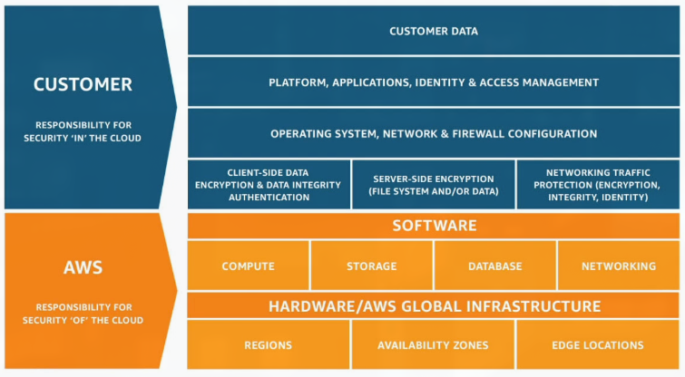
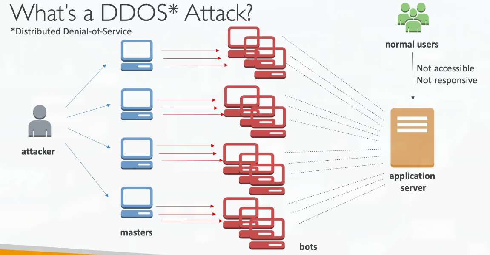
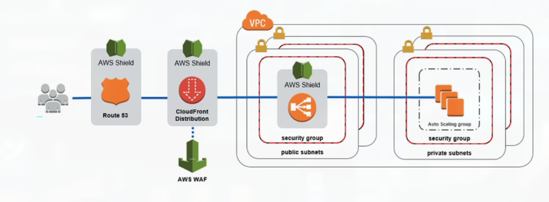
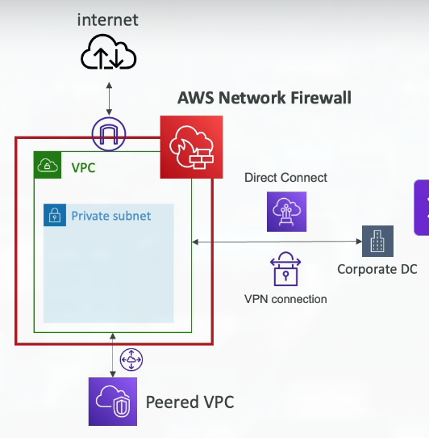
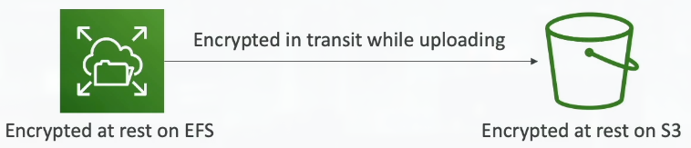
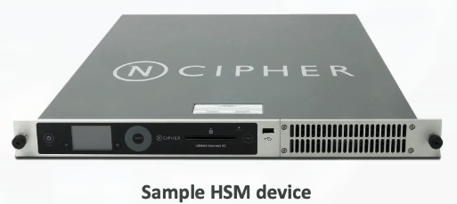
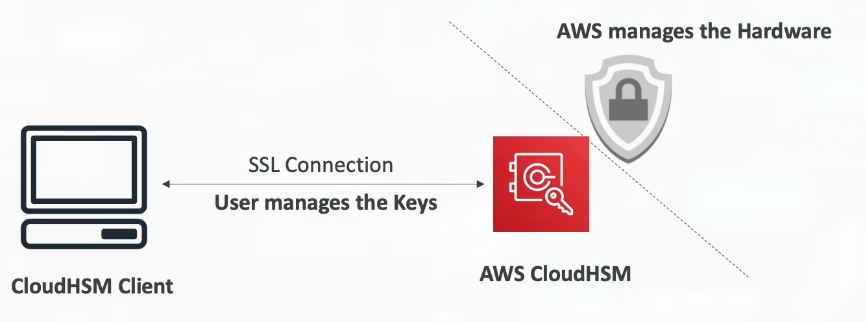

# Section 16: Security & Compliance

## 182. Shared Responsibility Model: Reminders & Examples

### AWS Shared Responsibility Model

- AWS responsibility - Security of the Cloud
    - Protecting infrastructure (hardware, software, facilities, and networking) that runs all the AWS services
    - Managed services like S3, DynamoDB, RDS, etc
- Customer responsibility - Security in the Cloud
    - For EC2 instance, customer is responsible for management of the guest OS (including security patches and updates), firewall & network configuration, IAM
    - Encrypting application data
- Shared controls:
    - Patch Management, Configuration Management, Awareness & Training

### Example, for RDS

- AWS responsibility:
    - Manage the underlying EC2 instance, disable SSH access
    - Automated DB patching
    - Automated OS patching
    - Audit the underlying instance and disks & duarantee it functions
- Your responsibility
    - Check the ports / IP / security group inbound rules in DB's SG
    - In-database user creation and permissions
    - Creating a database with or without public access
    - Ensure parameter groups or DB is configured to only allow SSL connections
    - Database encryption setting

### Example, for S3
- AWS responsibility:
    - Guarantee you get unlimited storage
    - Guarantee you get encryption
    - Ensure separation of the data between different customers
    - Ensure AWS employees can't access your data
- Your responsibility:
    - Bucket configuration
    - Bucket policy / public setting
    - IAM user and roles
    - Enabling encryption

### Shared Responsibility Model diagram

## 183. DDoS Protection: WAF & Shield

### What's a DDOS* Attack?

***Distributed Denial-of-Service***

### DDOS Protection on AWS
- AWS Shield Standard: protects against DDOS attack for your website and applications, for all customers at no additional costs
- AWS Shield Advanced: 24/7 premium DDoS protection
- AWS WAF: Filter specific requests based on rules
- CloudFront and Route 53:
    - Availability protection using global edge network
    - Combined with AWS Shield, provides attack mitigation at the edge
- Be ready to scale - leverage AWS Auto Scaling

### Sample Reference Architecture for DDoS Protection

### AWS Shield
- AWS Shield Standard:
    - Free service that is activated for every AWS customer
    - Provides protection from attacks such as SYN/UDP Floods, Reflection attacks and other layer 3 / layer 4 attacks
- AWS Shield Advanced:
    - Optional DDoS mitigation service ($3,000 per month per organization)
    - Protect against more sophisticated attack on Amazon EC2, Elastic Load Balancing (ELB), Amazon CloudFront, AWS Global Accelerator, and Route 53
    - 24/7 access to AWS DDoS response team (DRP)
    - Protect against higher fees during usage spikes due to DDoS

### AWS WAF - Web Application Firewall
- Protects your web applications from common web exploits (Layer 7)
- Layer 7 is HTTP (vs Layer 4 is TCP)
- Deploy on Application Load Balancer, API Gateway, CloudFront
- Define Web ACL (Web Access Control List):
    - Rules can include IP addresses, HTTP headers, HTTP body, or URI strings
    - Protects from common attack - SQL injection and Cross-Site Scripting (XSS)
    - Size constraints, geo-match (block countries)
    - Rate-based rules (to count occurrences of events) - for DDoS protection

## 184. AWS Network Firewall

### AWS Network Firewall
- Protect your entire Amazon VPC
- From Layer 3 to Layer 7
- Any direction, you can inspect
    - VPC to VPC traffic
    - Outbound to internet
    - Inbound from internet
    - To / from Direct Connect & Site-to-Site VPN

## 185. AWS Firewall Manager

### AWS Firewall Manager
- Manage security rules in all accounts of an AWS Organization
- Security policy: common set of security rules
    - VPC Security Groups for EC2, Application Load Balancer, etc...
    - WAF fules
    - AWS Shield Advanced
    - AWS Network Firewall
- Rules are applied to new resources as they are created (good for compliance) across all and future accounts in your Organization

## 186. Penetration Testing

### Penetration Testing on AWS Cloud
- AWS customers are welcome to carry out security assessments or penetration tests against their AWS infrastructure without prior approval for 8 services:
    - Amazon EC2 instances, NAT Gateways, and Elastic Load Balancers
    - Amazon RDS
    - Amazon CloudFront
    - Amazon Aurora
    - Amazon API Gateways
    - AWS Lambda and Lambda Edge functions
    - Amazon Lightsail resources
    - Amazon Elastic Beanstalk environments
- List can increase overtime (you won't be tested on that at the exam)

- Prohibited Activities
    - DNS zone walking via Amazon Route 53 Hosted Zones
    - Denial of Service (DoS), Distributed Denial of Service (DDoS), Simulated DoS, Simulated DDoS
    - Port flooding
    - Protocol flooding
    - Request flooding (login request flooding, API request flooding)

## 187. Encryption with KMS & CloudHSM

### Data at rest vs. Data in transit

- At rest: data stored or archived on a device
    - On a hard disk, on a RDS instance, in S3 Glacier Deep Archive, etc
- In transit (in motion): data being moved from one location to another
    - Transfer from on-premises to AWS, EC2 to DynamoDB, etc
    - Means data transferred on the network
- We want to encrypt data in both states to protect it!
- For this we leverage encryption keys

### AWS KMS (Key Management Service)
- Anytime you hear "encryption" for an AWS service, it's most likely KMS
- KMS = AWS manages the encryption keys for us
- Encryption Opt-in:
    - EBS volumes: encrypt volumes
    - S3 buckets: Server-side encryption of objects (SSE-S3 enabled by default, SSE-KMS opt in)
    - Redshift database: encryption of data
    - RDS database: encryption of data
    - EFS drives: encryption of data
- Encryption Automatically enabled:
    - CloudTrail Logs
    - S3 Glacier
    - Storage Gateway

### CloudHSM
- KMS => AWS manages the software for encryption
- CloudHSM => AWS provisions encryption hardware
- Dedicated Hardware (HSM = Hardware Security Module)
- You manage your own encryption keys entirely (not AWS)
- HSM device is tamper resistant, FIPS I 40-2 Level 3 compliance

### CloudHSM Diagram

### Types of KMS Keys
- Customer Managed Key:
    - Create, manage and used by the customer, can enable or disable
    - Possibility of rotation policy (new key generated every year, old key preserved)
    - Possibility to bring-your-own-key
- AWS Managed Key:
    - Created, managed and used on the customer's behalf by AWS
    - Used by AWS services (aws/s3,aws/eb,aws/redshift)
- AWS Owned Key:
    - Collection of CMKs that an AWS service owns and manages to use in multiple accounts
    - AWS can use those to protect resources in your account (but you can't view the kys)
- CloudHSM Keys (custom keystore):
    - Keys generated from your own CloudHSM hardware device
    - Cryptographic operations are performed within the CloudHSM cluster

## 188. Encryption with KMS & CloudHSM Hands On

## 189. AWS Certificate Manager (ACM) Overview

## 190. Secrets Manager Overview

## 191. Artifact Overview

## 192. GuardDuty Overview

## 193. Inspector Overview

## 194. Config Overview

## 195. Macie Overview

## 196. Security Hub Overview

## 197. Amazon Detective Overview

## 198. AWS Abuse

## 199. Root User Privileges

## 200. IAM Access Analyzer

## 201. Security & Compliance Summary
