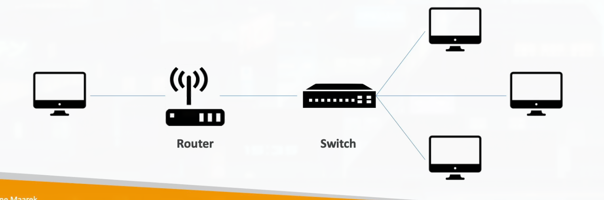

# Section 3: What is Cloud Computing

## 7. Traditional IT Overview

### How Websites Work

The basic architecture of how websites function follows a simple pattern:

**Client** → **Network** → **Server**

- **Clients** have **IP addresses** (Internet Protocol addresses) - these are unique identifiers for devices on a network
- **Servers** have **IP addresses** - these identify where the server is located on the internet

> Think of IP addresses like street addresses for computers. Just as your home has a unique address, every device connected to the internet has an IP address that allows other devices to find and communicate with it. When you type a website URL into your browser, your computer uses DNS (Domain Name System) to translate the human-readable domain name (like "amazon.com") into the server's IP address, then sends your request over the network to that address.

### What is a Server Composed Of?

A server is essentially a computer that provides services to other computers. It consists of several key components:

- **Compute**: **CPU** (Central Processing Unit) - the "brain" that processes instructions
- **Memory**: **RAM** (Random Access Memory) - temporary storage for active programs and data
- **Storage**: Data storage devices - where files and data are permanently stored
- **Database**: A structured way to store and organize data for efficient retrieval
- **Network**: **Routers**, **switches**, **DNS servers** - components that enable communication between devices

### IT Terminology

Understanding basic networking terminology is essential for cloud computing:

- **Network**: A collection of cables, **routers**, and **servers** connected to each other, allowing devices to communicate
- **Router**: A networking device that forwards data packets between computer networks. Routers act like traffic directors, knowing where to send your data packets on the internet
- **Switch**: A device that takes a data packet and sends it to the correct server or client within your local network

### Traditionally, How to Build Infrastructure

The evolution of IT infrastructure typically follows this path:

1. **Data stored in Home or Garage**: Small businesses or individuals start with servers in their own space
2. **Move to Office and have a Data Center**: As businesses grow, they move to dedicated office spaces with proper data centers

### Problems with Traditional IT Approach

Running your own infrastructure comes with significant challenges and costs:

- **Pay for rent** for the data center facility
- **Pay for power supply**, cooling systems, and ongoing maintenance
- **Adding and replacing hardware takes time** - you must physically procure, install, and configure new equipment
- **Scaling is limited** - you can only scale as much as your physical space and budget allow
- **Hire a 24/7 team** to monitor the infrastructure - requires skilled IT professionals around the clock
- **How to deal with disasters?** - Natural disasters, power outages, or hardware failures can cause complete service disruption
- **Can we externalize all this?** - This question led to the birth of cloud computing

> The traditional approach requires significant upfront investment (CAPEX - Capital Expenditure) and ongoing operational costs (OPEX - Operational Expenditure). You're essentially building and maintaining your own mini-version of what cloud providers do at massive scale. This is not only expensive but also limits your ability to quickly adapt to changing business needs. Cloud computing emerged as a solution to externalize all these concerns, allowing businesses to focus on their core competencies rather than managing infrastructure.

## 8. What is Cloud Computing

### What is Cloud Computing?

**Cloud computing** is the on-demand delivery of compute power, database storage, applications, and other IT resources through a cloud services platform with **pay-as-you-go pricing**.

Key characteristics of cloud computing:

- You can **provision exactly the right type and size** of computing resources you need
- You can **access as many resources as you need, almost instantly**
- It's a **simple way to access servers, storage, databases, and a set of application services**

> **Amazon Web Services** owns and maintains the network-connected hardware required for these application services, while you provision and use what you need via a web application. This is the fundamental shift: instead of buying and maintaining your own servers, you rent computing resources from AWS, paying only for what you use, when you use it. It's like the difference between buying a car (traditional IT) versus using a ride-sharing service (cloud computing) - you get the same result (transportation/computing power) but without the upfront costs, maintenance, or long-term commitment.

### You Have Been Using Some Cloud Services

You're likely already familiar with cloud computing through everyday services:

- **Gmail**:
    - E-mail cloud service
    - Pay for ONLY your emails stored (no infrastructure, etc.)
- **Dropbox**:
    - Cloud Storage Service
    - Originally built on **AWS**
- **Netflix**:
    - Built on **AWS**
    - Video on Demand service

### The Deployment Models of the Cloud

There are three main ways organizations can deploy cloud services:

- **Private Cloud**:
    - Cloud services used by a **single organization**, not exposed to the public
    - **Complete control** over the infrastructure
    - Enhanced **security for sensitive applications**
    - Can **meet specific business needs** and compliance requirements

- **Public Cloud**:
    - Cloud resources owned and operated by a **third-party cloud service provider** delivered over the Internet
    - Examples include **AWS**, **Microsoft Azure**, and **Google Cloud Platform**
    - Offers the **Six Advantages of Cloud Computing** (discussed below)

- **Hybrid Cloud**:
    - **Keep some servers on premises** and extend some capabilities to the Cloud
    - Allows organizations to gradually migrate to the cloud while maintaining critical on-premises systems

### The Five Characteristics of Cloud Computing

According to the National Institute of Standards and Technology (NIST), cloud computing has five essential characteristics:

1. **On-Demand Self Service**:
    - Users can **provision resources and use them without human interaction** from the service provider
    - You can spin up servers, storage, or databases instantly through a web interface or API

2. **Broad Network Access**:
    - Resources are **available over the network** and can be accessed by diverse client platforms (laptops, mobile devices, tablets)
    - Access is available from anywhere with an internet connection

3. **Multi-Tenancy and Resource Pooling**:
    - **Multiple customers can share the same infrastructure** and applications with security and privacy
    - Multiple customers are serviced from the same physical resources
    - Resources are dynamically assigned and reassigned according to demand

> Multi-tenancy is like an apartment building: multiple tenants (customers) live in the same building (physical infrastructure), but each has their own secure apartment (isolated resources). The building owner (cloud provider) maintains the building, while tenants only pay for their space. This model allows cloud providers to achieve massive economies of scale, which translates to lower costs for customers. AWS uses sophisticated virtualization and security technologies to ensure complete isolation between tenants, so your data and applications are completely private and secure, even though you're sharing the underlying physical hardware.

4. **Rapid Elasticity and Scalability**:
    - **Automatically and quickly acquire and dispose resources** when needed
    - **Quickly and easily scale based on demand**
    - Resources appear to be unlimited and can be provisioned in any quantity at any time

5. **Measured Service**:
    - **Usage is measured**, users pay correctly for what they have used
    - Cloud systems automatically control and optimize resource use through metering capabilities
    - You can monitor, control, and report resource usage, providing transparency for both the provider and consumer

### Six Advantages of Cloud Computing

Cloud computing offers six key advantages over traditional IT infrastructure:

1. **Trade Capital Expense (CAPEX) for Operational Expense (OPEX)**
    - **Pay On-Demand**: don't own hardware
    - **Reduced Total Cost of Ownership (TCO)** & Operational Expense (OPEX)
    - No large upfront investments in hardware

> CAPEX vs OPEX is a fundamental financial shift. Capital Expenditure (CAPEX) means buying assets (servers, networking equipment) that you own and depreciate over time. Operational Expenditure (OPEX) means paying for services as you use them. With cloud computing, instead of spending $100,000 upfront on servers (CAPEX), you might pay $2,000 per month for the same computing power (OPEX). This is especially beneficial for startups and growing businesses that need to preserve cash flow. Additionally, cloud expenses are typically tax-deductible as operating expenses, providing immediate tax benefits compared to capital expenses that must be depreciated over several years.

2. **Benefit from Massive Economies of Scale**
    - Prices are reduced as **AWS is more efficient due to large scale**
    - AWS can negotiate better prices for hardware, power, and bandwidth due to massive purchasing power

3. **Stop Guessing Capacity**
    - **Scale based on actual measured usage**
    - No need to provision for peak capacity that you rarely use

4. **Increase Speed and Agility**
    - Deploy resources in minutes instead of weeks or months
    - Experiment and innovate faster with lower risk

5. **Stop Spending Money Running and Maintaining Data Centers**
    - Focus on your business, not infrastructure management
    - AWS handles all the maintenance, updates, and security patches

6. **Go Global in Minutes: Leverage the AWS Global Infrastructure**
    - Deploy applications in multiple regions worldwide with just a few clicks
    - Provide low-latency experiences to users around the globe

### Problems Solved by the Cloud

The cloud addresses many challenges that plague traditional IT infrastructure:

- **Flexibility**: Change resource types when needed - upgrade or downgrade without physical hardware changes
- **Cost-Effectiveness**: Pay as you go, for what you need - no wasted resources
- **Scalability**: Accommodate larger loads by making hardware stronger (vertical scaling) or adding additional nodes (horizontal scaling)
- **Elasticity**: Ability to scale out (add resources) and scale-in (remove resources) when needed automatically
- **High-Availability and Fault-Tolerance**: Built across multiple data centers - if one fails, others continue operating
- **Agility**: Rapidly develop, test, and launch software applications - reduce time to market

## 9. The Different Types of Cloud Computing

### Types of Cloud Computing

Cloud computing services are typically categorized into three main types, each offering different levels of abstraction and management:

1. **Infrastructure as a Service (IaaS)**
    - Provides **building blocks for cloud IT**
    - Provides **networking, computers, data storage space**
    - **Highest level of flexibility** - you manage the operating system, applications, and data
    - **Easy parallel with traditional on-premises IT** - similar to managing physical servers, but virtualized

2. **Platform as a Service (PaaS)**
    - **Removes the need for your organization to manage the underlying infrastructure**
    - **Focus on the deployment and management of your application**
    - AWS manages the servers, operating systems, and runtime environments
    - You focus on writing and deploying your code

3. **Software as a Service (SaaS)**
    - **Completed product that is run and managed by the service provider**
    - You simply use the software - no infrastructure or platform management needed
    - Typically accessed through a web browser

### Examples of Cloud Computing Types

**Infrastructure as a Service (IaaS)**:
    - **Amazon EC2** (on AWS) - virtual servers
    - **GCP** (Google Cloud Platform), **Azure** (Microsoft), Rackspace, Digital Ocean, Linode

**Platform as a Service (PaaS)**:
    - **Elastic Beanstalk** (on AWS) - deploy applications without managing infrastructure
    - **Heroku**, **Google App Engine** (GCP), **Windows Azure** (Microsoft)

**Software as a Service (SaaS)**:
    - Many AWS services (e.g., **Rekognition** for Machine Learning)
    - **Google Apps** (Gmail), **Dropbox**, **Zoom**

### Pricing of the Cloud - Quick Overview

**AWS** follows a **pay-as-you-go pricing model** with three fundamental pricing components:

1. **Compute**:
    - Pay for compute time (how long your servers run)
    - Billed per second or per hour depending on the service

2. **Storage**:
    - Pay for data stored in the Cloud
    - Different storage classes have different pricing (more on this in the S3 section)

3. **Data Transfer OUT of the Cloud**:
    - **Data transfer IN is free** - AWS doesn't charge for uploading data to their services
    - Data transfer OUT (downloading) incurs charges, though the first 100 GB per month is often free

> This pricing model solves the expensive issue of traditional IT. In traditional IT, you pay for hardware whether you use it or not. With cloud computing, you only pay for what you actually use. It's like the difference between buying a generator that runs 24/7 (traditional IT) versus paying for electricity only when you turn on the lights (cloud computing). This model allows businesses to start small and scale costs with growth, making it accessible to startups and cost-effective for enterprises.

## 10. AWS Cloud Overview

### AWS Cloud History

- 2002: Internally launched
- 2003: Amazon infrastructure is one of their core strength, Idea to market
- 2004: Launched publicly with SQS
- 2006: Re-launched publicly with SQS, S3 & EC2
- 2007: Launched in Europe

### AWS Cloud Number Facts

- In 2023, AWS had $90 billion in annual revenue
- AWS accounts for 31% of the market in Q1 2024 (Microsoft is 2nd with 25%)
- Pioneer and Leader of the AWS Cloud Market for the 13th consecutive year
- Over 1,000,000 active users

### AWS Cloud Use Cases

- AWS enables you to build sophisticated, scalable applications
- Applicable to a diverse set of industries
- Use cases include:
    - Enterprise IT, Backup & Storage, Big Data analytics
    - Website hosting, Mobile and Social Apps
    - Gaming

### AWS Global Infrastructure
- AWS Regions
- AWS Availability Zones
- AWS Data Centers
- AWS Edge Locations / Points of Presence

### AWS Regions

**AWS Regions** are geographic areas around the world where AWS clusters data centers:

- **AWS has Regions all around the world** - currently over 30 regions globally
- **Names follow a pattern** like `us-east-1`, `eu-west-3`, `ap-southeast-2`, etc.
    - Format: `[continent]-[direction]-[number]`
    - Example: `us-east-1` = United States, East Coast, Region 1
- **A region is a cluster of data centers** - each region contains multiple, isolated data centers
- **Most AWS services are region-scoped** - when you create a resource, you choose which region it lives in

### How to Choose an AWS Region

When launching a new application, choosing the right **AWS Region** is crucial. Consider these factors:

1. **Compliance with Data Governance and Legal Requirements**
    - **Data never leaves a region without your explicit permission**
    - Some countries/industries require data to stay within specific geographic boundaries
    - Example: European data protection laws may require data to stay in EU regions

2. **Proximity to Users**
    - Choose a region close to your users to reduce latency (delay)
    - Lower latency means faster response times for your application

3. **Service Availability**
    - **New services and new features aren't available in every Region**
    - Some regions may not have all AWS services yet
    - Check service availability before choosing a region

4. **Pricing**
    - **Pricing varies region to region** and is transparent on the service pricing page
    - Some regions are more expensive than others
    - Consider cost alongside other factors

> Choosing a region is like choosing where to build a physical store. You want to be close to your customers (low latency), comply with local laws (data residency), have access to the services you need (service availability), and consider the costs (pricing). Unlike physical stores, you can easily deploy to multiple regions later, but it's best to start with the right choice. A common strategy is to start in a major region like `us-east-1` (N. Virginia) which typically has the most services and lowest prices, then expand to other regions as your user base grows.

### AWS Availability Zones

**Availability Zones (AZs)** are the building blocks of AWS regions:

- **Each region has many availability zones** (usually 3, minimum is 3, maximum is 6)
- **Naming convention**: Region code + letter (a, b, c, etc.)
    - Example for `ap-southeast-2` (Sydney, Australia):
        - `ap-southeast-2a`
        - `ap-southeast-2b`
        - `ap-southeast-2c`
- **Each Availability Zone (AZ) is one or more discrete data centers** with redundant power, networking, and connectivity
- **They are separate from each other** - typically tens of kilometers apart, so they are isolated from disasters
- **They are connected with high bandwidth, ultra-low latency networking** - allows for fast data replication and failover

> Availability Zones are designed for high availability and fault tolerance. Think of them as separate buildings in different parts of a city. If one building (AZ) has a problem (power outage, natural disaster, network issue), your application can continue running in the other buildings. AWS recommends deploying applications across multiple AZs to ensure high availability. The physical separation ensures that a disaster affecting one AZ (like a flood or earthquake) won't affect others. The high-speed connections between AZs allow for real-time data replication, so if one AZ fails, you can failover to another with minimal data loss.

### AWS Points of Presence (Edge Locations)
- Amazon has 400+ Points of Presence (400+ Edge Locations & 10+ Regional Caches) in 90+ cities across 40+ countries
- Content is delivered to end users with lower latency

### Tour of the AWS Console

When you log into the AWS Management Console, you'll notice that services fall into two categories:

**AWS Global Services** (not tied to a specific region):
    - **Identity and Access Management (IAM)** - manages users, groups, and permissions globally
    - **Route 53** (DNS Service) - domain name system service
    - **CloudFront** (Content Delivery Network) - distributes content globally
    - **WAF** (Web Application Firewall) - protects web applications globally

**Most AWS services are Region-scoped** (you must select a region):
    - **Amazon EC2** (Infrastructure as a Service) - virtual servers
    - **Elastic Beanstalk** (Platform as a Service) - application deployment platform
    - **Lambda** (Function as a Service) - serverless compute
    - **Rekognition** (Software as a Service) - machine learning image analysis

## 12. Tour of the Console and Service of AWS

**Key Points to Remember:**

- **Some services will be global** (Route 53, IAM, etc.) - these work across all regions automatically
- **Most services will have a Region selector** for you to choose where resources are created
- **Some regions will not have some services** - newer services may roll out to regions gradually, and some specialized services may only be available in specific regions

## 13. Shared Responsibility Model & AWS Acceptable Use Policy

### Shared Responsibility Model

The **Shared Responsibility Model** is a fundamental concept in AWS that defines what AWS is responsible for versus what you (the customer) are responsible for.

> Understanding the Shared Responsibility Model is crucial for security and compliance. AWS is responsible for the security **OF** the cloud - they secure the infrastructure, hardware, software, networking, and facilities that run AWS services. You are responsible for security **IN** the cloud - your data, applications, access management, operating system configuration, and network traffic. Think of it like renting an apartment: the landlord (AWS) is responsible for the building's security (locks, alarms, structure), but you're responsible for what happens inside your apartment (locking your door, not leaving windows open, securing your valuables). This model applies to every AWS service, though the specific responsibilities vary by service type.

### AWS Acceptable Use Policy

When using AWS services, you must comply with the **AWS Acceptable Use Policy**. Key restrictions include:

- **No Illegal, Harmful, or Offensive Use or Content** - AWS services cannot be used for illegal activities
- **No Security Violations** - you cannot attempt to breach AWS security or other customers' security
- **No Network Abuse** - no denial of service attacks, spam, or network interference
- **No E-Mail or Other Message Abuse** - no spam, phishing, or unsolicited communications

<u>Violating the Acceptable Use Policy can result in immediate service termination and potential legal action.</u>
