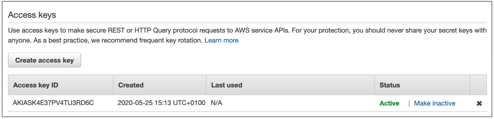
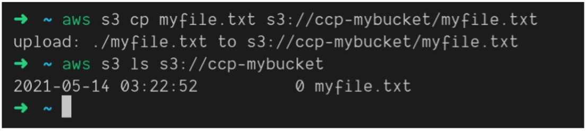
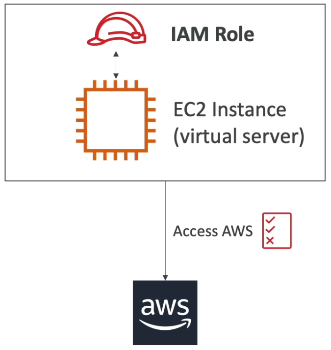

# Section 4: IAM - Identity and Access Management

## 14. IAM Introduction: Users, Groups, Policies

### IAM: Users & Groups

**IAM** stands for **Identity and Access Management** - it's a **global service** that manages who can access your AWS resources and what they can do.

Key concepts:

- **Root account created by default** - this is the account created when you first sign up for AWS
    - <u>Should not be used or shared</u> - the root account has unlimited permissions
- **Users are people within your organization** - individual accounts for each person who needs AWS access
- **Users can be grouped** - organize users into groups for easier permission management
- **Groups only contain users, not other groups** - you cannot nest groups within groups

### IAM: Permissions

**Permissions** in AWS are managed through **policies**:

- **Users or Groups can be assigned JSON documents called policies**
- **These policies define the permissions** of the users - what AWS services they can access and what actions they can perform
- **In AWS you apply the least privilege principle**: do not give more permissions than a user needs

> The least privilege principle is a fundamental security best practice. It means giving users only the minimum permissions they need to do their job - nothing more. For example, a developer who only needs to read S3 buckets shouldn't have permission to delete them or create EC2 instances. This reduces the risk of accidental damage or security breaches. If a user's account is compromised, the attacker can only do what that user is allowed to do, limiting potential damage. Think of it like giving someone a key to only the rooms they need to access, not the master key to the entire building.

## 15. IAM Users & Groups Hands On
***This is a lab tutorial lesson***

## 16. AWS Console Simultaneous Sign-in
***This is a lab tutorial lesson***

## 17. IAM Policies

### IAM Policies inheritance

### IAM Policies Structure

**IAM Policies** are JSON (JavaScript Object Notation) documents that follow a specific structure. Understanding this structure is essential for creating and managing permissions.

A policy consists of:

- **Version**: Policy language version, always include `"2012-10-17"` (the current version)
- **Id**: An identifier for the policy (optional) - useful for tracking policies
- **Statement**: One or more individual statements (required) - this is where the actual permissions are defined

Each statement consists of:

- **Sid** (Statement ID): An identifier for the statement (optional) - helps identify what each statement does
- **Effect**: Whether the statement **allows** or **denies** access - must be either "Allow" or "Deny"
- **Principal**: The account/user/role to which this policy is applied (used in resource-based policies, not identity-based policies)
- **Action**: List of actions this policy allows or denies - e.g., `"s3:GetObject"`, `"ec2:StartInstances"`
- **Resource**: List of resources to which the actions are applied - e.g., `"arn:aws:s3:::my-bucket/*"`
- **Condition**: Conditions for when this policy is in effect (optional) - e.g., time-based, IP-based restrictions

> IAM Policies use JSON format, which is a structured way to represent data. Think of a policy like a legal document that specifies exactly what someone can and cannot do. The "Effect" field is like a verdict - either "Allow" (permission granted) or "Deny" (permission denied). "Actions" are the specific operations - like verbs in a sentence (Get, Put, Delete, Start, Stop). "Resources" are the specific AWS resources - like nouns (this S3 bucket, that EC2 instance). "Conditions" add extra rules - like "you can access this, but only during business hours" or "only from this IP address". When AWS evaluates a request, it checks all applicable policies. If any policy explicitly denies the action, the request is denied. Otherwise, if at least one policy allows it, the request is granted.

## 18. IAM Policies Hands On
***This is a lab tutorial lesson***

## 19. IAM MFA Overview

### IAM - Password Policy

**Strong passwords** provide higher security for your AWS account. In AWS, you can set up a **password policy** to enforce security requirements:

- **Set a minimum password length** - typically 8-14 characters minimum
- **Require specific character types**:
    - Including **uppercase letters** (A-Z)
    - **Lowercase letters** (a-z)
    - **Numbers** (0-9)
    - **Non-alphanumeric characters** (special characters like !, @, #, $)
- **Allow all IAM users to change their own passwords** - enables self-service password management
- **Require users to change their password after some time** (password expiration) - forces regular password rotation
- **Prevent password re-use** - users cannot reuse recent passwords

### Multi-Factor Authentication (MFA)

**Multi-Factor Authentication (MFA)** adds an extra layer of security beyond just a password:

- **Users have access to your account** and can possibly change configurations or delete resources in your AWS account
- **You want to protect your Root Accounts and IAM users** - especially those with administrative privileges
- **MFA = password you know + security device you own** - requires two forms of authentication
- **Main benefit of MFA**: <u>If a password is stolen or hacked, the account is not compromised</u> - the attacker would also need physical access to your MFA device

> MFA works on the principle of "something you know" (your password) plus "something you have" (your MFA device). Even if someone steals your password, they can't access your account without also having your phone, security key, or hardware token. It's like having two locks on your door - even if someone copies your key, they still need the combination to the second lock. This dramatically reduces the risk of unauthorized access. AWS strongly recommends enabling MFA, especially for root accounts and users with administrative permissions. In fact, many organizations make MFA mandatory for all users as part of their security policies.

### MFA Device Options in AWS

AWS supports several types of MFA devices:

- **Virtual MFA Device**: Support for multiple tokens on a single device
    - Uses apps like Google Authenticator or Authy on your smartphone
    - Most convenient and cost-effective option
- **Universal 2nd Factor (U2F) Security Key**: Support for multiple root and IAM users using a single security key
    - Physical USB or NFC devices like YubiKey
    - Very secure and convenient for multiple accounts
- **Hardware Key Fob MFA Device**: Physical device that generates time-based codes
    - Provided by AWS or third-party vendors
- **Hardware Key Fob MFA Device for AWS GovCloud (US)**: Specialized hardware for government cloud environments

## 20. IAM MFA Hands On
***This is a lab tutorial lesson***

## 21. AWS Access Keys, CLI and SDK

### How Can Users Access AWS?

To access AWS, you have **three main options**:

1. **AWS Management Console** (protected by password + MFA)
    - Web-based graphical interface
    - Best for beginners and manual operations

2. **AWS Command Line Interface (CLI)**: Protected by access keys
    - Command-line tool for interacting with AWS services
    - Great for automation and scripting

3. **AWS Software Developer Kit (SDK)** - for code: Protected by access keys
    - Libraries for various programming languages
    - Used to build applications that interact with AWS

**Important points about Access Keys:**

- **Access Keys are generated through the AWS Console**
- **Users manage their own access keys**
- <u>**Access Keys are secret, just like a password - Do not share them**</u>
- **Access Key ID** ~= username (can be shared, but not sensitive)
- **Secret Access Key** ~= password (highly sensitive, never share)

> Access Keys are like a username and password pair for programmatic access to AWS. The Access Key ID is like your username - it identifies who you are, but it's not secret (you can see it in logs, etc.). The Secret Access Key is like your password - it must be kept completely secret. If someone gets your Secret Access Key, they can make API calls as you, potentially causing damage or incurring costs. Never commit access keys to code repositories, share them in emails, or store them in insecure locations. AWS provides IAM roles as a more secure alternative for applications running on AWS infrastructure, as roles automatically rotate credentials and don't require you to manage keys manually.

### Example Access Keys

- Access Key ID
- Secret Access Key
- <u>Remember: do not share your access keys</u>

### What is the AWS CLI?

The **AWS CLI** (Command Line Interface) is a unified tool that enables you to interact with AWS services using commands in your command-line shell:

- **Direct access to the public APIs** of AWS services - everything you can do in the console, you can do via CLI
- **You can develop scripts to manage your resources** - automate repetitive tasks
- **It is open-source** - available at https://github.com/aws/aws-cli
- **Alternative to using AWS Management Console** - some users prefer command-line for speed and automation

> The AWS CLI is like having a remote control for AWS. Instead of clicking through web pages, you type commands like `aws s3 ls` to list S3 buckets or `aws ec2 start-instances --instance-ids i-1234567890abcdef0` to start an EC2 instance. This is especially powerful for automation - you can write scripts that manage hundreds of resources, schedule tasks, or integrate AWS operations into your deployment pipelines. The CLI uses the same APIs that the console uses, so anything you can do in the console, you can do via CLI. Many DevOps engineers prefer the CLI because it's faster, scriptable, and can be integrated into automated workflows.

### What is the AWS SDK?

The **AWS SDK** (Software Development Kit) provides **language-specific APIs** (set of libraries) that enable you to access and manage AWS services programmatically:

- **Embedded within your application** - you include the SDK in your code
- **Enables programmatic access** to AWS services from your applications
- **Supports multiple languages and platforms**:
    - **SDKs**: JavaScript, Python, PHP, .NET, Ruby, Java, Go, Node.js, C++
    - **Mobile SDKs**: Android, iOS, and other mobile platforms
    - **IoT Device SDKs**: Embedded C, Arduino, and other IoT platforms
- **Example**: AWS CLI is built on AWS SDK for Python

> The AWS SDK is like a translator that helps your application speak AWS's language. Instead of manually crafting HTTP requests to AWS APIs, you use simple function calls in your preferred programming language. For example, in Python, you might write `s3_client.upload_file('myfile.txt', 'my-bucket', 'myfile.txt')` instead of manually constructing the HTTP request. The SDK handles authentication, request formatting, error handling, and response parsing for you. This makes it much easier to build applications that interact with AWS. The SDK is available for virtually every popular programming language, so you can use AWS from any application, whether it's a web app, mobile app, or embedded device.

## 22. AWS CLI Setup on Windows
***This is a lab tutorial lesson***

## 23. AWS CLI Setup on Mac
***This is a lab tutorial lesson***

## 24. AWS CLI Setup on Linux
***This is a lab tutorial lesson***

## 25. AWS CLI Hands On
***This is a lab tutorial lesson***

## 26. AWS CloudShell
***This is a lab tutorial lesson***

## 27. IAM Roles for AWS Services

**IAM Roles** are a way to grant permissions to AWS services (rather than to users):

- **Some AWS services will need to perform actions on your behalf**
    - For example, an EC2 instance might need to read from S3, or a Lambda function might need to write to DynamoDB
- **To do so, we assign permissions to AWS services with IAM Roles**
- **Common roles**:
    - **EC2 Instance Roles** - allow EC2 instances to access other AWS services
    - **Lambda Function Roles** - allow Lambda functions to access AWS services
    - **Roles for CloudFormation** - allow CloudFormation to create and manage resources

> IAM Roles are different from IAM Users. Users are for people, roles are for AWS services and applications. Think of a role like a job description - it defines what permissions something needs to do its job. When an EC2 instance needs to access S3, you don't give it a username and password (access keys). Instead, you attach a role to the EC2 instance. AWS automatically provides temporary credentials to the instance, and these credentials have the permissions defined in the role. This is much more secure than storing access keys on the instance because: (1) the credentials are temporary and automatically rotated, (2) you can't accidentally leak them, (3) if the instance is compromised, you can revoke the role and the credentials become invalid. Roles are the recommended way to grant permissions to AWS services.

## 28. IAM Roles Hands On
***This is a lab tutorial lesson***

## 29. IAM Security Tools

AWS provides two important security tools to help you audit and manage IAM permissions:

**IAM Credentials Report** (account-level):
    - **A report that lists all your account's users** and the status of their various credentials
    - Shows password age, access key age, MFA status, and last login information
    - Helps identify unused accounts, old passwords, or missing MFA

**IAM Access Advisor** (user-level):
    - **Access advisor shows the service permissions granted to a user** and when those services were last accessed
    - **You can use this information to revise your policies** - remove unused permissions
    - Helps implement the least privilege principle by identifying permissions that are never used

> These tools are essential for maintaining good security hygiene. The Credentials Report is like a health check for your IAM setup - it shows you which users haven't logged in for months (maybe they left the company), which passwords are old and need rotation, and which accounts don't have MFA enabled. The Access Advisor is like a usage report - it shows you what permissions each user actually uses. If a user has permission to use 20 AWS services but only uses 3 of them, you can remove the unused permissions. This follows the least privilege principle and reduces your attack surface. Regular reviews (monthly or quarterly) of these reports help ensure your IAM setup remains secure and compliant.

## 30. IAM Security Tools Hands On
***This is a lab tutorial lesson***

## 31. IAM Best Practices

Following IAM best practices is crucial for maintaining a secure AWS environment:

- **Do not use the root account except for AWS account setup**
    - The root account has unlimited permissions and cannot be restricted
    - Create IAM users for daily operations

- **One physical user = One AWS user**
    - Each person should have their own IAM user account
    - Enables proper auditing and access control

- **Assign users to groups and assign permissions to groups**
    - Don't assign permissions directly to users
    - Makes permission management easier and more consistent

- **Create a strong password policy**
    - Enforce minimum length, complexity, and rotation requirements

- **Use and enforce the use of Multi-Factor Authentication (MFA)**
    - Especially for root accounts and users with administrative permissions

- **Create and use Roles for giving permissions to AWS services**
    - Don't use access keys for services running on AWS infrastructure
    - Roles are more secure and automatically rotate credentials

- **Use Access Keys for Programmatic Access (CLI/SDK)**
    - Only when necessary and never commit them to code repositories

- **Audit permissions of your account using IAM Credentials Report & IAM Access Advisor**
    - Regular reviews help maintain security and compliance

- <u>**Never share IAM users and Access Keys**</u>
    - Each person should have their own credentials
    - Sharing credentials makes auditing impossible and violates security best practices

## 32. Shared Responsibility Model for IAM

**AWS**
- Infrastructure (global network security)
- Configuration and vulnerability analysis
- Compliance validation

**You**
- Users, Groups, Roles, Policies management and monitoring
- Enable MFA on all accounts
- Rotate all your keys often
- Use IAM tools to apply appropriate permissions
- Analyze access patterns and review permissions

## 33. IAM Summary

**Key IAM Concepts:**

- **Users**: Mapped to a physical user, has a password for AWS Console
- **Groups**: Contains users only (cannot nest groups)
- **Policies**: JSON document that outlines permissions for users or groups
- **Roles**: For EC2 instances or AWS services (not for people)
- **Security**: MFA + Password Policy for enhanced protection
- **AWS CLI**: Manage your AWS services using the command-line
- **AWS SDK**: Manage your AWS services using a programming language
- **Access Keys**: Access AWS using the CLI or SDK (keep secret!)
- **Audit**: IAM Credential Reports & IAM Access Advisor for security monitoring
