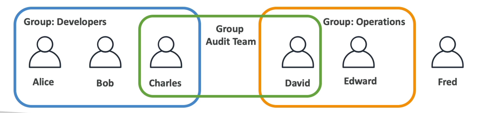
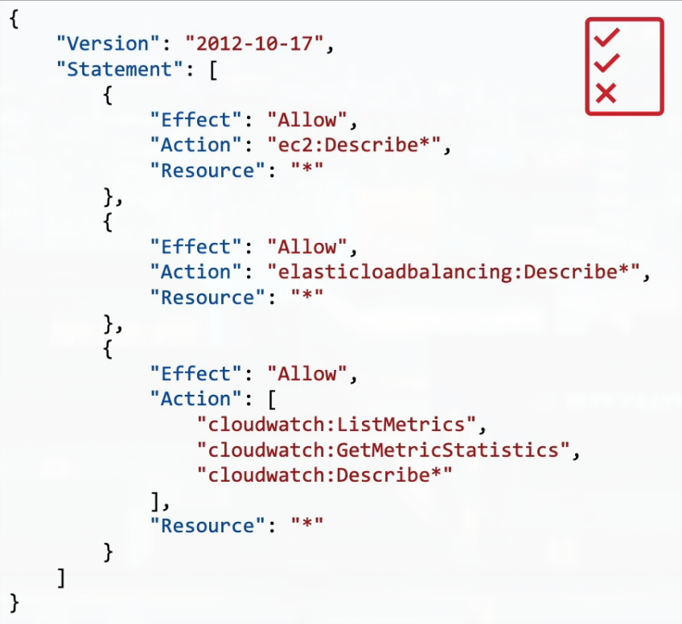
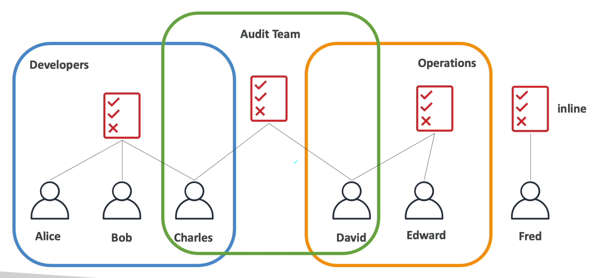
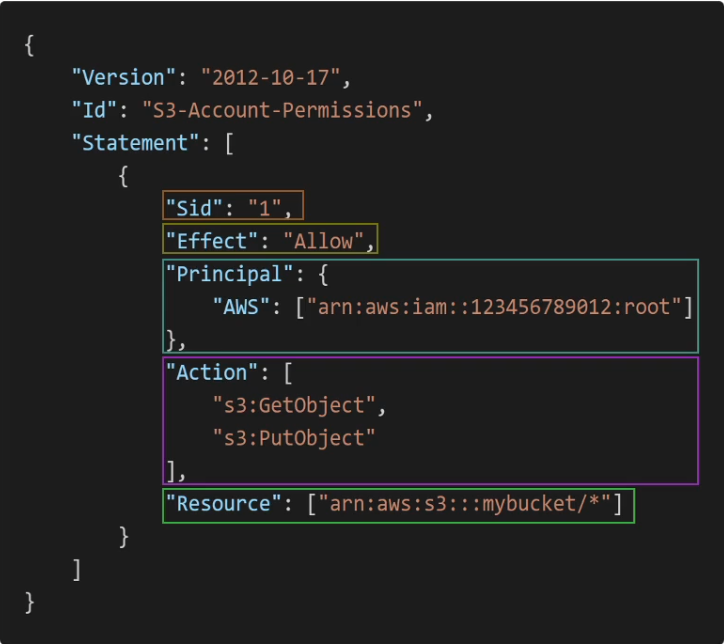

# Section 4: IAM - Identity and Access Management
## 14. IAM Introduction: Users, Groups,Policies

### IAM: Users & Groups
- IAM = Identity and Access Management, Global service
- Root account created by default, should not be used or shared
- Users are people within your organization, and can be grouped
- Groups only contain users, not other groups

### IAM: Permissions
- Users or Groups can be assigned JSON documents called policies
- These policies define the permissions of the users
- In AWS you apply the least privilege principle: do not give more permissions than a user needs

## 15. IAM Users & Groups Hands On
***This is a lab tutorial lesson***

## 16. AWS Console Simultaneous Sign-in
***This is a lab tutorial lesson***

## 17. IAM Policies

### IAM Policies inheritance

### IAM Policies Structure
- Consists of
    - Version: policy language version, always include "2012-10-17"
    - Id: an identifier for the policy (optional)
    - Statement: one or more individual statements (required)
- Statements consists of
    - Sid: an identifier for the statement (optional)
    - Effect: whether the statement allows or denied access (Allow, Deny)
    - Principal: account/user/role to which this policy applied to
    - Action: list of actions this policy allows or denies
    - Resource: list of resources to which the actions applied to
    - Condition: conditions of resources to which the actions applied to
    - Condition: conditions for when this policy is in effect (optional)

## 18. IAM Policies Hands On
***This is a lab tutorial lesson***

## 19. IAM MFA Overview
### IAM - Password Policy
- Strong password = higher security for your account
- In AWS, youc an setup a password policy:
    - Set a minimum password length
    - Require specific character types:
        - including uppercase letters
        - lowercase letters
        - numbers
        - non-alphanumeric characters
    - Allow all IAM users to change their own passwords
    - Require users to change their password after some time (password expiration)
    - Prevent password re-use

### Multi Factor Authentication - MFA
- Users have access to your account and can possibly change configurations or delete resources in your AWS account
- You want to protect your Root Accounts and IAM users
- MFA = password you know + security device you own
- Main benefit of MFA: <u>if a password is stolen or hacked, the account is not compromised</u>

### MFA devices options in AWS
- Virtual MFA device: support for multiple tokens on a single device
- Universal 2nd Factor (U2F) Security Key: Support for multiple root and IAM users using a single security key
- Hardware Key Fob MFA Device
- Hardware Key Fob MFA Device for AWS GovCloud (US)

## 20. IAM MFA Hands On

## 21. AWS Access Keys, CLI and SDK

## 22. AWS CLI Setup on Windows

## 23. AWS CLI Setup on Mac

## 24. AWS CLI Setup on Linux

## 25. AWS CLI Hands On

## 26. AWS CloudShell

## 27. IAM Roles for AWS Services

## 28. IAM Roles Hands On

## 29. IAM Security Tools

## 30. IAM Security Tools Hands On

## 31. IAM Best Practices

## 32. Shared Responsibility Model for IAM

## 33. IAM Summary
