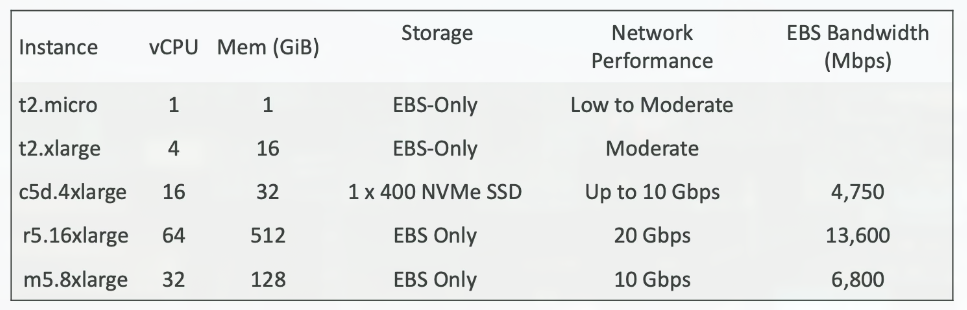
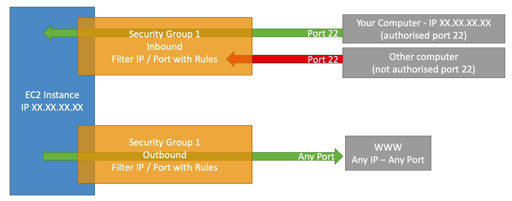
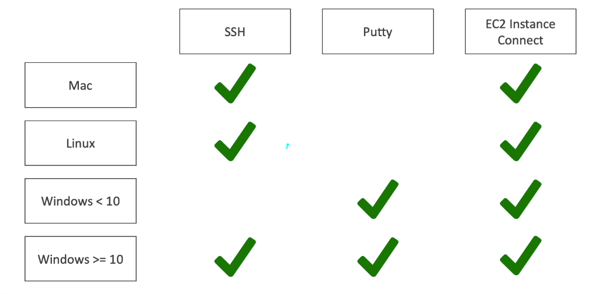
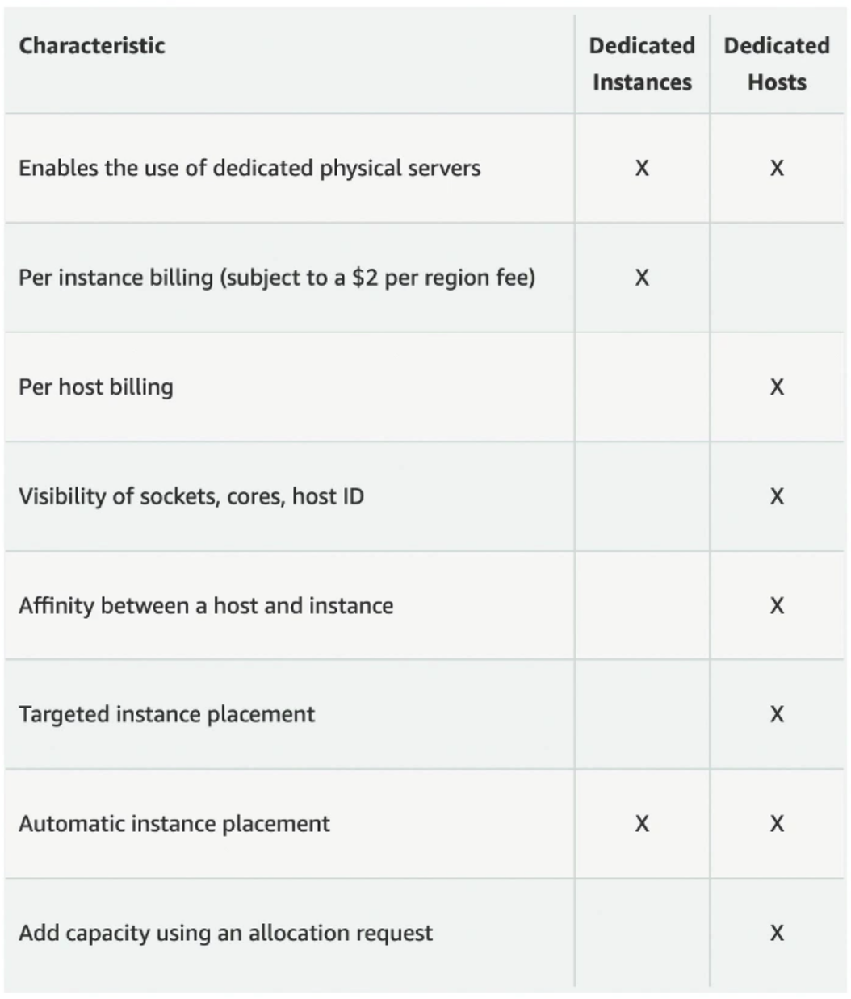
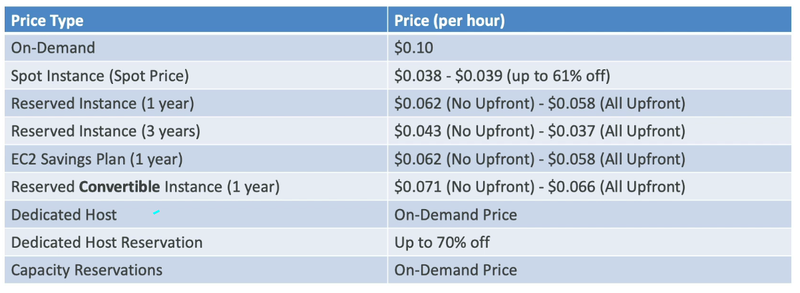
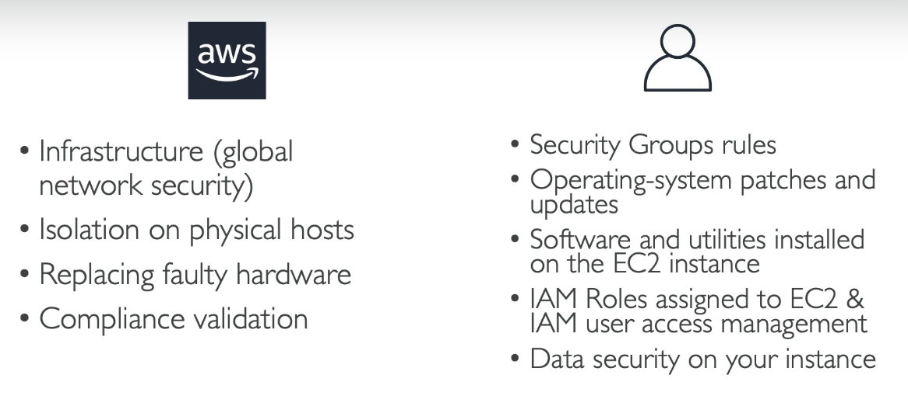

# Section 5: EC2 - Elastic Compute Cloud

## 34. AWS Budget Setup
***This is a lab tutorial lesson***

## 35. EC2 Basics

### Amazon EC2
- EC2 is one of the most popular of AWS' offering
- EC2 = Elastic Compute Cloud = Infrastructure as a Service
- It mainly cosists in the capability of:
    - Renting virtual machines (EC2)
    - Storing data on virtual drives (EBS)
    - Distributing load across machines (ELB)
    - Scaling the services using an auto-scaling group (ASG)
- Knowing EC2 is fundamental to understand how the Cloud works

### EC2 sizing and configuration options
- Operating System (OS): Linux, Windows or Mac OS
- How much compute power and cores (CPU)
- How much random-access memory (RAM)
- How much storage space:
    - Network-attached (EBS & EFS)
    - Hardware (EC2 Instance Store)
- Network card: speed of the card, Public IP address
- Firewall rules: security group
- Bootstrap script (configure at first launch): EC2 User Data

### EC2 User Data
- It is possible to bootstap our instances using an EC2 User Data script
- Bootstrapping means launching commands when a machine starts
- That script is only run one at the instance first start
- EC2 user data is used to automate boot tasks such as:
    - Installing updates
    - Installing software
    - Downloading common files from the internet
    - Anything you can thing of
- The EC2 User Data Script runs with the root user

## 36. Create an EC2 Instance with EC2 User Data to have a Website Hands On

### Hands-On: Launching an EC2 Instance running Linux
- We'll be launching our first virtual server using the AWS Console
- We'll get a first high-level approach to the various parameters
- We'll see that our web server is launched using EC2 user data
- We'll learn how to start / stop / terminate our instance

***This is a lab tutorial lesson***

## 37. EC2 Instance Types Basics

### EC2 Instance Types - Overview
- You can use different types of EC2 instances that are optimized for different use cases
- AWS has the following naming convention: m5.2xlarge
    - m: instance class
    - 5: generation (AWS improves them over time)
    - 2xlargeL size within the instance class
- General Purpose, Compute Optimized, Memory Optimized, Accelerated Computing, Storage Optmized, HPC Optimized, Instance Features, Measuring Instance Performance

### EC2 Instance Types - General Purpose
- Great for a diversity of workloads such as web servers or code repositories
- Balance between:
    - Compute
    - Memory
    - Networking
- In the course, we will be using the t2.micro which is a General Purpose EC2 isntance

### EC2 Instance Types - Compute Optimized
- Great for compute-intensive tasks that require high performance processors:
    - Batch processing workloads
    - Media transcoding
    - High performance web servers
    - High performance computing (HPC)
    - Scientific modeling and machine learning
    - Dedicated gaming servers

### EC2 Instance Types - Memory Optmized
- Fast performance for workloads that process large data sets in memory
- Use cases:
    - High performance, relational/non-relational databases
    - Distributed web scale cache stores
    - In-memory databases optimized for BI (business intelligence)
    - Applications performing real-time processing of big unstructured data

### EC2 Instance Types - Storage Optimized
- Great for storage-intensive tasks that require high, sequential read and write access to large data sets on local storage
- Use cases:
    - High frequency online transaction processing (OLTP) systems
    - Relational and NoSQL databases
    - Cache for in-memory databases (for example, Redis)
    - Data warehousing applications
    - Distributed file systems

### EC2 Instance Types: Example

## 38. Security Groups & Classic Ports Overview

### Introduction to Security Groups
- Security Groups are the fundamental of network security in AWS
- They control how traffic allowed into or out of our EC2 Instances

- Security groups only contain allow rules
- Security groups rules can reference by IP or by security group

### Security Groups - Deeper Dive
- Security groups are acting as a "firewall"  on EC2 instances
- They regulate:
    - Access to Ports
    - Authorised IP ranges - IPv4 and IPv6
    - Control of inbound network (from other to the instance)
    - Control of outbound network (from the instance to other)

### Security Groups Diagram

### Security Groups - Good to Know

- Can be attached to multiple instances
- Locked down to a region / VPC combination
- Does live (outside) the EC2 - if traffic is blocked the EC2 instance won't see it
- It is good to maintain one seperate security group for SSH access
- If your application is not accessible (time out), then it is security group issue
- If your application gives a "connection refused" error, then it's an application error or it's not launched
- All inbound traffic is blocked by default
- All outbound traffic is authorised by default

### Referencing Other Security Groups Diagram

### Classic Ports to Know
- 22 = SSH (Secure Shell) = log into a linux instance
- 21 = FTP (File Transfer Protocol) - upload files into a file share
- 22 = SFTP (Secure File Transfer Protocol) - upload files using SSH
- 80 = HTTP - access uncensured websites
- 443 = HTTPS = access secured website
- 3389 = RDP (Remote Desktop Protocol) - log into a Window instance

## 39. Security Groups Hands On
***This is a lab tutorial lesson***

## 40. SSH Overview

### SSH Summary Table

### Which Lectures to Watch
- Mac / Linux:
    - SSH on Mac/Linux lecture
- Windows:
    - Putty Lecture
    - If Windows 10: SSH on Windows 10 lecture
- All:
    - EC2 Instance Connect lecture
### SSH troubleshooting
- Students have the most problems with SSH
- If things do not work...
    - 1. Re-watch the lecture. You may have missed something
    - 2. Read the troubleshooting guide
    - 3. Try EC2 Instance Connect
- If one method works (SSH, Putty or EC2 Instance Connect) you are good
- If no method works, that is okay, the course won't use SSH much

## 41. How to SSH using Linux or Mac

### How to SSH into your EC2 instance
- We will learn how to SSH into your EC2 instance using Linux / Mac
- SSH is one of the most important function. It allows you to control a remote machine, all using the command line

***This is a lab tutorial lesson***

> chmod 0400 key.pem
> ssh -i key.pem ec2-user@public.ip.v4.address

## 42. How to SSH using Windows
***This is a lab tutorial lesson***

## 43. How to SSH using Windows 10
***This is a lab tutorial lesson***

## 44. SSH Troubleshooting
***This is a lab tutorial lesson***

## 45. EC2 Instance Connect
***This is a lab tutorial lesson***

## 46. EC2 Instance Roles Demo
***This is a lab tutorial lesson***

## 47. EC2 Instance Purchasing Options

### EC2 Instances Purchasing Options
- On-Demand Instances - short workload, predictable pricing, pay by second
- Reserved (1 & 3 years)
    - Reserved Instances - long workloads
    - Convertible Reserved Instances - long workloads with flexible instances
- Savings Plans (1 & 3 years) - commitment to an amount of usage, long workload
- Spot Instances - short workloads, cheap, can lose instances (less reliable)
- Dedicated Hosts - book an entire physical server, control instance placement
- Dedicated Instances - no other customers will share your hardware
- Capacity Reservations - reserve capacity in a specific AZ for any duration

### EC2 On Demand
- Pay for what you use:
    - Linux or Windows - billing per second, after the first minute
    - All other operating systems - billing per hour
- Has the highest cost but no upfront payment
- No long-term commitment
- Recommended for short-term and un-interrupted workloads, where you can't predict how the application will behave

### EC2 Reserved Instances
- Up to 72% discount compared to On-demand
- You reserve a specific instance attributes (Instance Type, Region, Tenancy, OS)
- Reservation Period - 1 year (+ discount) or 3 years (+++ discount)
- Payment Options - No Upfront (+), Partial Upfront (++), All Upfront (+++)
- Reserved Instance's Scope - Regional or Zonal (reserve capacity in an AZ)
- Recommended for steady-state usage applications (think database)
- You can buy and sell in the Reserved Instance Marketplace
- Convertible Reserved Instance
    - Can change the EC2 instance type, instance family, OS, scope and tenancy
    - Up to 66% discount

### EC2 Savings Plans
- Get a discount based on long-term usage (up to 72% - same as RIs)
- Commit to a certain type of usage ($10/hour for 1 or 3 years)
- Usage beyond EC2 Savings Plans is billed at the On-Demand price
- Locked to a specific instance family & AWS region (e.g., M5 is us-east-1)
- Flexible across:
    - Instance Size (e.g., m5.xlarge, m5.2xlarge)
    - OS (e.g., Linux, Windows)
    - Tenancy (Host, Dedicated, Default)

### EC2 Spot Instances
- Can get a discount of up to 90% compared to On-demand
- Instances that you can "lose" at any point of time if your max price is less than the current spot price
- The MOST cost-efficient instances in AWS
- Useful for workloads that are resilent to failure
    - Batch jobs
    - Data analysis
    - Image processing
    - Any distributed workloads
    - Workloads with a flexible start and end time
- Not suitable for critical jobs or databases

### EC2 Dedicated Hosts
- A physical server with EC2 instance capacity fully dedicated to your use
- Allows you to address compliance requirements and use your existing server-bound software licenses (per-socket, per-core, pe-VM software licenses)
- Purchasing Options:
    - On-demand - pay per second for active Dedicated Host
    - Reserved - 1 or 3 years (No Upfront, Partial Upfront, All Upfront)
- The most expensive option
- Useful for software that have complicated licensing model (BYOL - Bring Your Own License)
- Or for companies that have strong regulatory or compliance needs

### EC2 Dedicated Instances
- Instances run on hardware that's dedicated to you
- May share hardware with other instances in same account
- No control over instance placement (can move hardware after stop/start)

### EC2 Capacity Reservations
- Reserve On-Demand instances capacity in a specific AZ for any duration
- You always have access to EC2 capacity when you need it
- No time commitment (create/cancel anytime), no billing discount
- Combine with Regional Reserved Instances and Saving Plans to benefits from billing discount
- You're charged at On-Demand rate whether you run instances or not
- Suitable for short-term, uninterrupted workloads that needs to be in a specific AZ

### Which purchasing option is right for me
- On demand: coming and staying in resort whenever we like, we pay the full price
- Reserved: like planning ahead and if we plan to stay for a long time, we may get a good discount
- Savings Plans: pay a certain amount per hour for certain period and stay in any room type (e.g., King, Suit, Sea View, ...)
- Spot instances: the hotel allows people to bid for the empty rooms and the highest bidder keeps the rooms. You can get kicked out at anytime
- Dedicated Hosts: We book an entire building of the resort
- Capacity Reservations: you book a room for a period with full price even you do not stay in it

### Price Comparison - Example: m4.large - us-east-1

## 48. Shared Responsibility Model for EC2

## 49. EC2 Summary
- EC2 Instance: AMI (OS) + Instance Size (CPU + RAM) + Storage + security groups + EC2 User Data
- Security Groups: Firewall attached to the EC2 instance
- EC2 User Data: Script launched at the first start of an instance
- SSH: start a terminal into our EC2 Instances (port 22)
- EC2 Instance Role: link to IAM roles
- Purchasing Options: On-Demand, Spot, Reserved (Standard + Convertible), Dedicated Host, Dedicated Instance
