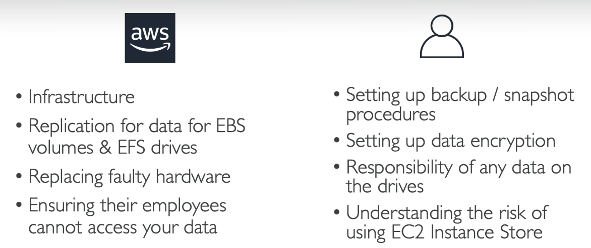
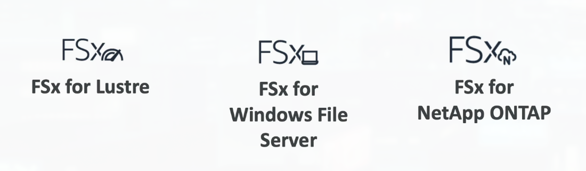
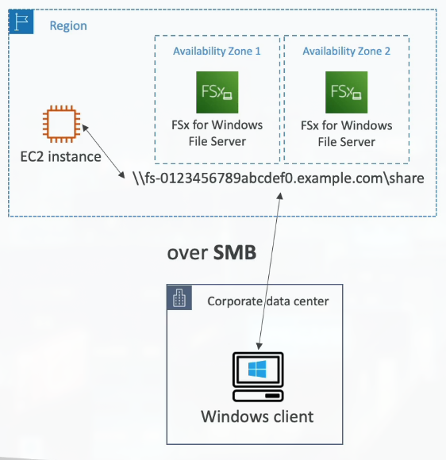
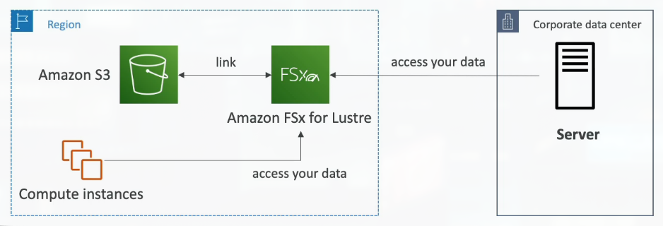

# Section 6: EC2 Instance Storage

## 50. EBS Overview

### What's an EBS Volume?

An **EBS (Elastic Block Store) Volume** is a **network drive** you can attach to your instances while they run:

- **It allows your instances to persist data**, even after their termination
- **They can only be mounted to one instance at a time** (at a CCP level)
- **They are bound to a specific Availability Zone** - cannot be attached across AZs
- **Analogy**: Think of them as a "network USB stick"

> EBS volumes are like external hard drives that connect over the network instead of USB. When you attach an EBS volume to an EC2 instance, it appears as a regular disk drive that you can format, mount, and use just like a physical hard drive. The key difference is that it's network-attached, which means there's a small amount of latency compared to a directly attached drive, but it also means you can detach it from one instance and attach it to another. This is incredibly useful for data persistence - if your EC2 instance crashes or you terminate it, your EBS volume (and all the data on it) remains safe. You can then attach that same volume to a new instance and continue working with your data. However, EBS volumes are locked to a specific Availability Zone - you can't attach a volume from us-east-1a to an instance in us-east-1b. To move data across AZs, you need to create a snapshot first.

### EBS Volume
- It's a network drive (i.e. not a physical drive)
    - It uses the network to communicate the instance, which means there might be a bit of latency
    - It can be detached from an EC2 instance and attached to another one quickly
- It's locked to an Availability Zone (AZ)
    - An EBS Volume in us-east-1a cannot be attached to us-east-1b
    - To move a volume across, you first need to snapshot it
- Have a provisioned capacity (size in GBs, and IOPS)
    - You get billed for all the provisioned capacity
    - You can increase the capacity of the drive over time

### EBS Volume - Example

### EBS - Delete on Termination Attribute

## 51. About EBS Multi-Attach

### What is EBS Multi-Attach?

**EBS Multi-Attach** allows a **single EBS volume to be attached to multiple EC2 instances** in the same Availability Zone:

- **This lets multiple instances access the same data at the same time**, which is useful for clustered applications
- **Only supported by specific EBS volume types** (like **io1** and **io2** - provisioned IOPS volumes)
- **Applications must be designed to safely coordinate access** to the shared volume - requires cluster-aware file systems

> EBS Multi-Attach is like having a shared network drive that multiple computers can access simultaneously. Normally, an EBS volume can only be attached to one instance at a time (like a USB drive that can only be plugged into one computer). Multi-Attach breaks this limitation, allowing multiple instances to read and write to the same volume. This is essential for clustered applications like databases that need shared storage. However, this requires special handling - you can't just use a regular file system like ext4 because multiple instances writing simultaneously would corrupt the data. You need cluster-aware file systems like GFS2 or OCFS2 that can coordinate access between instances. Multi-Attach is only available on io1 and io2 volume types (provisioned IOPS volumes), which are designed for high-performance, low-latency workloads. This feature is particularly useful for applications like Oracle RAC (Real Application Clusters) or other database clustering solutions.

## 52. EBS Hands On
***This is a lab tutorial lesson***

## 53. EBS Snapshots Overview

### EBS Snapshots
- Make a backup (snapshot) of your EBS volume at a point in time
- Not necessary to detach volume to do snapshot, but recommended
- Can copy snapshots across AZ or Region

### EBS Snapshots Features
- EBS Snapshot Archive
    - Move a Snapshot to an "archive tier" that is 75% cheaper
    - Takes within 24 to 72 hours for restoring the archive
- Recycle Bin for EBS Snapshots
    - Setup rules to retain deleted snapshots so you can recover them after an accidental deletion
    - Specify retention (from 1 day to 1 year)

## 54. EBS Snapshots Hands On
***This is a lab tutorial lesson***

## 55. AMI Overview

### AMI Overview

**AMI** stands for **Amazon Machine Image** - it's a template for creating EC2 instances:

- **AMI are a customization of an EC2 instance**
    - You add your own software, operating system, monitoring tools...
    - **Faster boot / configuration time** because your software is pre-packaged
- **AMI are built for a specific region** (and can be copied across regions)
- **You can launch EC2 instances from**:
    - **A Public AMI**: AWS provided (standard Linux/Windows images)
    - **Your own AMI**: You make and maintain them yourself
    - **An AWS Marketplace AMI**: An AMI someone else made (and potentially sells)

> An AMI is like a snapshot of a configured computer that you can use as a template. Instead of launching a fresh EC2 instance and spending 30 minutes installing software, configuring settings, and downloading files, you create an AMI with everything pre-installed. When you launch a new instance from that AMI, it boots up with all your software already installed and configured - ready to use in minutes instead of hours. This is incredibly powerful for scaling - if you need 10 identical web servers, you create one, configure it perfectly, create an AMI from it, then launch 10 instances from that AMI. They'll all be identical. AMIs are region-specific, but you can copy them to other regions if needed. Many organizations maintain a library of AMIs for different purposes - one for web servers, one for databases, one for application servers, etc. This ensures consistency and speeds up deployment.

### AMI Process (from an EC2 instance)
- Start an EC2 instance and customize it
- Stop the instance (for data integrity)
- Build an AMI - this will also create EBS snapshots
- Launch instances from other AMIs

## 56. AMI Hands On
***This is a lab tutorial lesson***

## 57. EC2 Image Builder Overview

### EC2 Image Builder
- Used to automate the creation of Virtual Machines or container images
- => Automate the creation, maintain, validate and test EC2 AMIs
- Can be run on a schedule (weekly, whenever packages are updated, etc...)
- Free service (only pay for the underlying resources)

## 58. EC2 Instance Store

### EC2 Instance Store

**EC2 Instance Store** provides **high-performance hardware disk** storage directly attached to your EC2 instance:

- **EBS volumes are network drives** with good but "limited" performance
- **If you need a high-performance hardware disk**, use **EC2 Instance Store**
- **Better I/O performance** - directly attached to the physical server
- **EC2 Instance Store loses its storage if the instance is stopped** (ephemeral storage)
- **Good for**: buffer, cache, scratch data, temporary content
- **Risk of data loss if hardware fails** - no durability guarantees
- **Backups and Replication are your responsibility**

> EC2 Instance Store is like having a super-fast SSD directly inside your computer, while EBS is like a network-attached storage device. Instance Store provides the highest possible I/O performance because it's physically attached to the same server as your EC2 instance - there's no network latency. However, this comes with a major trade-off: the data is ephemeral (temporary). If you stop, hibernate, or terminate the instance, all data on Instance Store is lost. Also, if the underlying hardware fails, your data is gone. This makes Instance Store perfect for temporary data that can be regenerated - like cache files, temporary processing data, or swap files. For anything that needs to persist, use EBS. Many high-performance applications use a combination: EBS for persistent data and Instance Store for temporary high-speed operations. Instance Store is included at no extra cost with certain instance types, but not all instance types support it.

### Local EC2 Instance Store

## 59. EFS Overview

### EFS - Elastic File System

**EFS (Elastic File System)** is a **managed NFS (Network File System)** that can be mounted on **100s of EC2 instances**:

- **EFS works with Linux EC2 instances** in multi-AZ
- **Highly available** - automatically replicates across multiple Availability Zones
- **Scalable** - automatically grows and shrinks as you add/remove files
- **Expensive** (approximately 3x the cost of gp2 EBS volumes)
- **Pay per use** - you pay for the storage you actually use
- **No capacity planning** - scales automatically

> EFS is like a shared network drive that multiple computers can access simultaneously, similar to a file server in a traditional office network. Unlike EBS volumes which can only be attached to one instance at a time, EFS can be mounted by hundreds of EC2 instances across multiple Availability Zones simultaneously. This makes it perfect for shared content - like web server files that need to be the same across all your web servers, or shared application code. EFS automatically scales - add files and it grows, delete files and it shrinks. You don't need to provision capacity in advance. However, this convenience comes at a cost - EFS is significantly more expensive than EBS (about 3x more). EFS uses the NFS protocol, which is standard for Linux systems, so it's easy to mount and use. It's highly available by default - your data is automatically replicated across multiple AZs, so if one AZ fails, your data is still accessible. EFS is perfect for use cases like content management systems, shared application code, or data that needs to be accessed by multiple instances simultaneously.

### EBS vs EFS

Understanding when to use **EBS** versus **EFS** is crucial:

**EBS (Elastic Block Store)**:
- Attached to **one EC2 instance** at a time
- Locked to **one Availability Zone**
- Lower cost
- Use for: databases, single-instance applications, boot volumes

**EFS (Elastic File System)**:
- Can be mounted by **multiple EC2 instances** simultaneously
- Works across **multiple Availability Zones**
- Higher cost (approximately 3x EBS)
- Use for: shared content, web servers, content management systems

### EFS Infrequent Access (EFS-IA)

- Storage class that is cost-optimized for files not accessed everyday
- Up to 92% lower cost compared to EFS Standard
- EFS will automatically move your files to EFS-IA based on the last time they were accessed
- Enable EFS0IA with a Lifecycle Policy
- Example: move files that are not accessed for 60 days to EFS-IA
- Transparent to the applications accessing EFS

## 60. Shared Responsibility Model for EC2 Storage

## 61. Amazon FSx Overview

### Amazon FSx - Overview
- Launch 3rd party high-performance file systems on AWS
- Fully managed service

### Amazon FSx for Windows File Server

**Amazon FSx for Windows File Server** provides a **fully managed, highly reliable, and scalable Windows native shared file system**:

- **Built on Windows File Server** - fully compatible with Windows applications
- **Supports SMB protocol & Windows NTFS** - standard Windows file sharing
- **Integrated with Microsoft Active Directory** - works with your existing AD infrastructure
- **Can be accessed from AWS or your on-premise infrastructure** - hybrid cloud support

> FSx for Windows is like having a Windows file server in the cloud. If you have Windows applications that need shared file storage (like file shares, home directories, or applications that require Windows file system features), FSx for Windows is the solution. EFS is Linux-only, so if you need Windows-compatible shared storage, FSx for Windows is your option. It supports the SMB (Server Message Block) protocol, which is the standard protocol for Windows file sharing, so your Windows servers and applications can access it just like a traditional Windows file server. It integrates with Active Directory, so you can use your existing user accounts and permissions. This makes it perfect for migrating Windows file servers to the cloud or extending on-premises Windows infrastructure to AWS.

### Amazon FSx for Lustre
- A fully managed, high-performance, scalable file storage High Performance Computing (HPC)
- The name Lustre is derived from "Linux" and "cluster"
- Machine Learning, Analytics, Video Processing, Financial Modeling, ...
- Scales up to 100s GB/s, millions of IOPS, sub-ms latencies

## 62. EC2 Instance Storage Summary

- EBS volumes:
    - network drives attached to one EC2 instance at a time
    - Mapped to an Availability Zones
    - Can use EBS Snapshots for backups / transferring EBS volumes across AZ
- AMI: create ready-to-use EC2 instances with out customizations
- EC2 Image Builder: automatically build, test and distribute AMIs
- EC2 Instance Store:
    - High performance hardware disk attached to our EC2 instance
    - Lost if our instance is stopped / terminated
- EFS: network file system, can be attached to 100s of instances in a region
- EFS-IA: cost-optimized storage class for infrequent accessed file
- FSx for Windows: Network File System for Windows servers
- FSx for Lustre: High Performance Computing Linux file system

## 63. Section Cleanup
***This is a lab tutorial lesson***
