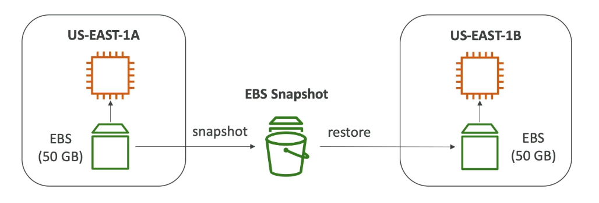
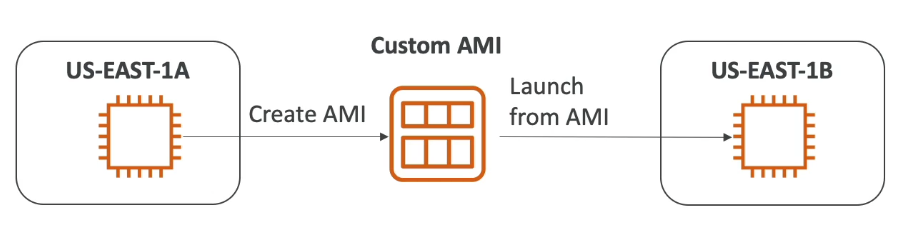
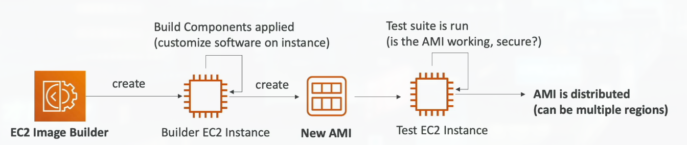
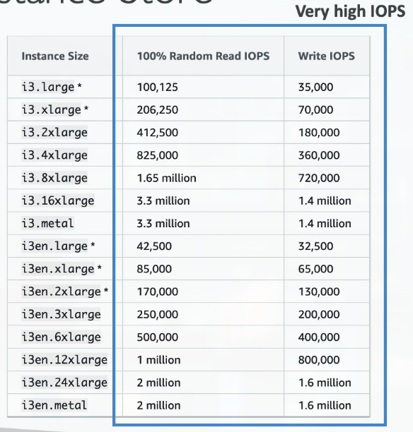
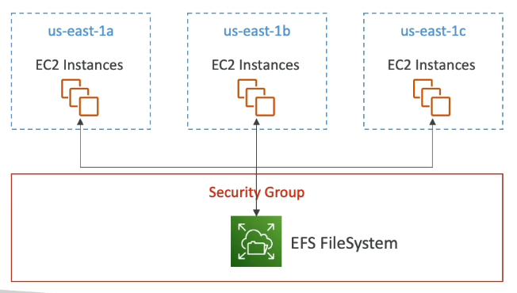
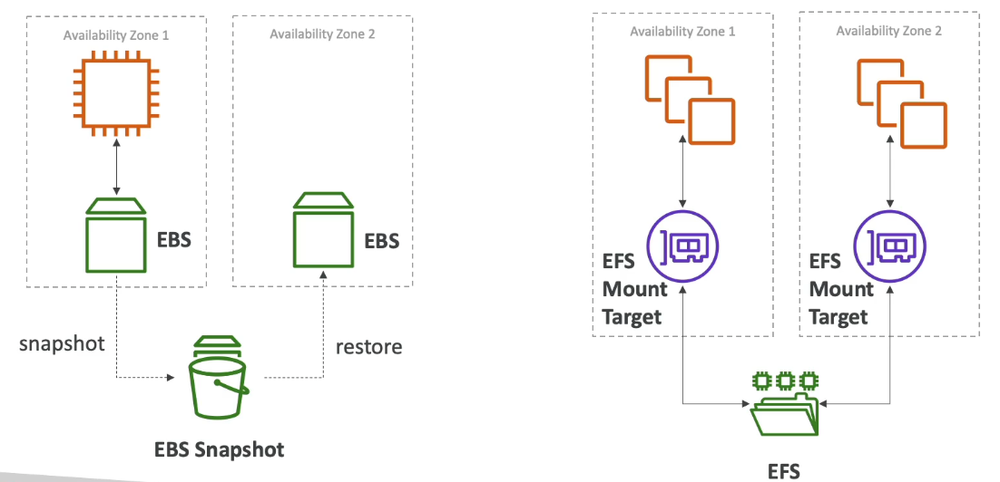
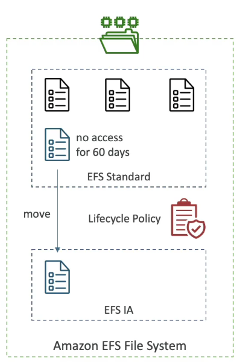

# Section 6: EC2 Instance Storage

## 50. EBS Overview

### What's an EBS Volume?
- An EBS (Elastic Block Store) Volume is network drive you can attach to your instances while they run
- It allows your instances to persist data, even after their termination
- They can only be mounted to one instance at a time (at a CCP level)
- They are bound to a specific availability zone
- Analogy: Think of them as a "network USB stick"

### EBS Volume
- It's a network drive (i.e. not a physical drive)
    - It uses the network to communicate the instance, which means there might be a bit of latency
    - It can be detached from an EC2 instance and attached to another one quickly
- It's locked to an Availability Zone (AZ)
    - An EBS Volume in us-east-1a cannot be attached to us-east-1b
    - To move a volume across, you first need to snapshot it
- Have a provisioned capacity (size in GBs, and IOPS)
    - You get billed for all the provisioned capacity
    - You can increase the capacity of the drive over time

### EBS Volume - Example

### EBS - Delete on Termination Attribute

## 51. About EBS Multi-Attach

### What is EBS Multi-Attach?
- EBS Multi-Attach allows a single EBS volume to be attached to multiple EC2 instances in the same Availability Zone.
- This lets multiple instances access the same data at the same time, which is useful for clustered applications.
- Only supported by specific EBS volume types (like io1 and io2).
- Applications must be designed to safely coordinate access to the shared volume.

## 52. EBS Hands On
***This is a lab tutorial lesson***

## 53. EBS Snapshots Overview

### EBS Snapshots
- Make a backup (snapshot) of your EBS volume at a point in time
- Not necessary to detach volume to do snapshot, but recommended
- Can copy snapshots across AZ or Region

### EBS Snapshots Features
- EBS Snapshot Archive
    - Move a Snapshot to an "archive tier" that is 75% cheaper
    - Takes within 24 to 72 hours for restoring the archive
- Recycle Bin for EBS Snapshots
    - Setup rules to retain deleted snapshots so you can recover them after an accidental deletion
    - Specify retention (from 1 day to 1 year)

## 54. EBS Snapshots Hands On
***This is a lab tutorial lesson***

## 55. AMI Overview

### AMI Overview
- AMI = Amazon Machine Image
- AMI are a customization of an EC2 instance
    - You add your own software, operating system, monitoring...
    - Faster boot / configuration time because your software is pre-packaged
- AMI are built for a specific region (and can be copied across regions)
- You can launch EC2 instances from:
    - A Public AMI: AWS provided
    - Your own AMI: you make and maintain them yourself
    - An AWS Marketplace AMI: an AMI someone else made (and potentially sells)

### AMI Process (from an EC2 instance)
- Start an EC2 instance and customize it
- Stop the instance (for data integrity)
- Build an AMI - this will also create EBS snapshots
- Launch instances from other AMIs

## 56. AMI Hands On
***This is a lab tutorial lesson***

## 57. EC2 Image Builder Overview

### EC2 Image Builder
- Used to automate the creation of Virtual Machines or container images
- => Automate the creation, maintain, validate and test EC2 AMIs
- Can be run on a schedule (weekly, whenever packages are updated, etc...)
- Free service (only pay for the underlying resources)

## 58. EC2 Instance Store

### EC2 Instance Store
- EBS volumes are network drives with good but "limited" performance
- If you need a high-performance hardware disk, use EC2 Instance Store
- Better I/O performance
- EC2 Instance Store lose their storage if they're stopped (ephemeral)
- Good for buffer / cache / scratch data / temporary content
- Risk of data loss if hardware fails
- Backups and Replication are your responsibility

### Local EC2 Instance Store

## 59. EFS Overview

### EFS - Elastic File System
- Managed NFS (network file system) that can be mounted on 100s of EC2
- EFS works with Linux EC2 instances in multi-AZ
- Highly available, scalable, expensive (3x gp2), pay per use, no capacity planning

### EBS vs EFS

### EFS Infrequent Access (EFS-IA)

- Storage class that is cost-optimized for files not accessed everyday
- Up to 92% lower cost compared to EFS Standard
- EFS will automatically move your files to EFS-IA based on the last time they were accessed
- Enable EFS0IA with a Lifecycle Policy
- Example: move files that are not accessed for 60 days to EFS-IA
- Transparent to the applications accessing EFS

## 60. Shared Responsibility Model for EC2 Storage

## 61. Amazon FSx Overview

## 62. EC2 Instance Storage Summary

## 63. Section Cleanup
