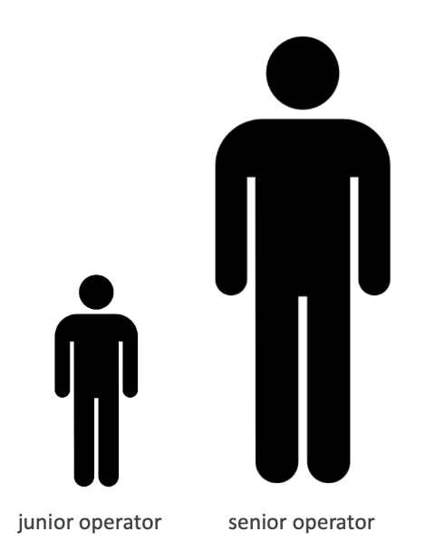
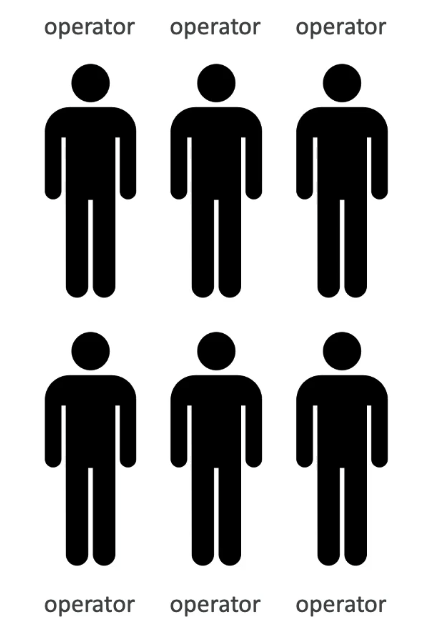
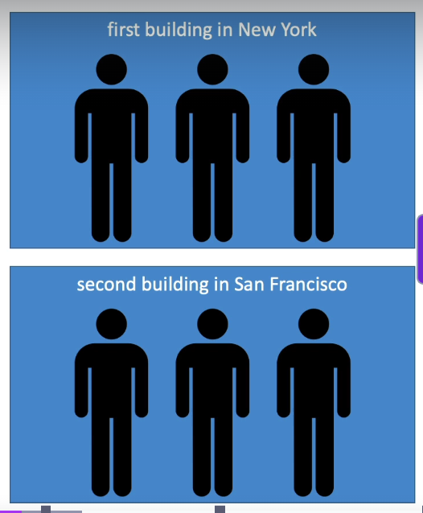

# Section 7: ELB & ASG - Elastic Load Balancing & Auto Scaling Groups

## 64. High Availability, Scalability, Elasticity

### Scalability & High Availability
- Scalability means that an application / system can handle greater loads by adapting
- There are two kinds of scalability:
    - Vertical Scalability
    - Horizontal Scalability (= elasticity)
- Scalability is linked but different to High Availability
- Let's deep dive into the distiction, using a call center as an example

### Vertical Scalability
- Vertical Scalability means increasing the size of the instance
- For example, your application runs on a t2.micro
- Scaling that application vertically means running it on a t2.large
- Vertical scalability is very common for non distributed systems, such as a database
- There's usually a limit to how much you can vertically scale (hardware limit)

### Horizontal Scalability
- Horizontal Scalability means increasing the number of instances / systems for your application
- Horizontal scaling implies distributed systems
- This is very common for web applications / modern applications
- It's easy to horizontally scale thanks the cloud offerings such as Amazon EC2

### High Availability
- High Availability usually goes hand in hand with horizontal scaling
- High availability means running your application / system in at least 2 Availability Zones
- The goal of high availability is to survive a data center loss (disaster)

### High Availability & Scalability for EC2
- Vertical Scaling: Increase instance size (= scale up/down)
    - From: t2.nano - 0.5G of RAM, 1 vCPU
    - To: u-12tb1.metal - 12.3 TB of RAM, 448 vCPUs
- Horizontal Scaling: Increase number of instances (= scale out/in)
    - Auto Scaling Group
    - Load Balancer
- High Availability: Run instances for the same application across multi AZ
    - Auto Scaling Group multi AZ

### Scalability vs Elasticity (vs Agility)
- Scalability: ability to accommodate a larger load by making the hardware stronger (scale up), or by adding nodes (scale out)
- Elasticity: once a system is scalable, elasticity means that there will be some "auto-scaling" so that the system can scale based on the load. This is "cloud friendly": pay-per-user, match demand, optimize costs
- Agility: (not related to scalability - distractor) new IT resources are only a click away, which means that you reduce the time to make those resources available to your developers from weeks to just minutes.

## 65. Elastic Load Balancing (ELB) Overview

## 66. Application Load Balancer (ALB) Hands On

## 67. Auto Scaling Groups (ASG) Overview

## 68. Auto Scaling Groups (ASG) Hands On

## 69. Auto Scaling Groups (ASG) Strategies

## 70. Section Cleanup

## 71. ELB & ASG Summary
