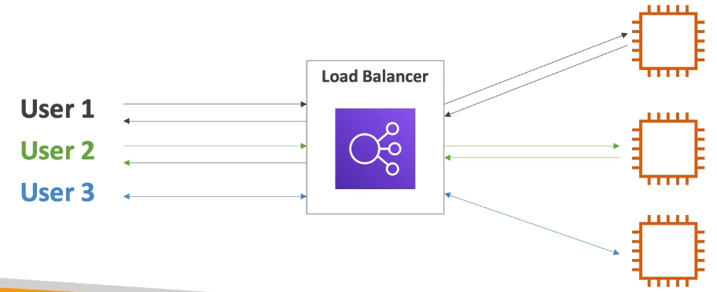
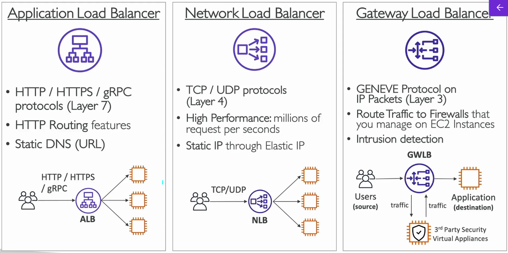
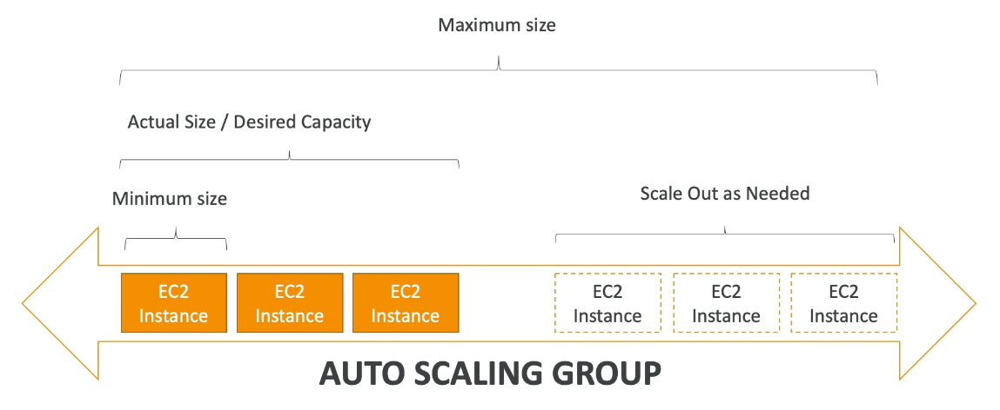
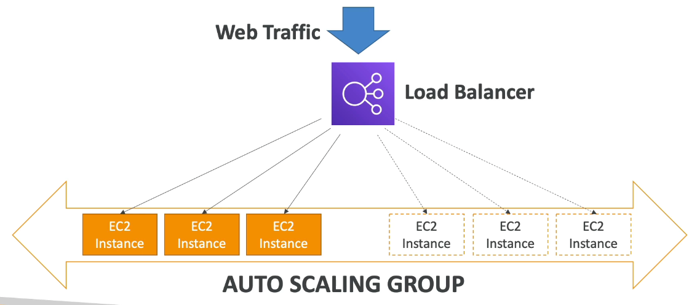
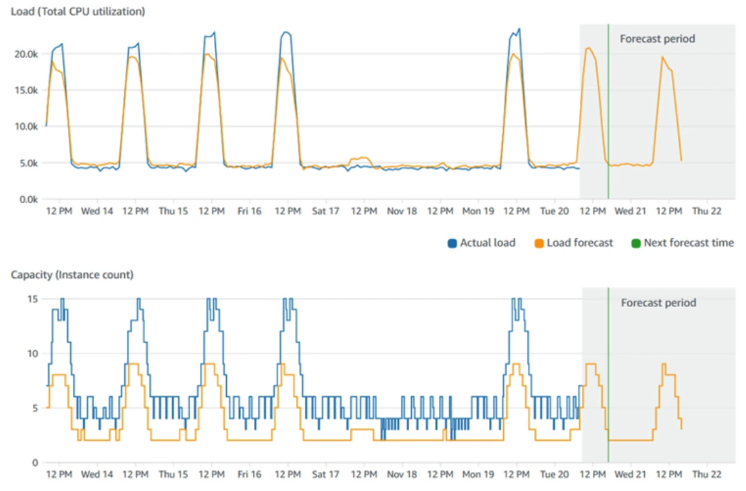

# Section 7: ELB & ASG - Elastic Load Balancing & Auto Scaling Groups

## 64. High Availability, Scalability, Elasticity

### Scalability & High Availability

**Scalability** means that an application or system can **handle greater loads by adapting**:

- **There are two kinds of scalability**:
    - **Vertical Scalability** - scale up (make it bigger)
    - **Horizontal Scalability** (= elasticity) - scale out (add more instances)
- **Scalability is linked but different from High Availability**
- Let's dive deep into the distinction, using a call center as an example

### Vertical Scalability

**Vertical Scalability** means **increasing the size of the instance** (scale up):

- **For example**, your application runs on a **t2.micro**
- **Scaling that application vertically** means running it on a **t2.large** (more CPU, more RAM)
- **Vertical scalability is very common for non-distributed systems**, such as a database
- **There's usually a limit to how much you can vertically scale** (hardware limit)

> Vertical scaling is like upgrading your computer - you replace your current computer with a more powerful one. If your application is running slowly on a t2.micro (1 vCPU, 1 GB RAM), you can vertically scale it by moving it to a t2.large (2 vCPUs, 8 GB RAM). This is simple and works well for applications that can't be easily distributed across multiple servers, like traditional databases. However, there's a ceiling - you can only scale up to the largest instance type available (like u-12tb1.metal with 448 vCPUs). Also, vertical scaling usually requires downtime - you need to stop the instance, change its size, and restart it. For applications that need to stay online, horizontal scaling (adding more instances) is often preferred.

### Horizontal Scalability

**Horizontal Scalability** means **increasing the number of instances or systems** for your application (scale out):

- **Horizontal scaling implies distributed systems** - your application runs across multiple servers
- **This is very common for web applications and modern applications**
- **It's easy to horizontally scale** thanks to cloud offerings such as **Amazon EC2**

> Horizontal scaling is like adding more workers to handle more customers. Instead of making one worker super strong (vertical scaling), you hire more workers. If your web application is getting too much traffic, you can horizontally scale by launching additional EC2 instances running your application. A load balancer then distributes incoming requests across all instances. This approach has several advantages: (1) No downtime - you can add instances while the application is running, (2) No hard limit - you can add as many instances as needed (within AWS limits), (3) Better fault tolerance - if one instance fails, others continue serving traffic. However, horizontal scaling requires your application to be designed for it - it needs to be stateless (not rely on local storage) and able to run on multiple servers simultaneously. Modern web applications are typically designed this way, making horizontal scaling the preferred approach for most cloud applications.

### High Availability

**High Availability** is about ensuring your application stays online even when components fail:

- **High Availability usually goes hand in hand with horizontal scaling**
- **High availability means running your application or system in at least 2 Availability Zones**
- **The goal of high availability is to survive a data center loss** (disaster)

> High Availability (HA) is about redundancy and fault tolerance. If you're running your application on a single EC2 instance in one Availability Zone, and that AZ has a power outage or network issue, your application goes down. High Availability means running your application across multiple Availability Zones (at least 2, often 3). If one AZ fails, your application continues running in the other AZs. This is different from scalability - you can have high availability with just 2 instances (one in each AZ), or you can have high availability AND scalability with many instances across multiple AZs. The key is distribution - don't put all your eggs in one basket. High Availability is measured in "nines" - 99.9% availability means your application is down for about 8.76 hours per year. 99.99% availability means it's down for about 52.56 minutes per year. Achieving high availability requires careful architecture - using load balancers, Auto Scaling Groups, and ensuring your application can handle instance failures gracefully.

### High Availability & Scalability for EC2
- Vertical Scaling: Increase instance size (= scale up/down)
    - From: t2.nano - 0.5G of RAM, 1 vCPU
    - To: u-12tb1.metal - 12.3 TB of RAM, 448 vCPUs
- Horizontal Scaling: Increase number of instances (= scale out/in)
    - Auto Scaling Group
    - Load Balancer
- High Availability: Run instances for the same application across multi AZ
    - Auto Scaling Group multi AZ

### Scalability vs Elasticity (vs Agility)

Understanding these related but distinct concepts is important:

- **Scalability**: Ability to accommodate a larger load by making the hardware stronger (scale up), or by adding nodes (scale out)
    - Can the system handle more load? (Yes/No question)

- **Elasticity**: Once a system is scalable, **elasticity means that there will be some "auto-scaling"** so that the system can scale based on the load
    - This is "cloud friendly": **pay-per-use, match demand, optimize costs**
    - Can the system automatically adjust to load changes? (Automatic scaling)

- **Agility**: (Not related to scalability - distractor) New IT resources are only a click away, which means that you reduce the time to make those resources available to your developers from weeks to just minutes
    - How quickly can you provision new resources? (Speed of deployment)

> These three concepts are often confused but are distinct. Scalability is about capacity - can your system handle more load? If you manually add more servers when traffic increases, your system is scalable but not elastic. Elasticity adds automation - the system automatically adds servers when traffic increases and removes them when traffic decreases. This is the "elastic" in "Elastic Compute Cloud" - your compute capacity automatically expands and contracts like a rubber band. Agility is about speed - how quickly can you deploy new resources or make changes? In traditional IT, provisioning a new server might take weeks (ordering hardware, waiting for delivery, installation, configuration). In the cloud, you can launch a new server in minutes. This agility enables rapid experimentation and innovation. A well-designed cloud system should be scalable (can handle more load), elastic (automatically adjusts to load), and agile (can quickly adapt to changing requirements).

## 65. Elastic Load Balancing (ELB) Overview

### What is load balancing?
- Load balancers are servers that forward internet traffic to multiple servers (EC2 Instances) downstream.

### Why use a load balancer?
- Spread load across multiple downstream instances
- Expose a single point of access (DNS) to your application
- Seamlessly handle failures of downstream instances
- Do regular health checks to your instances
- Provide SSL termination (HTTPS) for your websites
- High availability across zones

### Why Use an Elastic Load Balancer?

**An ELB (Elastic Load Balancer) is a managed load balancer**:

- **AWS guarantees that it will be working** - high availability built-in
- **AWS takes care of upgrades, maintenance, high availability** - you don't manage the infrastructure
- **AWS provides only a few configuration knobs** - simple to use
- **It costs less to set up your own load balancer** but it will be a lot more effort on your end (maintenance, integrations)

**4 kinds of load balancers offered by AWS**:

1. **Application Load Balancer (ALB)** - HTTP/HTTPS only - **Layer 7**
2. **Network Load Balancer (NLB)** - Ultra-high performance, allows for TCP - **Layer 4**
3. **Gateway Load Balancer** - **Layer 3**
4. **Classic Load Balancer** (retired in 2023) - Layer 4 & 7 - legacy option

> An Elastic Load Balancer is like a traffic director at a busy restaurant. When customers arrive, the host (load balancer) checks which servers (EC2 instances) are available and directs customers to them, ensuring no single server gets overwhelmed. AWS manages the load balancer infrastructure for you - you don't need to worry about the underlying servers, networking, or high availability. AWS ensures the load balancer itself is highly available and automatically scales to handle traffic. While you could set up your own load balancer on EC2 instances, you'd be responsible for maintaining it, ensuring high availability, handling updates, and scaling it. The managed ELB service handles all of this for you, allowing you to focus on your application. The different types of load balancers operate at different network layers - ALB works at the application layer (HTTP/HTTPS), NLB works at the transport layer (TCP), and Gateway LB works at the network layer (IP).

## 66. Application Load Balancer (ALB) Hands On
***This is a lab tutorial lesson***

## 67. Auto Scaling Groups (ASG) Overview

### What's an Auto Scaling Group?

**Auto Scaling Groups (ASG)** enable automatic scaling of your EC2 instances:

- **In real-life, the load on your websites and applications can change** - traffic varies throughout the day
- **In the cloud, you can create and get rid of servers very quickly** - take advantage of this flexibility
- **The goal of an Auto Scaling Group (ASG) is to**:
    - **Scale out (add EC2 instances)** to match an increased load
    - **Scale in (remove EC2 instances)** to match a decreased load
    - **Ensure we have a minimum and maximum number of machines running** - set boundaries
    - **Automatically register new instances to a load balancer** - seamless integration
    - **Replace unhealthy instances** - automatically detect and replace failed instances
- **Cost Savings**: Only run at an optimal capacity (principle of the cloud)

> An Auto Scaling Group is like having an intelligent system that automatically hires and fires workers based on how busy your business is. During peak hours (like Black Friday for an e-commerce site), the ASG automatically launches additional EC2 instances to handle the increased traffic. During quiet periods (like 3 AM), it terminates extra instances to save costs. You define the rules - minimum instances (always keep at least 2 running), maximum instances (never exceed 10), and scaling policies (add instances when CPU > 70%, remove instances when CPU < 30%). The ASG also performs health checks - if an instance becomes unhealthy (not responding, failed health checks), the ASG automatically terminates it and launches a replacement. This ensures your application always has healthy instances serving traffic. Combined with a load balancer, this creates a highly available, automatically scaling architecture that optimizes both performance and cost.

### Auto Scaling Group in AWS

### Auto Scaling Group in AWS with Load Balancer

## 68. Auto Scaling Groups (ASG) Hands On
***This is a lab tutorial lesson***

## 69. Auto Scaling Groups (ASG) Strategies

### Auto Scaling Groups - Scaling Strategies

**Auto Scaling Groups** support multiple scaling strategies:

1. **Manual Scaling**: Update the size of an ASG manually
    - You control when to add or remove instances
    - Good for predictable, one-time changes

2. **Dynamic Scaling**: Respond to changing demand automatically
    - **Simple / Step Scaling**:
        - When a **CloudWatch alarm is triggered** (example CPU > 70%), then add 2 units
        - When a **CloudWatch alarm is triggered** (example CPU < 30%), then remove 1
    - **Target Tracking Scaling**:
        - Example: I want the average ASG CPU to stay at around 40%
        - ASG automatically adds/removes instances to maintain the target
    - **Scheduled Scaling**:
        - Anticipate scaling based on known usage patterns
        - Example: increase the min. capacity to 10 at 5 pm on Fridays

> Scaling strategies determine how your Auto Scaling Group decides when to add or remove instances. Manual scaling is like manually adjusting the thermostat - you decide when to change it. Simple/Step scaling is reactive - it responds to CloudWatch alarms. For example, if CPU usage exceeds 70%, add 2 instances. If it drops below 30%, remove 1 instance. This is good for responding to current conditions. Target tracking is more intelligent - you set a target (like "keep CPU at 40%"), and the ASG automatically figures out how many instances are needed to maintain that target. It's like cruise control in a car - you set the speed, and the car adjusts the throttle automatically. Scheduled scaling is predictive - you know your traffic patterns (e.g., higher traffic on weekdays, lower on weekends), so you schedule scaling actions in advance. For example, scale up before business hours, scale down after hours. Many organizations use a combination - scheduled scaling for predictable patterns, target tracking for maintaining performance, and step scaling as a safety net for unexpected spikes.

### Auto Scaling Groups - Predictive Scaling

**Predictive Scaling** is an advanced scaling strategy:

- **Uses Machine Learning to predict future traffic** ahead of time
- **Automatically provisions the right number of EC2 instances in advance**
- **Useful when your load has predictable time-based patterns**

> Predictive Scaling uses machine learning to analyze your historical traffic patterns and predict future demand. It's like having a weather forecast for your application traffic. If the ML model predicts a traffic spike at 2 PM based on historical data, it will start scaling up instances at 1:45 PM, so they're ready when the traffic arrives. This is more sophisticated than scheduled scaling because the ML model can identify complex patterns - not just "busy on weekdays," but "busy on the first Monday of each month" or "traffic increases gradually over 2 hours before peak." Predictive Scaling works best when you have at least 14 days of historical data and predictable patterns. It combines with Target Tracking Scaling - Predictive Scaling handles the predictable patterns, while Target Tracking handles the unpredictable variations. This ensures your application is always ready for traffic while minimizing costs by not over-provisioning.

## 70. Section Cleanup
***This is a lab tutorial lesson***

## 71. ELB & ASG Summary
- High Availability vs Scalability (vertical and horizontal) vs Elasticity vs Agility in the Cloud
- Elastic Load Balancers (ELB)
    - Distribute traffic across backend EC2 instances, can be Multi-AZ
    - Supports health checks
    - 4 types: Classic (old), Application (HTTP - L7), Network (TCP - L4), Gateway (L3)
- Auto Scaling Groups (ASG)
    - Implement Elasticity for your application, across multiple AZ
    - Scale EC2 instances based on the demand on your system, replace unhealthy
    - Integrated with the ELB
