# Section 8: Amazon S3

## 72. S3 Overview

### Section Introduction

**Amazon S3** (Simple Storage Service) is one of the main building blocks of AWS:

- **It's advertised as "infinitely scaling" storage** - can store virtually unlimited amounts of data
- **Many websites use Amazon S3 as a backbone** - for storing images, videos, and static content
- **Many AWS services use Amazon S3 as an integration** as well - S3 integrates with many other AWS services
- We'll have a step-by-step approach to S3

### Amazon S3 Use cases
- Backup and storage
- Disaster Recovery
- Archive
- Hybrid Cloud storage
- Application hosting
- Media hosting
- Data lakes & big data analytics
- Software delivery
- Static website

### Amazon S3 - Buckets

**Amazon S3** allows people to store **objects (files) in "buckets"** (like directories):

- **Buckets must have a globally unique name** (across all regions, all accounts) - like a domain name
- **Buckets are defined at the region level** - you choose which region when creating a bucket
- **S3 looks like a global service but buckets are created in a region** - each bucket exists in a specific region

**Naming Convention** (important to follow):
    - **No uppercase, No underscore** - use lowercase letters, numbers, and hyphens only
    - **3-63 characters long**
    - **Not an IP** address format
    - **Must start with lowercase letter or number**
    - **Must NOT start with the prefix** `xn--`
    - **Must NOT end with the suffix** `-s3alias`

> S3 buckets are like top-level folders that contain your files. The globally unique name requirement means if someone else has a bucket named "my-bucket", you can't use that name - even in a different region or account. This is because S3 bucket names are used in URLs (like `https://my-bucket.s3.amazonaws.com`), so they need to be unique globally, similar to domain names. When you create a bucket, you choose a region, and that's where the bucket (and its objects) will be stored. This is important for data residency requirements and latency - choose a region close to your users. The naming restrictions ensure compatibility with DNS and various AWS services that reference buckets by name.

### Amazon S3 - Objects

**Objects (files) in S3** have several important properties:

- **Objects have a Key** - this is the unique identifier for the object
- **The key is the FULL path**:
    - `s3://my-bucket/my_file.txt`
    - `s3://my-bucket/my_folder/another_folder/my_file.txt`
- **The key is composed of prefix + object name**
    - In `s3://my-bucket/my_folder/another_folder/my_file.txt`, the prefix is `my_folder/another_folder/` and the object name is `my_file.txt`
- **There's no concept of "directories" within buckets** (although the UI will trick you to think otherwise)
    - **Just keys with very long names that contain slashes ("/")** - the slashes are part of the key name, not actual folders
- **Object values are the content of the body**:
    - **Max. Object Size is 5TB (5000GB)**
    - **If uploading more than 5GB, must use "multi-part upload"** - breaks large files into parts
- **Metadata** (list of text key/value pairs - system or user metadata) - like file properties
- **Tags** (Unicode key/value pair - up to 10) - useful for security, lifecycle management, and cost allocation
- **Version ID** (if versioning is enabled) - tracks different versions of the same object

> Understanding S3's flat structure is crucial. Unlike a traditional file system with actual folders, S3 is a flat namespace - it's just a collection of objects with unique keys. The "folders" you see in the S3 console are just a UI convenience - they're really just objects whose keys contain slashes. For example, if you upload a file and the key is "photos/vacation/beach.jpg", S3 doesn't create "photos" and "vacation" folders. It just stores one object with that key. However, the console groups objects by their prefix (the part before the last slash) to make navigation easier. This flat structure makes S3 extremely scalable - there's no directory tree to traverse, just direct key lookups. The 5TB object size limit is massive - most files are much smaller. For files larger than 5GB, you must use multi-part upload, which breaks the file into chunks, uploads them in parallel (faster), and then combines them. This is also more reliable - if one part fails, you only need to retry that part, not the entire file.

## 73. S3 Hands On
***This is a lab tutorial lesson***

## 74. S3 Security: Bucket Policy

### Amazon S3 - Security

**S3 Security** uses multiple layers of access control:

**User-Based**:
    - **IAM Policies** - which API calls should be allowed for a specific user from IAM
    - Controls what actions users can perform (GetObject, PutObject, DeleteObject, etc.)

**Resource-Based**:
    - **Bucket Policies** - bucket-wide rules from the S3 console - allows cross-account access
    - **Object Access Control List (ACL)** - finer grain control (can be disabled)
    - **Bucket Access Control List (ACL)** - less common (can be disabled)

**Important Note**: An IAM principal can access an S3 object if:
    - The user IAM permissions **ALLOW** it **OR** the resource policy **ALLOW** it
    - **AND** there's no explicit **DENY**

**Encryption**: Encrypt objects in Amazon S3 using encryption keys - protects data at rest

> S3 security follows a "whitelist" model with explicit deny override. If either an IAM policy or a bucket policy allows access, the user can access the object - unless there's an explicit deny. This is important: a deny always wins. For example, if your IAM policy allows access to all S3 buckets, but a bucket policy explicitly denies your user, you won't be able to access that bucket. This allows for flexible security models - you can grant broad permissions via IAM for most buckets, but use bucket policies to restrict access to specific sensitive buckets. Bucket policies are particularly powerful because they can grant cross-account access - allowing users from other AWS accounts to access your bucket. This is useful for sharing data between organizations or allowing third-party services to access your S3 data. Encryption adds another layer - even if someone gains access to your objects, they can't read them without the encryption keys.

### S3 Bucket Policies
- JSON based policies
    - Resources: buckets and objects
    - Effect: Allow / Deny
    - Actions: Set of API to Allow or Deny
    - Principal: The account or user to apply the policy to
- Use S3 bucket for policy to
    - Grant public access to the bucket
    - Force objects to be encrypted at upload
    - Grant access to another account (Cross Account)

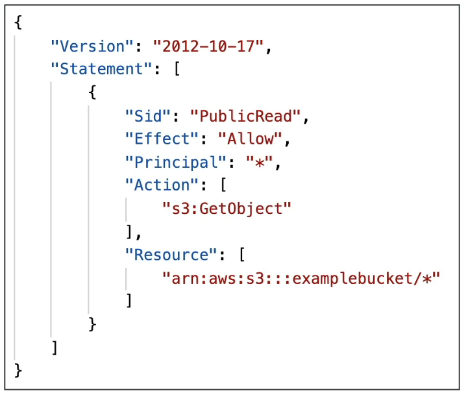

### Example: Public Access - Use Bucket Policy

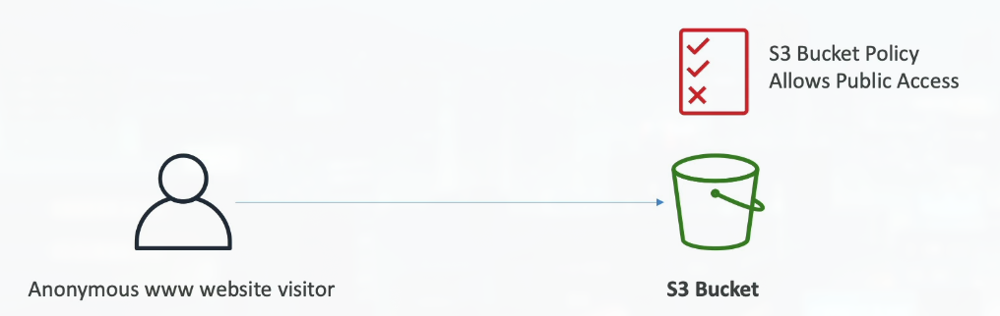

### Example: User Access to S3 - IAM permissions

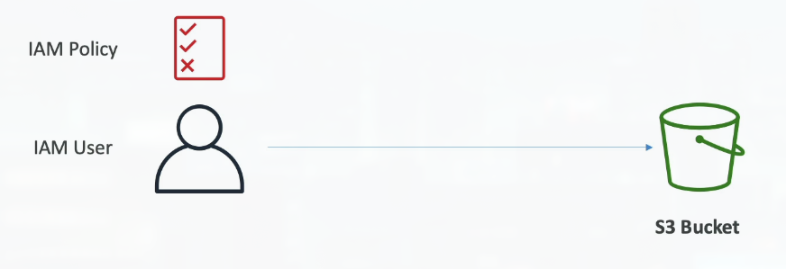

### Example: EC2 instance access - Use IAM Roles

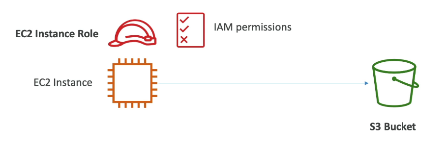

### Advanced: Cross-Account Access - Use Bucket Policy

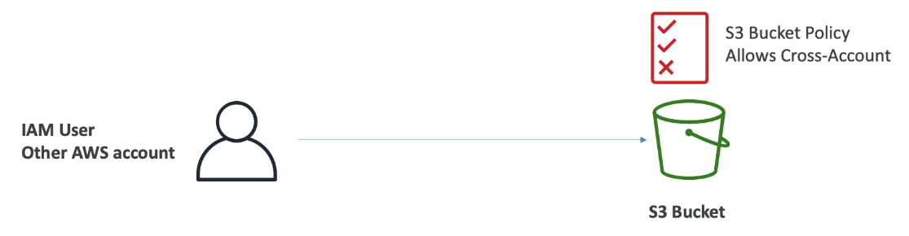

### Bucket settings for Block Public Access

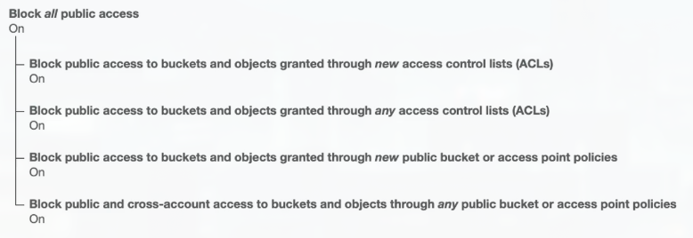

- These settings were created to prevent company data leaks
- If you know your bucket should never be public, leave these on
- Can be set at the account level

## 75. S3 Security: Bucket Policy Hands On
***This is a lab tutorial lesson***

## 76. S3 Website Overview

### Amazon S3 - Static Website Hosting
- S3 can host static websites and have them accessible on the Internet
- The website URL will be (depending on the region)
    - http://**bucket-name**.s3-website-**aws-region**.amazonaws.com
    - OR http://**bucket-name**.s3-website.**aws-region**.amazonaws.com
- If you get a **403 Forbidden** error, make sure the bucket policy allows public reads!

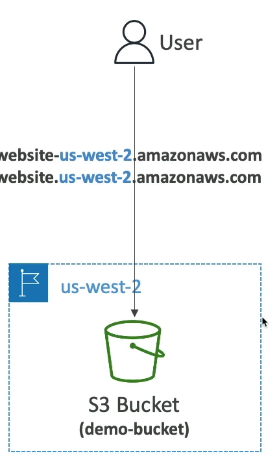

## 77. S3 Website Hands On
***This is a lab tutorial lesson***

## 78. S3 Versioning Overview

### Amazon S3 - Versioning
- You can version your files in Amazon S3
- It is enabled at the bucket level
- Same key overwrite will change the "version": 1,2,3...
- It is best practice to version your buckets
    - Protect against unintended deletes (ability to restore a version)
    - Easy roll back to previous version
- Notes:
    - Any file that is not versioned prior to enabling versioning will have version "null"
    - Suspending versioning does not delete the previous versions

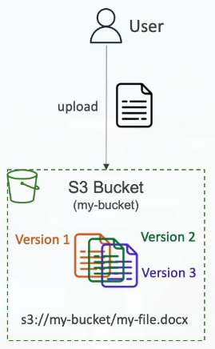

## 79. S3 Versioning Hands On
***This is a lab tutorial lesson***

## 80. S3 Replication Overview

### Amazon S3 - Replication (CRR & SRR)
- Must enable Versioning in source and destination buckets
- Cross-Region Replication (CRR)
- Same-Region Replication (SRR)
- Buckets can be in different AWS accounts
- Copying is asynchronous
- Must give proper IAM permissions to S3
- Use cases:
    - CRR - compliance, lower latency access, replication across accounts
    - SRR - log aggregation, live replication between production and test accounts

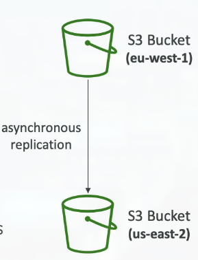

## 81. S3 Replication Hands On
***This is a lab tutorial lesson***

## 82. S3 Storage Classes Overview

### S3 Storage Classes

**S3 offers multiple storage classes** optimized for different access patterns and cost requirements:

1. **Amazon S3 Standard** - General Purpose
2. **Amazon S3 Standard - Infrequent Access (IA)**
3. **Amazon S3 One Zone - Infrequent Access**
4. **Amazon S3 Glacier Instant Retrieval**
5. **Amazon S3 Glacier Flexible Retrieval**
6. **Amazon S3 Glacier Deep Archive**
7. **Amazon S3 Intelligent Tiering**

**You can move between classes manually or using S3 Lifecycle configurations** - automatically transition objects to cheaper storage classes as they age

> S3 Storage Classes are like different types of storage boxes - some are easily accessible but expensive (like a filing cabinet in your office), while others are cheaper but take longer to access (like a storage unit across town). S3 Standard is like your office filing cabinet - fast access, always available, but more expensive. S3 Standard-IA is like a nearby storage unit - still accessible quickly, but cheaper because you don't access it often. Glacier classes are like deep archive storage - very cheap, but you might need to wait hours to retrieve files. The key is matching your access patterns to the right storage class. If you access files frequently, use Standard. If you access them once a month, use Standard-IA. If you're archiving data you might never need, use Glacier Deep Archive. S3 Lifecycle policies can automatically move objects between classes based on age - for example, move objects to Standard-IA after 30 days, then to Glacier after 90 days. This optimizes costs automatically without manual intervention.

### S3 Durability and Availability
- Durability
    - High durability (99.99%) of objects across multiple AZ
    - If you store 10,000,000 objects with Amazon S3, you can on average expect to incur a loss of a single object once every 10,000 years
    - Same for all storage classes
- Availability:
    - Measures how readily available a service is
    - Varies depending on storage class
    - Example: S3 standard has 99.99% availability = not available 53 minutes a year

### S3 Standard - General Purpose
- 99.99% Availability
- Used for frequently accessed data
- Low latency and high throughput
- Sustain 2 concurrent facility failures
- Use Cases: Big Data analytics, mobile & gaming applications, content distribution...

### S3 Storage Classes - Infrequent Access
- For data that is less frequently accessed, but required rapid access when needed
- Lower cost than S3 Standard
- Amazon S3 Standard-Infrequent Access (S3 Standard-IA)
    - 99.9% Availability
    - Use cases: Disaster Recovery, backups
- Amazon S3 One Zone - Infrequent Access (S3 One Zone-IA)
    - High durability (99.99%) in a single AZ; data lost when AZ is destroyed
    - 99.5% Availability
    - Use Cases: Storing secondary backup copies of on-premise data, or data you can recreate

### Amazon S3 Glacier Storage Classes
- Low-cost object storage meant for archiving/backup
- Pricing: price for storage + object retrieval cost
- Amazon S3 Glacier Instant Retrieval
    - Millisecond retrieval, great for data accessed once a quarter]
    - Minimum storage duration of 90 days
- Amazon S3 Glacier Flexible Retrieval (formerly Amazon S3 Glacier)
    - Expedited (1 to 5 minutes), Standard (3 to 5 hours), Bulk (5 to 12 hours) - free
    - Minimum storage duration of 90 days
- Amazon S3 Glacier Deep Archive - for long term storage:
    - Standard (12 hours), Bult (48 hours)
    - Minimum storage duration of 180 days

### S3 Intelligent-Tiering

**S3 Intelligent-Tiering** is a storage class that **automatically optimizes costs** by moving objects between access tiers:

- **Small monthly monitoring and auto-tiering fee** - pays for itself through savings
- **Moves objects automatically between Access Tiers based on usage** - no manual intervention needed
- **There are no retrieval charges in S3 Intelligent-Tiering** - unlike Glacier classes
- **Frequent Access tier (automatic)**: Default tier - for recently accessed objects
- **Infrequent Access tier (automatic)**: Objects not accessed for 30 days - automatically moved here
- **Archive Instant Access tier (automatic)**: Objects not accessed for 90 days - automatically moved here
- **Archive Access tier (optional)**: Configurable from 90 days to 700+ days
- **Deep Archive Access tier (optional)**: Configurable from 180 days to 700+ days

> S3 Intelligent-Tiering is like having an intelligent filing system that automatically organizes your files based on how often you use them. Files you access frequently stay in the "Frequent Access" tier (like S3 Standard). If you don't touch a file for 30 days, it automatically moves to the "Infrequent Access" tier (cheaper). After 90 days of no access, it moves to "Archive Instant Access" (even cheaper, but still retrievable in milliseconds). You can optionally enable deeper archive tiers for objects that haven't been accessed for even longer. The beauty is that it's all automatic - you don't need to think about it. If you suddenly need an archived file, Intelligent-Tiering retrieves it instantly (unlike Glacier, which has retrieval delays). There's a small monthly fee per object for the monitoring service, but this is usually offset by the savings from automatic tiering. Intelligent-Tiering is perfect if you're not sure about your access patterns or want to "set it and forget it" - just enable it and let AWS optimize your storage costs automatically.

### S3 Storage Classes Comparison

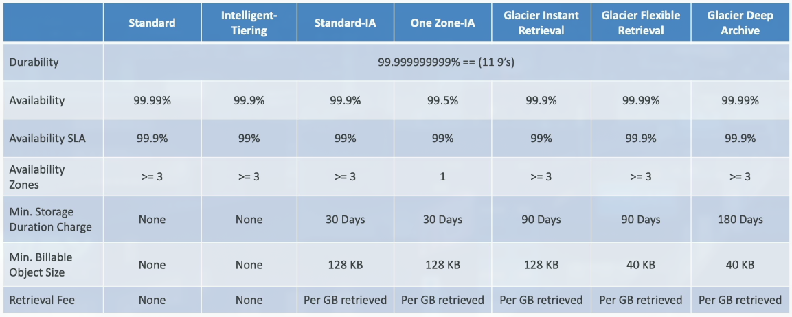

### S3 Storage Classes - Price Comparison
**Example: us-east-1**

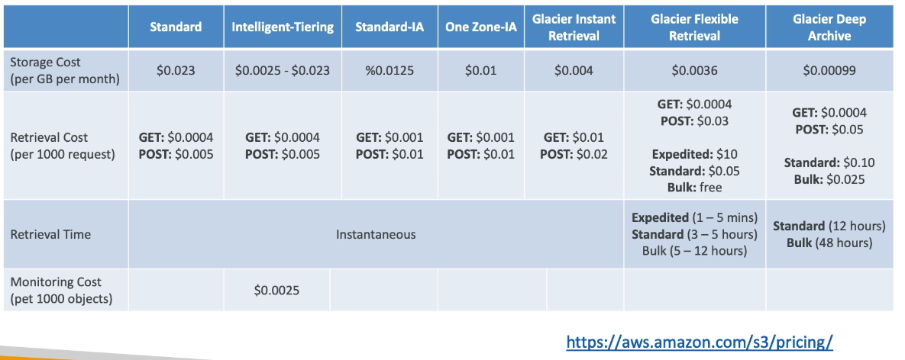

## 83. S3 Storage Classes Hands On
***This is a lab tutorial lesson***

## 84. S3 Express One Zone

- High performance, single Availability Zone storage class
- Objects stored in a Directory Bucket (bucket in a single AZ)
- Handle 100,000s request per second with single-digit millisecond latency
- Up to 10x better performance than S3 Standard (50% lower costs)
- High Durability (99.99%) and Availability (99.95%)
- Co-locate your storage and compute resources in the same AZ (reduces latency)
- Use cases: latency-sensitive apps, data-intensive apps, AI & ML training, financial modeling, media processing, HPC...
- Best integrated with SageMaker Model Training, Athena, EMR, Glue...

## 85. S3 Encryption

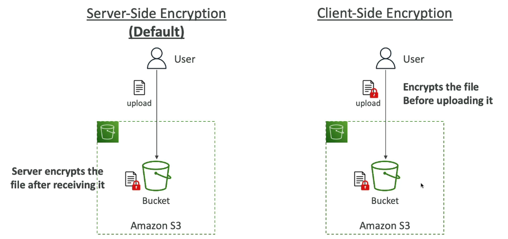

## 86. IAM Access Analyzer for S3

- Ensures that only intended people have access to your S3 buckets
- Example: publicly accessible bucket, bucket shared with other AWS account
- Evaluates S3 Bucket Policies, S3 ACLs, S3 Access Point Policies
- Powered by IAM Access Analyzer

## 87. Shared Responsibility Model for S3

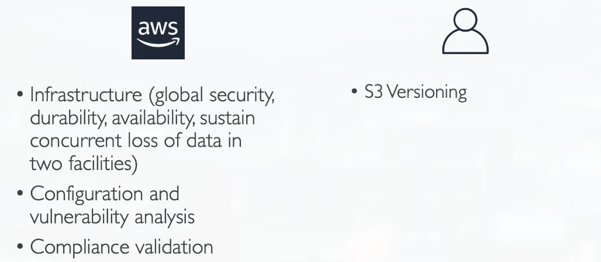

## 88. AWS Snow Family Overview

### AWS Snowball
- Highly-secure, portable devices to collect and process data at the edge, and migrate data into and out of AWS
- Helps migrate up to Petabytes of data

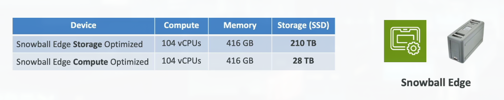

### Data Migrations with Snowball

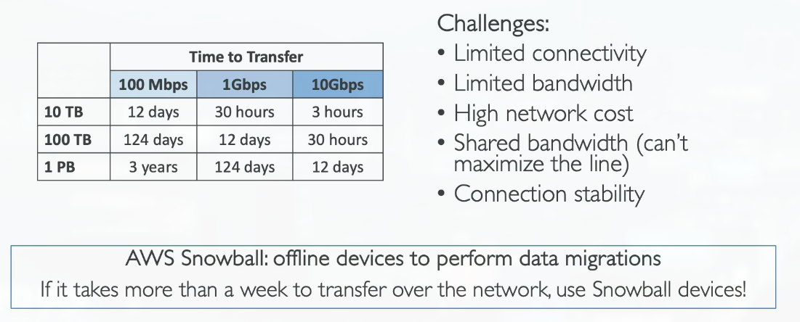

### Diagrams

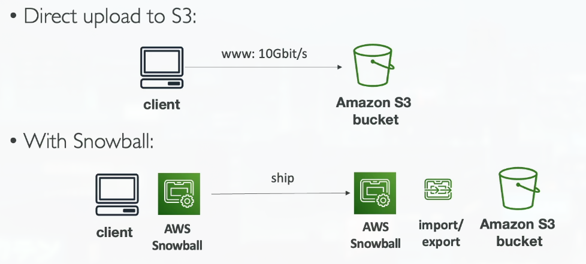

### What is Edge Computing?

**Edge Computing** means **processing data while it's being created on an edge location**:

- **Examples of edge locations**:
    - A truck on the road, a ship on the sea, a mining station underground
- **These locations may have limited internet and no access to computing power**
- **We set up a Snowball Edge device to do edge computing**:
    - **Snowball Edge Compute Optimized** (dedicated for that use case) & Storage Optimized
    - **Run EC2 Instances or Lambda functions at the edge**
- **Use cases**: Preprocess data, machine learning, transcoding media

> Edge Computing brings computation closer to where data is generated, rather than sending all data to a central cloud location. Think of it like having a mini data center in a remote location. A truck collecting sensor data might have limited or expensive internet connectivity, so instead of sending all raw data to AWS (which would be slow and expensive), a Snowball Edge device on the truck can process the data locally. It can filter out irrelevant data, run machine learning models to detect anomalies, or transcode video files. Only the processed results or important data need to be sent to AWS when connectivity is available. This reduces bandwidth costs, improves response times (no need to wait for data to travel to the cloud and back), and enables real-time processing even in disconnected environments. Snowball Edge devices are essentially portable AWS data centers - they can run EC2 instances and Lambda functions, so you can deploy the same applications that run in AWS, but at the edge location.

## 89. AWS Snow Family Hands On
***This is a lab tutorial lesson***

## 90. AWS Snowball Edge - Pricing

### Snowball Edge Pricing
- You pay for device usage and data transfer out of AWS
- Data transfer IN to Amazon S3 is $0.00 per GB
- On-Demand
    - Includes a one-time service fee per job, which includes:
        - 10 days of usage for Snowball Edge Storage Optimized 80TB
        - 15 days of usage for Snowball Edge Storage Optimized 210TB
        - Shipping days are NOT counted towards the included 10 or 15 days
        - Pay per day for any additional days
    - Committed Upfront
        - Pay in advance for monthly, 1-year, and 3-years of usage (Edge Computing)
        - Up to 62% discounted pricing

## 91. Storage Gateway Overview

### Hybrid Cloud for Storage
- AWS is pushing for "hybrid cloud"
    - Part of your infrastructure is on-premises
    - Part of your infrastructure is on the cloud
- This can be due to
    - Long cloud migrations
    - Security requirements
    - Compliance requirements
    - IT strategy
- S3 is a proprietary storage technology (unlike EFS / NFS), so how do you expose the S3 data on-premise?

### AWS Storage Cloud Native Options
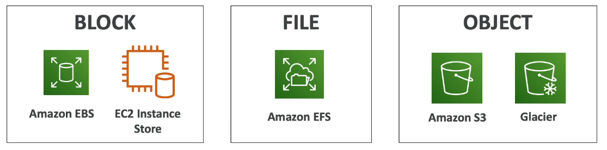

### AWS Storage Gateway
- Bridge between on-premise data and cloud data in S3
- Hybrid storage service to allow on-premises to seamlessly use the AWS Cloud
- Use cases: disaster recovery, backup & restore, tiered storage
- Types of Storage Gateway
    - File Gateway
    - Volume Gateway
    - Tape Gateway
- No need to know the types at the exam

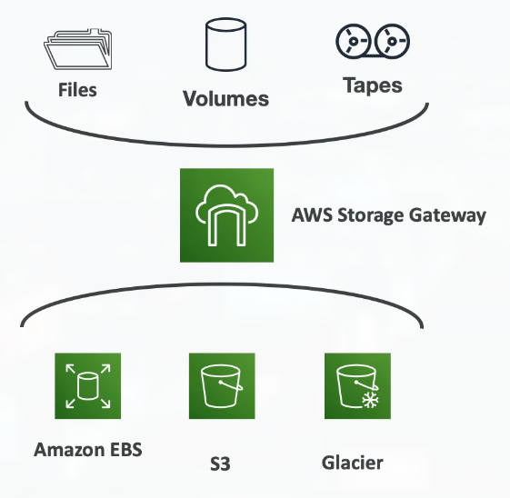

## 92. S3 Summary

### Amazon S3 - Summary
- Buckets vs Objects: global unique name, tied to a region
- S3 security: IAM policy, S3 Bucket Policy (public access), S3 Encryption
- S3 Websites: host a static website on Amazon S3
- S3 Versioning: multiple versions for files, prevent accidental deletes
- S3 Replication: same-region or cross-region, must enable versioning
- S3 Storage Classes: Standard, IA, IZ-IA, Intelligent, Glacier (Instant, Flexible, Deep)
- Snowball: import data onto S3 through a physical device, edge computing
- Storage Gateway: hybrid solution to extend on-premises storage to S3
