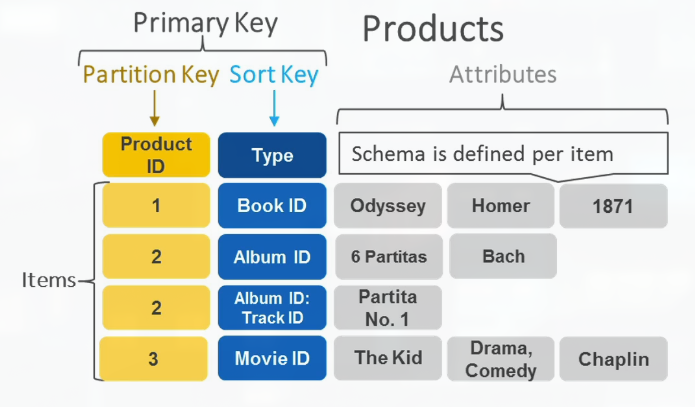
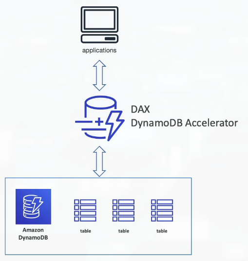
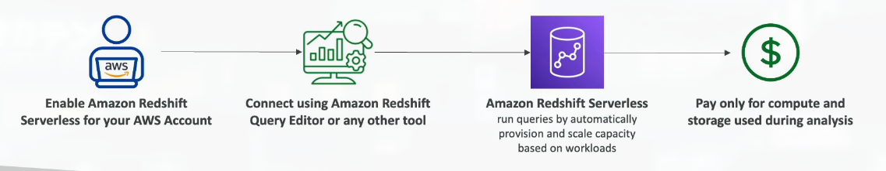
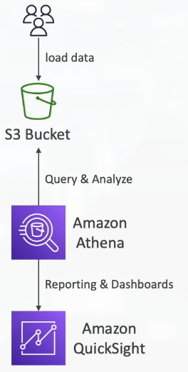
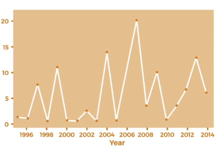
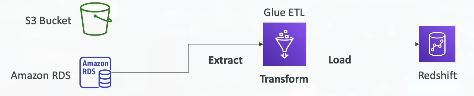
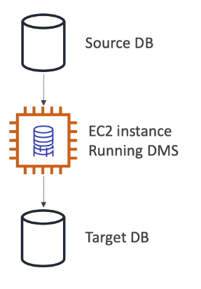

# Section 9: Databases & Analytics

## 93. Databases Introduction

### Databases Intro
- Storing data on disk (EFS, EBS, EC2 Instance Store, S3) can have its limits
- Sometimes, you want to store data in a database...
- You can structure the data
- You build indexes to efficiently query / search through the data
- You define relationships between your datasets
- Databases are optimized for a purpose and come with different features, shapes and constraints

### Relational Databases

**Relational Databases** organize data into tables with relationships:

- **Looks just like Excel spreadsheets, with links between them!**
- **Can use the SQL language** to perform queries/lookups
- Data is structured in rows and columns
- Tables can be linked through relationships (foreign keys)

### NoSQL Databases

**NoSQL** = **non-SQL** = **non-relational databases**:

- **NoSQL databases are purpose-built for specific data models** and have flexible schemas for building modern applications
- **Benefits**:
    - **Flexibility**: Easy to evolve data model - add new fields without restructuring
    - **Scalability**: Designed to scale-out by using distributed clusters - horizontal scaling
    - **High-performance**: Optimized for specific data models and use cases
- **Examples**: Key-value, document, graph, in-memory, search databases

> NoSQL databases emerged to solve limitations of relational databases, particularly around scalability and flexibility. Relational databases require a fixed schema (you define the structure upfront) and can be difficult to scale horizontally (adding more servers). NoSQL databases are designed for modern applications that need to scale massively and handle rapidly changing data structures. For example, a document database (like MongoDB) stores data as JSON documents - you can add new fields to documents without changing the database schema. A key-value database (like DynamoDB) is optimized for simple lookups - give it a key, get the value, extremely fast. Graph databases (like Neptune) are optimized for relationships - perfect for social networks where you need to find connections between entities. The trade-off is that NoSQL databases typically don't support complex joins and transactions like relational databases. The choice between SQL and NoSQL depends on your use case - relational databases are great for structured data with complex relationships, while NoSQL is great for unstructured data, high-scale applications, or when you need flexible schemas.

### NoSQL data example: JSON
- JSON = JavaScript Object Notation
- JSON is a common form of data that fits into a NoSQL model
- Data can be nested
- Fields can change overtime
- Support for new types: arrays, etc...

### Databases & Shared Responsibility on AWS
- AWS offers use to manage different databases
- Benefits include:
    - Quick Provisioning, High Availability, Vertical and Horizontal Scaling
    - Automated Backup & Restore, Operations, Upgrades
    - Operating System Patching is handled by AWS
    - Monitoring, alerting
- Note: many databases technologies could be run on EC2, but you must handle yourself the resiliency, backup, patchin, high availability, fault tolerance, scaling, ...

## 94. RDS & Aurora Overview

### Amazon RDS Overview
- RDS stands for Relational Database Service
- It's a managed DB service for DB use SQL as a query language
- It allows you to create databases in the cloud that are managed by AWS
    - Postgres
    - MySQL
    - MariaDB
    - Oracle
    - Microsoft SQL Server
    - IBM DB2
    - Aurora (AWS Proprietary database)

### Advantages of Using RDS versus Deploying DB on EC2

**RDS is a managed service** that handles many database administration tasks:

- **Automated provisioning, OS patching** - AWS handles the operating system and database software updates
- **Continuous backups and restore to specific timestamp (Point in Time Restore)!** - Can restore to any second in the past (within retention period)
- **Monitoring dashboards** - Built-in CloudWatch integration
- **Read replicas for improved read performance** - Scale read operations across multiple copies
- **Multi-AZ setup for DR (Disaster Recovery)** - Automatic failover to standby in another AZ
- **Maintenance windows for upgrades** - Schedule when updates occur
- **Scaling capability (vertical and horizontal)** - Easy to resize or add replicas
- **Storage backed by EBS** - Automatic storage scaling

**But you can't SSH into your instances** - AWS manages the OS, so you don't have shell access

> RDS is like hiring a database administrator (DBA) to manage your database for you. Instead of launching an EC2 instance, installing database software, configuring backups, setting up replication, and monitoring performance yourself, RDS does all of this automatically. This is a huge time saver and reduces the risk of misconfiguration. For example, RDS automatically takes daily backups and transaction logs, so you can restore to any point in time within your retention period (typically 7-35 days). If your database crashes at 2:34 PM, you can restore it to exactly 2:33 PM. Multi-AZ deployment creates a standby database in another Availability Zone that automatically takes over if the primary fails - this happens in seconds with minimal data loss. The trade-off is less control - you can't SSH into the instance to tweak OS settings or install custom software. But for most use cases, the managed service benefits far outweigh this limitation. If you need full control, you can still run databases on EC2, but you'll be responsible for all the management tasks that RDS handles automatically.

### RDS Solution Architecture

### Amazon Aurora
- Aurora is a propriery technology from AWS (not open sourced)
- PostgreSQL and MySQL are both supported as Aurora DB
- Aurora is "AWS cloud optimized" and claim 5x performance improvement over MySQL on RDS, over 3x the performance of Postgres on RDS
Aurora storage automatically grows in increments of 10GB, up to 256 TB
- Aurora costs more then RDS (20% more) - but is more efficient

### Amazon Aurora Serverless
- Automated database instantiation and auto-scaling based on actual usage
- PostgreSQL and MySQL are both supported as Aurora Serverless DB
- No capacity planning needed
- Least management overhead
- Pay per second, can be more cost-effective
- Use cases: good for infrequent, intermittent or unpredictable workloads...

## 95. RDS Hands On
***This is a lab tutorial lesson***

## 96. RDS Deployments Options

### RDS Deployments: Read Replicas, Multi-AZ

Understanding the difference between **Read Replicas** and **Multi-AZ** is crucial:

**Read Replicas**:
    - **Scale the read workload of your DB** - distribute read queries across multiple copies
    - **Can create up to 15 Read Replicas** - scale reads massively
    - **Data is only written to the main DB** - writes go to primary, reads can go to replicas
    - Use for: Scaling read-heavy applications, offloading reporting queries, cross-region reads

**Multi-AZ**:
    - **Failover in case of AZ outage (high availability)** - automatic disaster recovery
    - **Data is only read/written to the main database** - standby is for failover only
    - **Can only have 1 other AZ as failover** - one primary, one standby
    - Use for: Production databases requiring high availability

> Read Replicas and Multi-AZ solve different problems. Read Replicas are for scaling reads - if you have a read-heavy application (like a news website where many people read articles but few write them), you can create multiple read replicas and distribute read queries across them. This improves performance and reduces load on the primary database. However, read replicas are asynchronous - there's a small delay before data written to the primary appears in replicas. Multi-AZ is for high availability - it creates a synchronous standby copy in another Availability Zone. If the primary fails, RDS automatically fails over to the standby in about 60-120 seconds. During normal operation, you only use the primary - the standby just sits there waiting (you can't read from it). You can combine both - have Multi-AZ for high availability AND Read Replicas for scaling reads. This gives you both disaster recovery and read scaling.

### RDS Deployments: Multi-Region
- Multi-Region (Read Replica)
    - Disaster recovery in case of region issue
    - Local performance for global reads
    - Replication cost

## 97. ElastiCache Overview

### Amazon ElastiCache Overview
- The same way RDS is to get managed Relational Databases...
- ElastiCache is to get managed Redis or Memcached
- Caches are in-memory databases with high-performance, low latency
- Helps reduce load off databases for read intensive workloads

- AWS takes care of OS maintenance / patching, optimizations, setup, configuration, monitoring, failure recovery and backups

### ElastiCache Solution Architecture - Cache

## 98. DynamoDB Overview

### DynamoDB

**DynamoDB** is AWS's fully managed **NoSQL database**:

- **Fully Managed, Highly available** with replication across 3 AZ - automatic multi-AZ deployment
- **NoSQL database** - not a relational database - key-value and document database
- **Scales to massive workloads**, distributed "serverless" database - no servers to manage
- **Millions of requests per second, trillions of rows, 100s of TB of storage** - virtually unlimited scale
- **Fast and consistent in performance** - predictable performance at any scale
- **Single-digit millisecond latency** - low latency retrieval
- **Integrated with IAM** for security, authorization and administration
- **Low cost and auto scaling capabilities** - pay only for what you use
- **Standard & Infrequent Access (IA) Table Class** - cost optimization options

> DynamoDB is AWS's answer to the need for a massively scalable, serverless database. Unlike RDS where you provision database instances, DynamoDB is truly serverless - you just create tables and start using them. AWS handles all the infrastructure, scaling, backups, and maintenance. DynamoDB can handle millions of requests per second and store trillions of items - it's designed for internet-scale applications. The key-value model is simple but powerful - you store items (like JSON documents) with a primary key, and you can retrieve them extremely quickly. DynamoDB automatically partitions your data across multiple servers and Availability Zones, so it scales seamlessly. If your traffic doubles, DynamoDB automatically handles it - no manual scaling needed. The performance is consistent - whether you're doing 10 requests per second or 10 million, the latency stays in the single-digit milliseconds. This makes DynamoDB perfect for high-traffic applications like gaming leaderboards, session stores, or real-time applications. The trade-off is that it's a NoSQL database - you lose some features of relational databases like complex joins and transactions (though DynamoDB does support transactions within a single table).

### DynamoDB - type of data
- DynamoDB is a key/value database

### DynamoDB Accelerator - DAX
- Fully Managed in-memory cache for DynamoDB
- 10x performance improvement - single-digit millisecond latency to microseconds latency - when accessing your DynamoDB tables
- Secure, highly scalable & highly available
- Difference with ElastiCache at the CCP level: DAX is only used for and is integrated with DynamoDB, while ElastiCache can be used for other databases

## 99. DynamoDB Hands On
***This is a lab tutorial lesson***

## 100. DynamoDB Global Tables

### DynamoDB - Global Tables
- Make a DynamoDB table accessible with low latency in multiple-region
- Active-Active replication (read/write to any AWS Region)

## 101. Redshift Overview

### Redshift Overview

**Amazon Redshift** is a **data warehousing and analytics** service:

- **Redshift is based on PostgreSQL**, but it's not used for OLTP (Online Transaction Processing)
- **It's OLAP** - Online Analytical Processing (analytics and data warehousing)
- **Load data once every hour; not every second** - designed for batch analytics, not real-time transactions
- **10x better performance than other data warehouses**, scale to PBs (Petabytes) of data
- **Columnar storage of data** (instead of row-based) - optimized for analytical queries
- **Massively Parallel Query Execution (MPP)**, highly available - queries run across multiple nodes in parallel
- **Pay as you go** based on the instances provisioned
- **Has a SQL interface** for performing the queries - familiar SQL syntax
- **BI tools such as AWS QuickSight or Tableau** integrate with it - connect your favorite analytics tools

> Redshift is designed for a completely different use case than RDS. RDS is for OLTP - handling transactions like "update this user's order status" or "insert this new customer record". Redshift is for OLAP - answering analytical questions like "what were our total sales by region last quarter?" or "which products are trending?" The key difference is in the data model: OLTP databases (like RDS) store data in rows (row-based) and are optimized for reading and writing individual records quickly. OLAP databases (like Redshift) store data in columns (columnar storage) and are optimized for scanning large amounts of data to answer analytical questions. Think of it like a spreadsheet: row-based is like reading across a row (one customer's data), columnar is like reading down a column (all customers' ages). For analytics, you often need to scan millions of rows to calculate aggregates (sums, averages, counts), and columnar storage makes this much faster. Redshift uses a cluster of nodes that work together - when you run a query, it's automatically parallelized across all nodes, making it extremely fast. You typically load data into Redshift periodically (hourly, daily) from your transactional databases, then run analytical queries against it. This separation (OLTP for transactions, OLAP for analytics) is a common pattern called the "data warehouse" architecture.

### Redshift Serverless
- Automatically provisions and scales data warehouse underlying capacity
- Run analytics workloads without managing data warehouse infrastructure
- Pay only for what you use (save costs)
- Use cases: Reporting, dashboarding applications, real-time analytics...

## 102. EMR Overview

### Amazon EMR
- EMR stands for "Elastic MapReduce"
- EMR helps creating Hadoop clusters (Big Data) to analyze and process vast amount of data
- The clusters can be made of hundreds of EC2 instances
- Also supports Apache Spark, HBase, Presto, Flink...
- EMR takes care of all the provisioning and configuration
- Auto-scaling and integrated with Spot instances
- Use cases: data processing, machine learning, web indexing, big data...

## 103. Athena Overview

### Amazon Athena
- Serverless query service to perform analytics against S3 objects
- Use standard SQL language to query the files
- Supports CSV, JSON, ORC, Avro, and Parquet (built on Presto)
- Pricing: $5.00 per TB of data scanned
- Use compressed or columnar data for cost-savings (less scan)
- Use cases: Business intelligence / analytics / reporting, analyze & query VPC Flow Logs, ELB Logs, CloudTrail trails, etc...
- Exam Tips: analyze data in S3 using serverless SQL, using Athena

## 104. QuickSight Overview

### Amazon QuickSight
- Serverless machine learning-powered business intelligence service to create interactive dashboards
- Fast, automatically scalable, embeddable, with per-session pricing
- Use cases:
    - Business analytics
    - Building visualizations
    - Perform ad-hoc analytics
    - Get business insights using data
- Integrated with RDS, Aurora, Athena, Redshift, S3...

## 105. DocumentDB Overview

### DocumentDB
- Aurora is an "AWS-implementation" of PostgreSQL/MySQL...
- DocumentDB is the same for MongoDB (which is a NoSQL database)
- MongoDB is used to store, query, and index JSON data
- Similar "deployment concepts" as Aurora
- Fully Managed, highly available with replication across 3 AZ
- DocumentDB storage automatically grows in increments of 10GB
- Automatically scales to workloads with millions of requests per seconds

## 106. Neptune Overview

### Amazon Neptune
- Fully managed graph database
- A popular graph dataset would be a social network
    - Users have friends
    - Posts have comments
    - Comments have likes from users
    - Users share and like posts
- Highly available across 3 AZ, with up to 15 read replicas
- Build and run applications working with highly connected datasets - optimized for these complex and hard queries
- Can store up to billions of relations and query the graph with milliseconds latency
- Highly available with replications across multiple AZs
- Great for knowledge graphs (Wikipedia), fraud detection, recommendation engines, social networking

## 107. Timestream Overview

### Amazon Timestream
- Fully managed, fast, scalable, serverless time series database
- Automatically scales up/down to adjust capacity
- Store and analyze trillions of events per day
- 1000s times faster & 1/10th the cost of relational databases
- Built-in time series analytics functions (helps you identify patterns in your data in near real-time)

## 108. Managed Blockchain Overview

### Amazon Managed Blockchain
- Blockchain makes it possible to build applications where multiple parties can execute transactions without the need for a trusted, central authority
- Amazon Managed Blockchain is a managed service to
    - Join public blockchain networks
    - Or create your own scalable private network
- Compatible with the frameworks Hyperledger Fabric & Ethereum

## 109. Glue Overview

### AWS Glue
- Managed extract, transform, and load (ETL) service
- Useful to prepare and transform data for analytics
- Fully serverless service

- Glue Data Catalog: catalog of datasets
    - can be used by Athena, Redshift, EMR

## 110. DMS Overview

### DMS - Database Migration Service

- Quickly and securely migrate databases to AWS, resilient, self-healing
- The source database remains available during the migration
- Supports
    - Homogenous migrations: ex Oracle to Oracle
    - Heterogeneous migrations: ex Microsoft SQL Server to Aurora

## 111. Databases & Analytics Summary

- Relational Databaes - OLTP: RDS & Aurora (SQL)
- Differences between Multi-AZ, Read Replicas, Multi-Region
- In-memory Database: ElastiCache
- Key-Value Database: DynamoDB (serverless) & DAX (cache for DynamoDB)
- Warehouse - OLAP: Redshift (SQL)
- Hadoop Cluster: EMR
- Athena: query data on Amazon S3 (severless & SQL)
- QuickSight: dashbaords on your data (serverless)
- DocumentDB: Aurora for MongoDB (JSON - NoSQL database)
