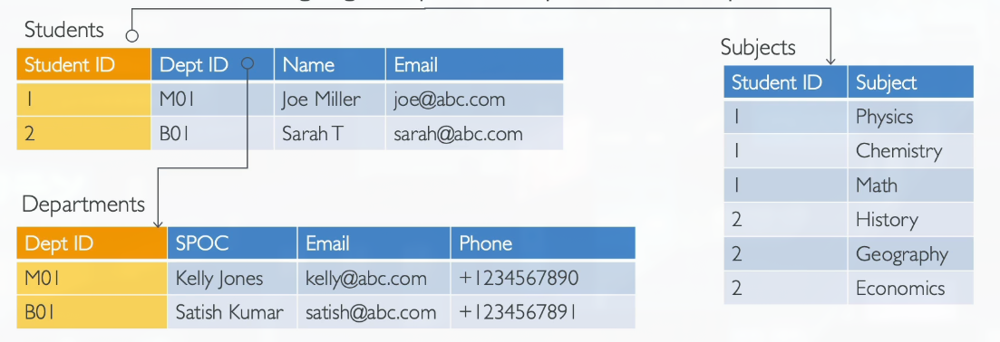
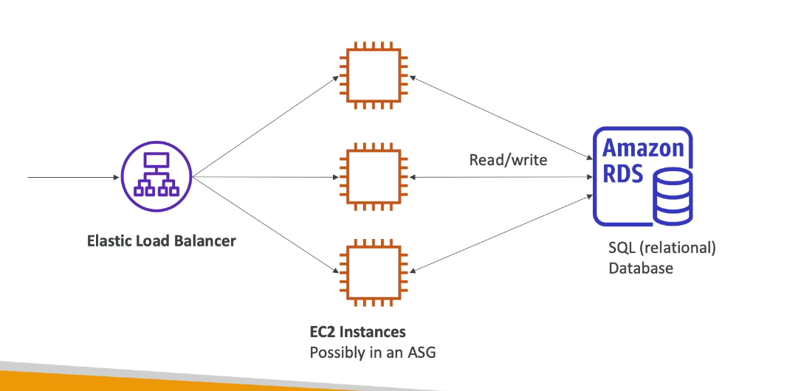
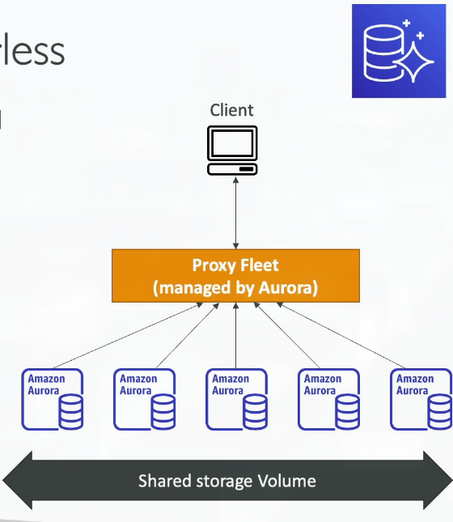
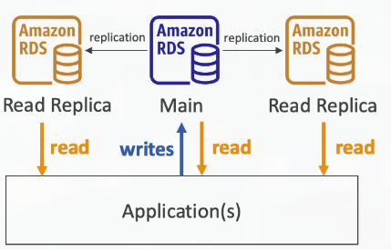
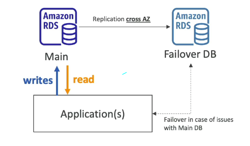
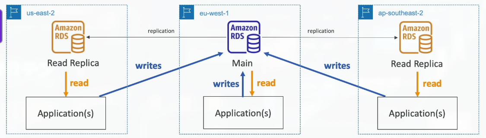
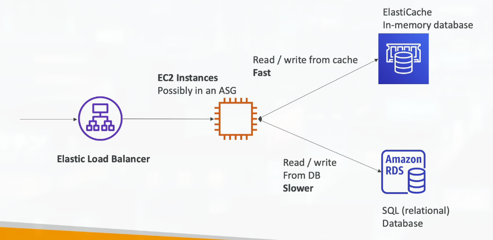

# Section 9: Databases & Analytics

## 93. Databases Introduction

### Databases Intro
- Storing data on disk (EFS, EBS, EC2 Instance Store, S3) can have its limits
- Sometimes, you want to store data in a database...
- You can structure the data
- You build indexes to efficiently query / search through the data
- You define relationships between your datasets
- Databases are optimized for a purpose and come with different features, shapes and constraints

### Relational Databases
- Looks just like Excel spreadsheets, with links between them!
- Can use the SQL language to perform queries/lookups

### NoSQL Databases
- NoSQL = non-SQL = non relational databases
- NoSQL databases are purpose built for specific data models and have flexible schemas for building modern applications
- Benefits:
    - Flexibility: easy to evolve data model
    - Scalability: designed to scale-out by using distributed clusters
    - High-performance: optmized for a specific data models and have flexible schemas for building modern applications
- Examples: key-valuem document, graph, in-memory, search databases

### NoSQL data example: JSON
- JSON = JavaScript Object Notation
- JSON is a common form of data that fits into a NoSQL model
- Data can be nested
- Fields can change overtime
- Support for new types: arrays, etc...

### Databases & Shared Responsibility on AWS
- AWS offers use to manage different databases
- Benefits include:
    - Quick Provisioning, High Availability, Vertical and Horizontal Scaling
    - Automated Backup & Restore, Operations, Upgrades
    - Operating System Patching is handled by AWS
    - Monitoring, alerting
- Note: many databases technologies could be run on EC2, but you must handle yourself the resiliency, backup, patchin, high availability, fault tolerance, scaling, ...

## 94. RDS & Aurora Overview

### Amazon RDS Overview
- RDS stands for Relational Database Service
- It's a managed DB service for DB use SQL as a query language
- It allows you to create databases in the cloud that are managed by AWS
    - Postgres
    - MySQL
    - MariaDB
    - Oracle
    - Microsoft SQL Server
    - IBM DB2
    - Aurora (AWS Proprietary database)

### Advantage over using RDS versus deploying DB on EC2
- RDS is a managed serviceL
    - Automated provisioning, OS patching
    - Continuous backups and restore to specific timestamp (Point of Time Restore)!
    - Monitoring dashboards
    - Read replicas for improved read performance
    - Multi AZ setup for DR (Disaster Recovery)
    - Maintenance windows for upgrades
    - Scaling capability (vertical and horizontal)
    - Storage backed by EBS
- But you can't SSH into your instances

### RDS Solution Architecture

### Amazon Aurora
- Aurora is a propriery technology from AWS (not open sourced)
- PostgreSQL and MySQL are both supported as Aurora DB
- Aurora is "AWS cloud optimized" and claim 5x performance improvement over MySQL on RDS, over 3x the performance of Postgres on RDS
Aurora storage automatically grows in increments of 10GB, up to 256 TB
- Aurora costs more then RDS (20% more) - but is more efficient

### Amazon Aurora Serverless
- Automated database instantiation and auto-scaling based on actual usage
- PostgreSQL and MySQL are both supported as Aurora Serverless DB
- No capacity planning needed
- Least management overhead
- Pay per second, can be more cost-effective
- Use cases: good for infrequent, intermittent or unpredictable workloads...

## 95. RDS Hands On
***This is a lab tutorial lesson***

## 96. RDS Deployments Options

### RDS Deployments: Read Replicas, Multi-AZ
- Read Replicas:
    - Scale the read workload of your DB
    - Can create up to 15 Read Replicas
    - Data is only written to the main DB

- Multi-AZ:
    - Failover in case of AZ outage (high availability)
    - Data is only read/written to the main database
    - Can only have 1 other AZ as failover

### RDS Deployments: Multi-Region
- Multi-Region (Read Replica)
    - Disaster recovery in case of region issue
    - Local performance for global reads
    - Replication cost

## 97. ElastiCache Overview

### Amazon ElastiCache Overview
- The same way RDS is to get managed Relational Databases...
- ElastiCache is to get managed Redis or Memcached
- Caches are in-memory databases with high-performance, low latency
- Helps reduce load off databases for read intensive workloads

- AWS takes care of OS maintenance / patching, optimizations, setup, configuration, monitoring, failure recovery and backups

### ElastiCache Solution Architecture - Cache

## 98. DynamoDB Overview

## 99. DynamoDB Hands On

## 100. DynamoDB Global Tables

## 101. Redshift Overview

## 102. EMR Overview

## 103. Athena Overview

## 104. QuickSight Overview

## 105. DocumentDB Overview

## 106. Neptune Overview

## 107. Timestream Overview

## 108. Managed Blockchain Overview

## 109. Glue Overview

## 110. DMS Overview

## 111. Databases & Analytics Summary
